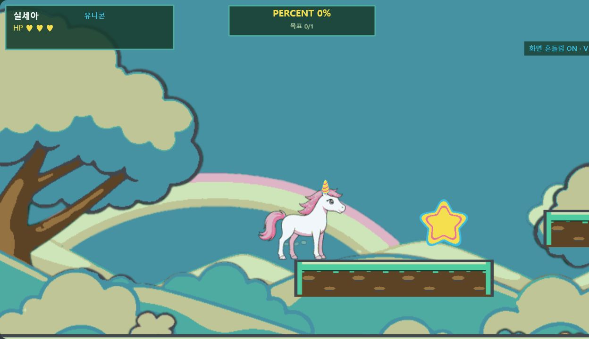
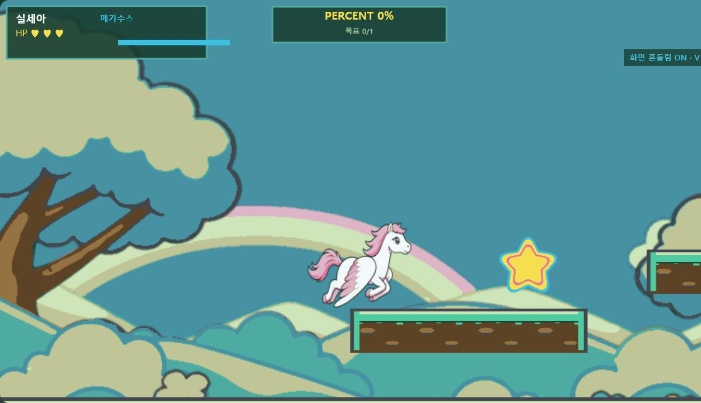
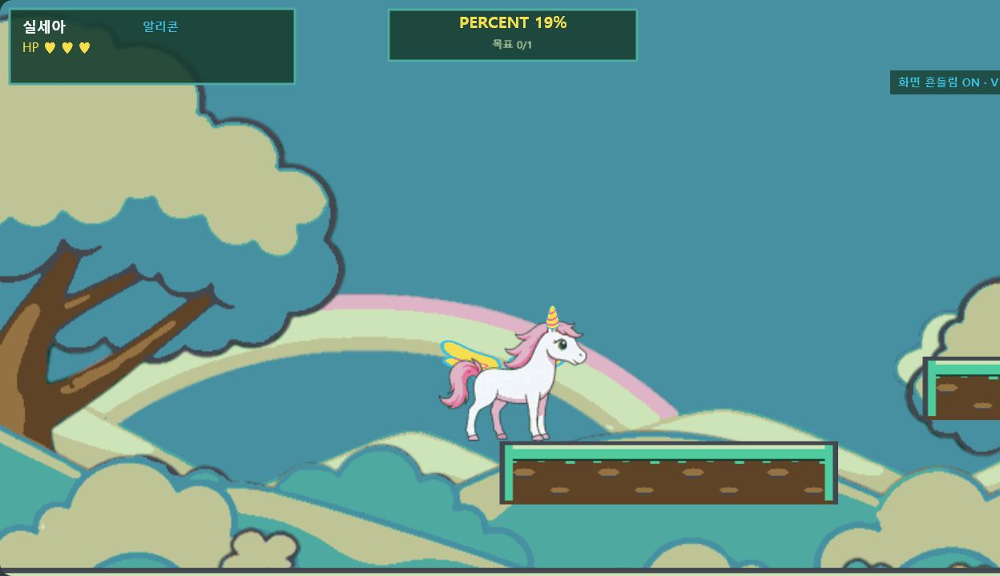
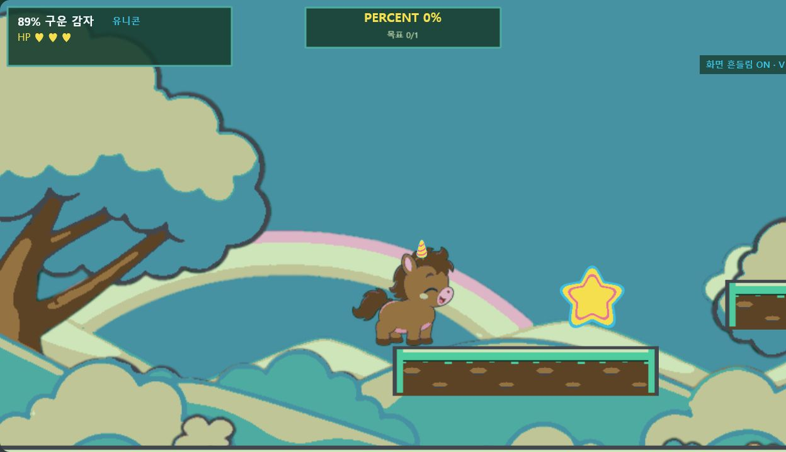
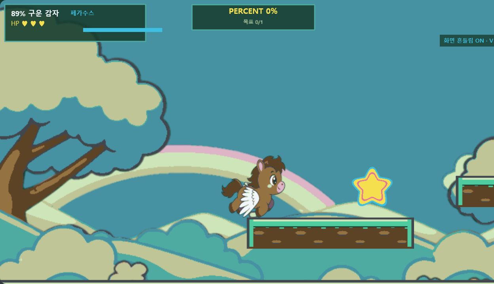
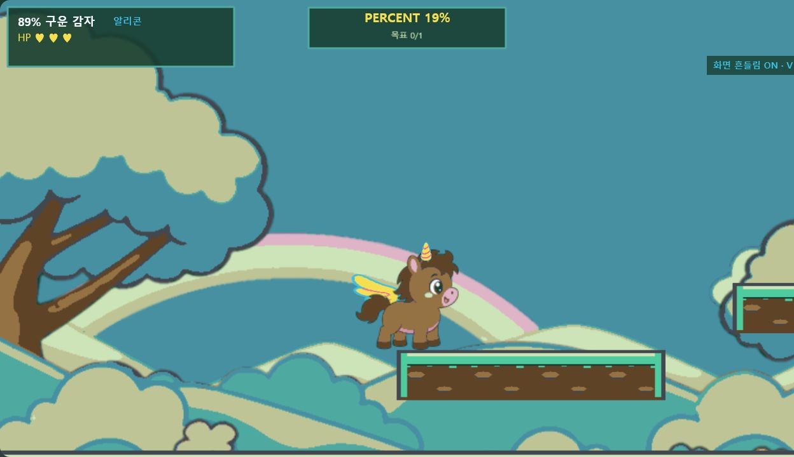

# Phase 3 캐릭터 런타임 검수

- 검수일: 2026-08-05
- 에셋 제작 기준점: `de4f246`
- 게임 캔버스 기준: 1280×720
- 승인 캡처: 1248×720 (앱 내 브라우저 CSS-fit, 화면 비율 유지)
- 결과: 보정 후 승인

## 검수 범위

두 캐릭터를 `Player`, `CharacterAnimationManager`, `TransformationManager`의 실제 게임 경로로 렌더링했다. 기본 이동, 유니콘 대기, 페가수스 비행, 알리콘 대기 상태에서 다음 항목을 확인했다.

- 프레임 전환 중 발 기준선과 화면상 크기 유지
- 캐릭터별 뿔 앵커와 날개 위치
- 비행 시트에 포함된 날개와 런타임 부착물의 중복 여부
- 공용 팔레트·외곽선·셰이딩 일관성
- 변신 상태 HUD와 점수 표시 안정성

## 발견 및 보정

| 발견 사항 | 보정 | 결과 |
|---|---|---|
| 유니콘 뿔이 단색 삼각형으로 머리에서 분리되어 보임 | 승인된 `item_horn` 텍스처와 캐릭터별 앵커 적용 | 두 캐릭터 머리에 자연스럽게 결합 |
| 알리콘 날개가 단색 타원이며 몸통 뒤에 가려짐 | 승인된 `item_wings` 텍스처를 128×73으로 적용하고 앵커 상향 | 대기 실루엣에서 날개 역할 판독 가능 |
| 비행 시트 자체 날개와 부착물 중복 가능성 | `fly`, `transform_pegasus`, `transform_alicorn` 재생 중 부착 날개 숨김 | 비행 화면에 날개 한 쌍만 표시 |
| 알리콘 자석 수집 중 보간 점수가 긴 소수로 노출 | HUD 표시값에 정수 반올림 적용 | `PERCENT n%` 형식 유지 |

## 승인 캡처

### 실세아

### 감자89

## 재현 형식

`/?visualReview=level-02&section=start&offset=650&character={silsea|potato89}&form={base|unicorn|pegasus|alicorn}&animation={move|idle|fly}&zoom=1.65`

검수 진입점은 선택한 애니메이션을 런타임에서 고정하고, 알리콘 만료를 검수 시간 동안 보류한다. 일반 플레이 흐름과 실제 변신 지속 시간에는 영향을 주지 않는다.
