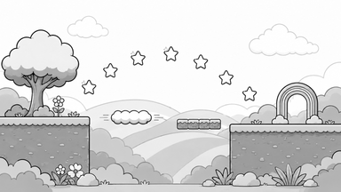
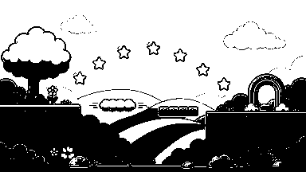

# C1 무지개 이어달리기 — 선택 카드 앵커 검수

> 상태: 사용자 앵커 승인 완료
> 작성일: 2026-09-04
> 선행 승인: 2026-09-04 사용자 `C1 규칙 승인`, `C1 코스 승인`
> 앵커 승인: 2026-09-04 사용자 `다음 단계 진행`

## 검수 결론

승인된 공중 발판 구간과 종료 구간을 한 장의 문자 없는 16:9 흑백 구도로 압축했다. 왼쪽 시작 발판에서 중앙의 두 짧은 틈과 움직이는 구름 발판·분절 붕괴 발판을 거쳐 오른쪽의 넓은 회복 지면과 띠형 무지개 게이트로 이어진다. 별 일곱 개의 호가 시선을 왼쪽에서 오른쪽으로 유도하며, 25% 축소와 이진 실루엣에서도 세 핵심 랜드마크가 분리된다.

## 잠금할 구도

- 왼쪽: 둥근 나무가 있는 안전한 시작 잔디 발판
- 중앙: 두 개의 짧은 틈, 둥근 구름 이동 발판, 작은 분절 붕괴 발판
- 진행 단서: 왼쪽에서 오른쪽으로 상승·하강하는 5각 별 호
- 오른쪽: 넓고 안전한 착지 지면과 띠가 구분되는 무지개 아치 게이트
- 여백: 큰 하늘과 단순한 먼 언덕·구름 실루엣
- 제외: 캐릭터, 적, 보스, 비밀 공간, 문자, 숫자, UI, 로고, 워터마크

## 파일과 생성 기록

| 용도 | 파일 | 규격 |
|---|---|---:|
| 내장 이미지 생성 원본 | `assets/_source/c1/c1_rainbow_relay_anchor_generated_v1.png` | 1672×941 |
| 승인 대상 앵커 | `references/could1-challenge-anchor.png` | 1536×864 |
| 25% 판독 검토본 | `references/could1-challenge-anchor-25.png` | 384×216 |
| 25% 이진 실루엣 | `references/could1-challenge-anchor-silhouette-25.png` | 384×216 |

- 생성 방식: Codex 내장 이미지 생성, 최초 결과 1회 채택
- 구도 참고: 승인된 `could1-course-flight-a.png`, `could1-course-finish.png`
- 후처리: `scripts/build-c1-challenge-anchor-review.js`가 16:9 중앙 맞춤, 1536×864 회색조 변환, 25% 축소와 임계값 220 실루엣 생성을 재현한다.
- 정량 결과: 최종 RGB 채널 최대 편차 0, 25% 검토본 384×216

## 25% 검토본



## 25% 이진 실루엣



## 생성 프롬프트

```text
Use case: stylized-concept
Asset type: 16:9 grayscale composition anchor for a 2D side-scrolling game's stage-select thumbnail
Input images: Image 1 is the approved moving-platform course composition reference; Image 2 is the approved recovery-ground and rainbow-gate composition reference. Use them only as layout and shape references, not as edit targets.
Primary request: create one clean black-and-white thumbnail anchor for the approved stage 'Rainbow Relay'. Show a readable left-to-right route: a safe grassy starting ledge on the left, two short gaps across the center with one rounded cloud moving platform and one small segmented crumble platform, a clear arc of collectible five-point stars guiding the route, then a broad safe landing ledge on the right ending in a recognizable banded rainbow arch gate. No boss and no secret room.
Scene/backdrop: simple rolling hill and cloud silhouettes with large uncluttered sky.
Subject: the route geometry, moving platform, star arc, and finish gate are the focal elements.
Style/medium: polished 2D cel-cartoon line-art anchor matching a friendly children's platform game; bold dark outlines; flat grayscale only.
Composition/framing: exact wide 16:9 landscape; side view; all route landmarks fully inside the frame with generous edge padding; strong readability at 25% scale; visual flow left to right.
Color palette: pure black, white, and a few neutral grays only. No hue, no colored tint.
Constraints: no text, no letters, no numbers, no UI frame, no character, no enemy, no boss, no watermark, no logo, no extra objects; do not crop the starting ledge or finish gate; keep the central sky open and uncluttered.
```

## 승인 뒤 다음 작업

1. 이 구도와 실루엣을 선택 카드 미리보기의 잠금값으로 확정한다.
2. 승인된 앵커만 입력으로 사용해 최종 컬러 미리보기 한 장을 생성한다.
3. manifest·mapping에 연결하고 잠금/해금/선택/fallback 상태를 검수한다.
4. 미실시 입력 플레이테스트를 명시한 최종 리뷰를 준비한다.

## 승인 문구

구도와 25% 판독성은 다음 문구로 승인되었다.

`다음 단계 진행` — 2026-09-04
