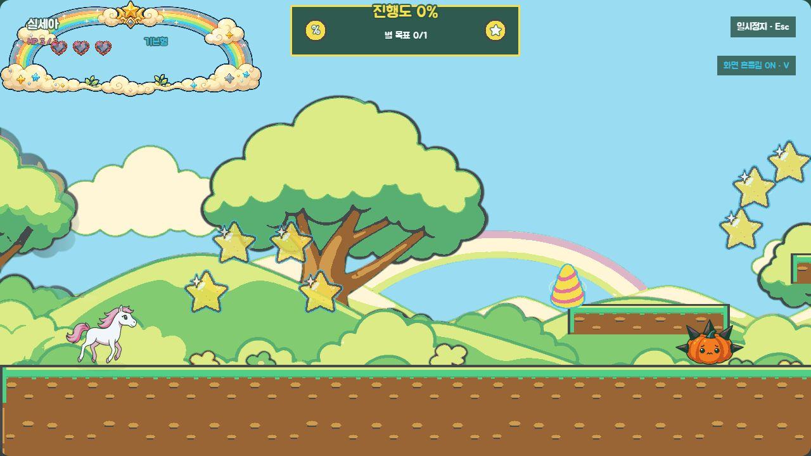
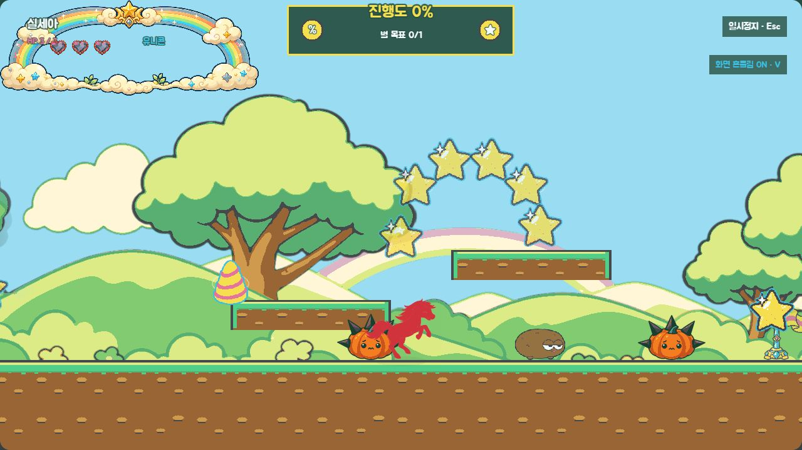
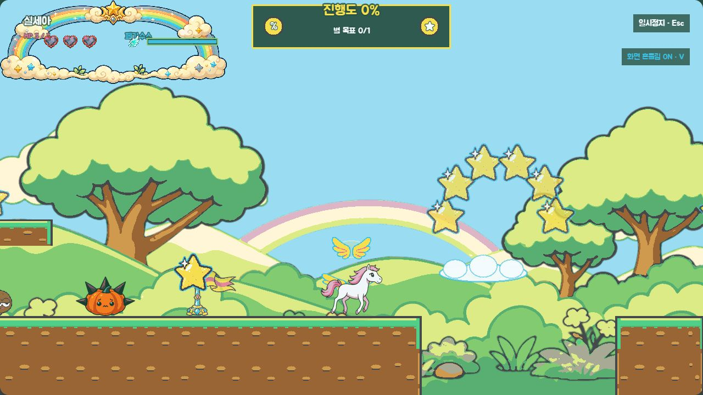
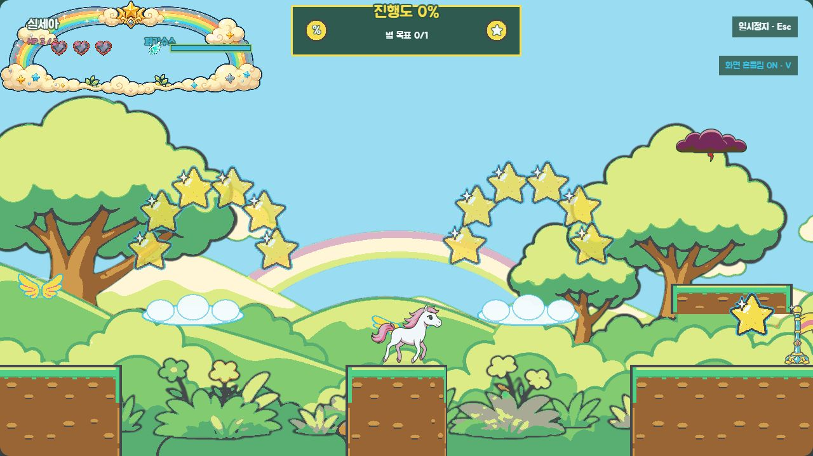
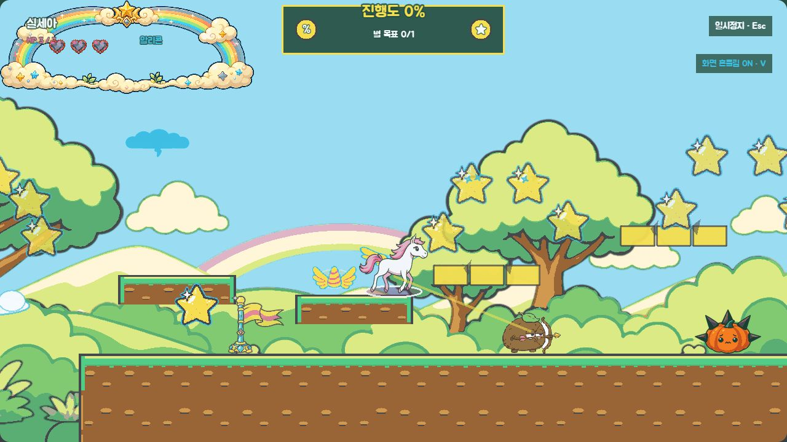
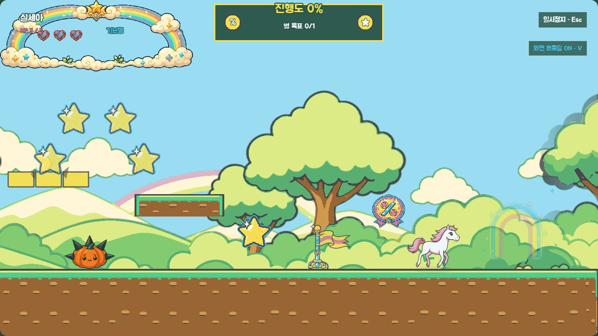
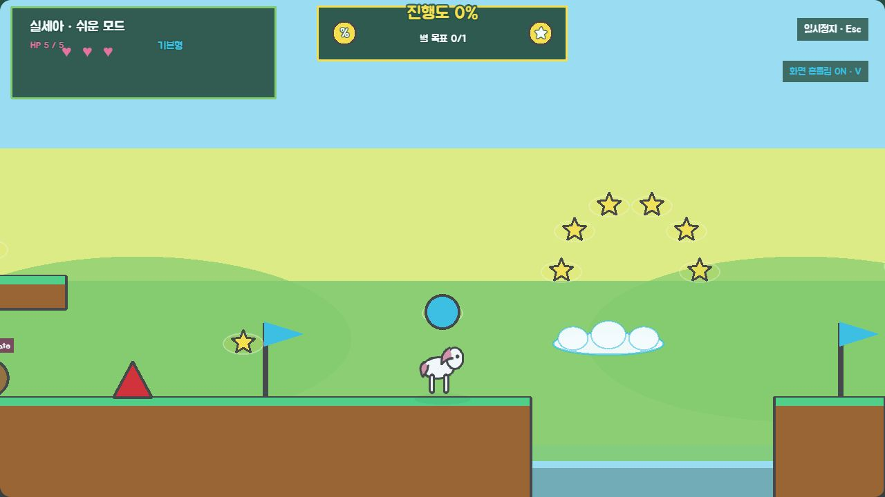
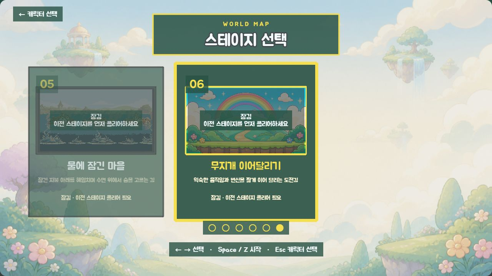

# C1 무지개 이어달리기 — 코스 검수

> 상태: 사용자 코스 승인 완료
> 작성일: 2026-09-04
> 선행 승인: 2026-09-04 사용자 `C1 규칙 승인`
> 코스 승인: 2026-09-04 사용자 `C1 코스 승인`

## 검수 결론

5,120px 안에 시작, 유니콘, 공중 발판, 복합 시험, 무위험 종료의 다섯 구간을 배치했다. 기본 상태는 지상과 이동 발판으로 완주할 수 있고, 세 변신은 상단 별 33개를 빠르게 잇는 보상 경로다. 마지막 체크포인트 이후 576px에는 새 적·위험물이 없다.

## 구간과 지형 좌표

| 구간 | 범위 | 고정 지형 | 핵심 시험 |
|---|---:|---|---|
| 시작 | 0~768 | 평지 0~2,176 | 별 4개와 낮은 단차로 조작 재확인 |
| 유니콘 | 768~1,920 | x896·y480, x1248·y400 발판 | 뿔 x896, 호박 x1120·1600, 상단 별 6개 |
| 공중 발판 | 1,920~3,328 | 섬 2,528~2,688, 착지 지면 2,976~ | 352/288px 낭떠러지, 이동 발판 2개, 날개와 별 12개 |
| 복합 시험 | 3,328~4,608 | x3328·y480, x4128·y416 발판 | 알리콘, 붕괴 발판 2개, 궁수 x3712, 호박 x4032 |
| 종료 | 4,608~5,120 | 연속 평지 | 회복 체크포인트 x4544, 대형 퍼센트 x4672, 게이트 x4944 |

## 동적 장치와 안전값

| 요소 | 좌표/범위 | 값 | 안전 근거 |
|---|---|---|---|
| 이동 다리 | x2208, y480, 160×32 | 가로 +144, 72px/s | 첫 낭떠러지 양 끝에서 기다릴 수 있음 |
| 이동 승강기 | x2736, y480, 160×32 | 세로 -96, 64px/s | 중간 섬과 오른쪽 착지면을 동시에 보여줌 |
| 붕괴 발판 낮음 | x3552, y432, 176×32 | 950ms, 2초 복원 | 아래 연속 지면이 안전 경로 |
| 붕괴 발판 높음 | x3856, y368, 176×32 | 900ms, 2초 복원 | 실패해도 낭떠러지 대신 지면에 착지 |
| 궁수 | x3712, trigger 3328 | 1,050ms 예고, 1회 공격 | 복합 구간 입구에서 384px 앞에 보임 |
| 마지막 위험 | 호박 x4032 | 종료 시작보다 576px 앞 | 회복 체크포인트와 게이트에 위험 없음 |

## 체크포인트와 쉬운 모드

- 일반 체크포인트: x1792, x3264, x4544. 마지막 지점은 체력과 비행 에너지를 회복한다.
- 쉬운 모드 추가 체크포인트: x2624. 궁수를 제거하고 이동 속도 0.75배, 붕괴 지연 1.5배, 비행 소모 0.65배, 낭떠러지 점수 손실 0을 적용한다.
- 스폰·체크포인트·출구는 모두 고정 지면 위에 있으며 위험물과 겹치지 않는다.

## 검수 주소

- 시작: `http://localhost:4173/?visualReview=level-06&section=relay_start&offset=160`
- 유니콘: `http://localhost:4173/?visualReview=level-06&section=relay_unicorn&offset=400&form=unicorn`
- 공중 발판 A: `http://localhost:4173/?visualReview=level-06&section=relay_flight&offset=128&form=pegasus`
- 공중 발판 B: `http://localhost:4173/?visualReview=level-06&section=relay_flight&offset=704&form=pegasus`
- 복합 시험: `http://localhost:4173/?visualReview=level-06&section=relay_mix&offset=160&form=alicorn`
- 종료: `http://localhost:4173/?visualReview=level-06&section=relay_finish&offset=160`
- 쉬운 모드 fallback: `http://localhost:4173/?visualReview=level-06&section=relay_flight&offset=128&fallback=1&effects=reduced&mute=1&easy=1`
- 6번 선택 카드: `http://localhost:4173/?visualReview=stage-select&stage=level-06`

## 화면 기록

## 자동·브라우저 확인

- `npm run test`: 통과
- `npm run validate`: 플레이 레벨 6개, 개발 시험 3개 통과
- `npm run build`: 통과. 기존 Phaser 청크 크기 경고만 유지
- `git diff --check`: 통과
- 일반 구간 고정 화면과 쉬운 모드 fallback에서 콘솔 warning/error 0건
- 키보드·실제 게임패드 완주와 6번 카드 실제 해금은 아직 수행하지 않았으며 완료로 기록하지 않았다.

## 승인 뒤 다음 작업

1. 현재 좌표를 코스 잠금값으로 확정했다.
2. 선택 카드용 문자 없는 16:9 흑백 앵커를 제작했다.
3. 앵커 승인 뒤 전용 미리보기 한 장만 최종 생성한다.
4. 실제 해금·결과 화면·fallback 회귀 검사를 마친 뒤 최종 승인을 요청한다.

## 승인 문구

현재 코스와 안전 간격은 다음 문구로 승인되었다.

`C1 코스 승인` — 2026-09-04
