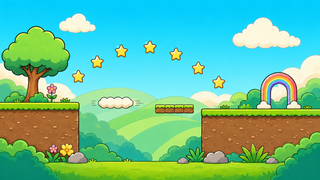
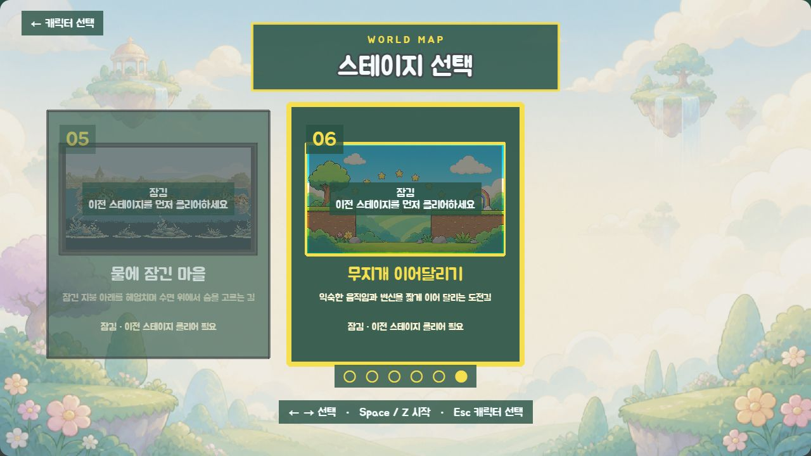
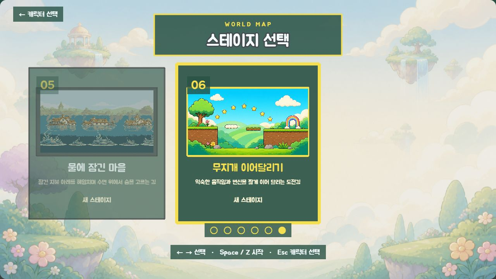
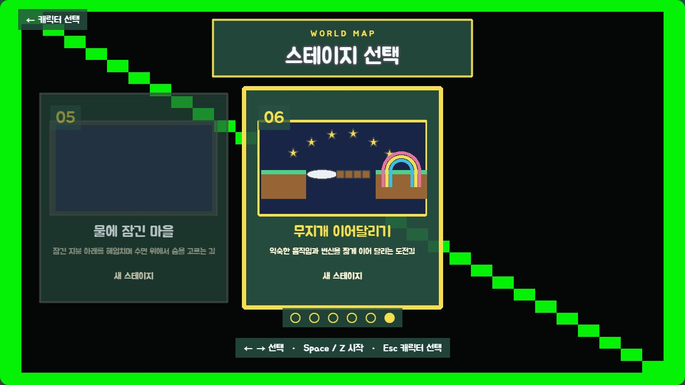

# C1 무지개 이어달리기 — 최종 검수

> 상태: 사용자 최종 승인 완료
> 작성일: 2026-09-04
> 선행 승인: `C1 규칙 승인`, `C1 코스 승인`, 사용자 `다음 단계 진행`에 의한 앵커 승인
> 최종 승인: 2026-09-04 사용자 `C1 최종 승인`

## 구현 결론

정규 5개 스테이지를 통과한 뒤 열리는 5,120px 챌린지 `level-06`과 6번 선택 카드 전용 미리보기를 연결했다. 스테이지 본편은 승인 규칙대로 기존 밝은 들판 배경·타일·기믹만 재사용하며, 새로 만든 런타임 이미지는 선택 카드 한 장뿐이다.

## 최종 선택 카드



- 런타임 파일: `assets/backgrounds/stage_preview_rainbow_relay.png`
- 생성 원본: `assets/_source/c1/c1_rainbow_relay_color_source_v1.png`
- 규격: 1280×720, 16:9
- 축소 검토본: 320×180
- 채도 픽셀 비율: 97.7%
- 구성: 시작 지형, 두 짧은 틈, 구름 이동 발판, 4칸 붕괴 발판, 별 7개 호, 안전 지면과 무지개 게이트
- 제외: 문자, 숫자, UI, 캐릭터, 적, 보스, 비밀 공간, 로고, 워터마크, 추가 별

## 카드 상태 검수

### 잠금 상태



### 검수용 해금 상태



### 강제 fallback 상태



- 잠금: 실제 진행 데이터가 없는 상태에서 이전 스테이지 클리어 안내가 카드 위에 표시된다.
- 해금 표시: `unlock=1`은 `visualReview=stage-select`에서만 쓰는 비영속 시각 검수 값이며 저장 진행도를 수정하지 않는다.
- 순차 해금 규칙: 자동 테스트에서 `level-05` 미클리어 시 `level-06` 잠금, 클리어 처리 뒤 해금을 확인했다.
- fallback: 전용 이미지가 없어도 양쪽 지형, 구름 발판, 4칸 발판, 별 호와 3중 무지개 게이트가 코드 도형으로 남는다.
- 세 상태 모두 선택 강조, 이름, 설명과 상태 문구가 겹치지 않았고 브라우저 warning/error는 0건이었다.

## 검수 주소

- 잠금: `http://localhost:4173/?visualReview=stage-select&stage=level-06`
- 검수용 해금: `http://localhost:4173/?visualReview=stage-select&stage=level-06&unlock=1`
- fallback: `http://localhost:4173/?visualReview=stage-select&stage=level-06&unlock=1&fallback=1`
- 시작 구간: `http://localhost:4173/?visualReview=level-06&section=relay_start&offset=160`
- 종료 구간: `http://localhost:4173/?visualReview=level-06&section=relay_finish&offset=160`

## 재현 절차

1. `node scripts/build-c1-challenge-preview.js`로 런타임 PNG와 축소 검토본을 재생성한다.
2. `npm run test`로 레벨 순서, 잠금/해금, C1 규칙과 쉬운 모드 불변성을 확인한다.
3. `npm run validate`로 레벨·manifest·mapping·실제 파일·통합 참조를 검사한다.
4. `npm run build`와 `git diff --check`를 실행한다.
5. 위 세 선택 카드 주소에서 정상·잠금·fallback 렌더링과 콘솔을 확인한다.

## 검증 결과

- `npm run test`: 통과
- `npm run validate`: 통과 — 플레이 6개, 개발 시험 3개, manifest 275개
- `npm run build`: 통과 — 기존 Phaser 청크 크기 경고만 유지
- `git diff --check`: 통과
- 브라우저 카드 3상태: warning/error 0건
- `stage_preview_rainbow_relay`: manifest·mapping·`level-06.assets.preview` 연결 완료

## 미실시 실제 플레이테스트

다음 항목은 자동 검사나 고정 화면 검수로 완료 처리하지 않았다.

- 키보드로 일반 모드 기본 경로 완주
- 키보드로 쉬운 모드 기본 경로 완주
- 실제 게임패드로 기본 경로 완주
- 실제 `level-05` 클리어 저장에서 6번 카드가 열리는 흐름
- 실제 `level-06` 게이트 통과 뒤 결과 화면과 스테이지 선택 복귀
- `fallback=1&effects=reduced&mute=1` 상태의 실제 완주

## 최종 이미지 생성 프롬프트

```text
Use case: precise-object-edit
Asset type: final 16:9 stage-select thumbnail for a friendly 2D side-scrolling children's game
Input images: Image 1 is the sole edit target and the user-approved grayscale composition anchor. Image 2 is a color and finish reference only.
Primary request: colorize Image 1 into a polished game-ready thumbnail using Image 2's bright cheerful palette and cel-cartoon finish.
EDIT TARGET AND INVARIANTS:
- Preserve Image 1's exact 16:9 framing, left starting ledge, large left tree, two center gaps, rounded cloud moving platform, four-block segmented crumble platform, seven-star arc, broad right landing ledge, banded rainbow arch gate, background hill layers, line weights, object count, object positions, proportions, spacing, and left-to-right visual flow.
- Change only color, lighting, and restrained cel-shaded surface finish. Do not redraw, add, remove, move, crop, rotate, relabel, merge, or replace any landmark.
- Keep the start ledge and finish gate fully inside the frame with generous edge padding.
Color palette: vivid cyan-blue sky; warm cream clouds; fresh lime and emerald grass and shrubs; warm brown soil and stones; golden-yellow collectible stars with pale highlights; a clearly banded pastel rainbow gate using coral, orange, yellow, green, cyan, and lavender; charcoal-purple outlines. Use Image 2 as the palette and finish reference.
Lighting/mood: bright clear daytime, cheerful and inviting, high legibility at small card size.
Style/medium: polished 2D cel-cartoon game art, crisp dark outlines, controlled flat fills, subtle soft shading, no photorealistic texture.
Constraints: no text, no letters, no numbers, no UI frame, no character, no enemy, no boss, no secret room, no logo, no watermark, no new objects, no extra stars, no sparkles; preserve exactly seven collectible five-point stars and the approved geometry; output one clean wide 16:9 landscape image.
```

## 종료 기록

1. 사용자 최종 승인을 기록했다.
2. C1 범위만 `feat: add rainbow relay challenge level`로 커밋한다.
3. Could 진행판에서 C1을 완료하고 C2 범위 확정 대기로 이동했다.

## 승인 문구

최종 카드와 현재 미실시 항목을 포함한 C1 구현은 다음 문구로 승인되었다.

`C1 최종 승인` — 2026-09-04
