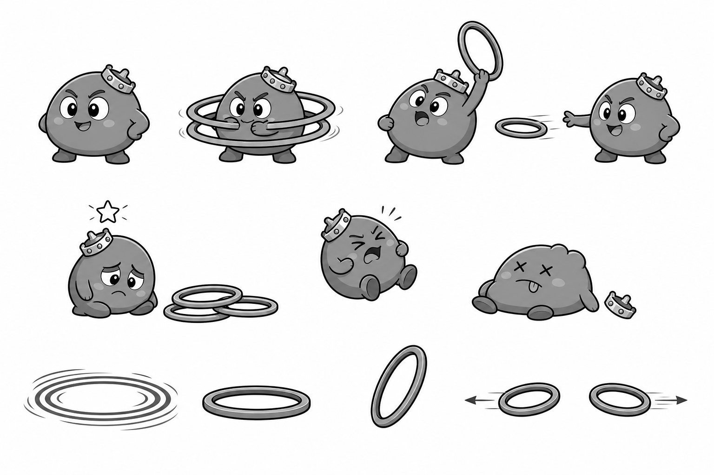
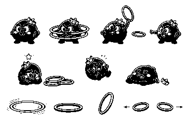

# P10 훌라후프대왕 흑백 아트 앵커 검토

> 상태: 승인 완료 — 2026-08-31 사용자 `P10 앵커 승인`
> 범위: 훌라후프대왕 본체, 회전 방어, 공격 예고·투척, 정지 약점, 피격·격파, 링 효과의 형태 승인
> 주의: 아래 이미지는 최종 컬러 에셋 제작 전 방향을 잠그는 흑백 콘셉트다. 게임 에셋·manifest·mapping에는 아직 등록하지 않았고 신규 SFX도 만들지 않았다.

## 1. 잠글 시각 방향

1. 사용자 영상 속 원안처럼 큰 원형·타원형 몸, 작은 팔, 짧은 다리를 핵심 정체성으로 유지한다.
2. 기존 감자대왕과 다른 보스로 읽히도록 몸은 더 둥글고 매끈하게, 왕관은 몸 실루엣을 가리지 않는 작은 머리띠형으로 둔다.
3. 회전 방어는 몸을 가로지르는 세 겹 링, 공격 예고는 머리 위로 든 링과 뒤로 젖힌 몸, 투척은 뻗은 팔과 분리된 링으로 구분한다.
4. 정지 약점은 몸을 가로지르는 링을 모두 없애고 바닥에 멈춘 링 묶음과 머리 위 별을 함께 보여준다.
5. 낮은 링은 넓고 납작한 타원, 점프 링은 세운 타원, 양방향 링은 서로 반대쪽을 향한 두 개의 분리된 링으로 만든다.

## 2. 검토 이미지

### 전체 흑백 앵커

위쪽은 대기·회전 방어·공격 예고·투척, 가운데는 정지 약점·피격·격파, 아래쪽은 회전 잔상·낮은 링·점프 링·양방향 링이다. 상태와 효과를 서로 겹치지 않게 배치했다.

### 25% 축소 확인

384×256에서도 몸을 가로지르는 세 겹 방어 링, 머리 위 예고 링, 바닥에 놓인 정지 링, 피격·격파 자세와 세 투사체 유형이 구분된다.

### 25% 이진 실루엣

중간 명암을 제거해도 회전 방어는 가로로 넓은 링 덩어리, 공격 예고는 위로 솟은 링, 정지 약점은 몸과 분리된 바닥 링, 투사체는 납작함·세움·양방향 개수 차이로 남는다.

## 3. 승인 뒤 잠글 제작 단위

| 역할 | 제안 프레임 | 용도 |
|---|---:|---|
| `idle` | 4 | 등장·회복 뒤 짧은 대기 |
| `spin` | 8 | 세 겹 링 회전 방어 반복 |
| `warning` | 4 | 최소 900ms 공격 예고 반복 |
| `throw` | 6 | 링을 들어 왼쪽으로 발사 |
| `vulnerable` | 4 | 링을 내려놓은 정지 약점 반복 |
| `hurt` | 3 | 유효 밟기 반동 |
| `defeated` | 8 | 왕관이 벗겨지고 주저앉는 1회 연출 |
| 회전 잔상 | 6 | 투명 PNG 반복 효과 |
| 링 투사체 | 3형 | 낮은 링·점프 링·양방향 링 공통 원본 |

캐릭터 스프라이트는 128×128 우향/좌향 중 런타임 진행 방향에 맞는 한 방향 원본을 만들고 반대 방향은 코드 반전을 사용한다. 정확한 duration과 baseline은 앵커 승인 뒤 최종 에셋을 제작하면서 실제 런타임 크기로 잠근다.

## 4. 최종 컬러 적용안

새 HEX를 추가하지 않고 `data/palette.js`의 승인 팔레트만 사용한다.

| 역할 | 적용안 |
|---|---|
| 몸 | `#DEB5C6` 기본, `#D294AC` 그림자 |
| 얼굴·강조 | `#F4FBFD`, `#42474E` |
| 왕관 | `#F5DF4F`, 어두운 부분 `#D09A4E` |
| 회전 링 3겹 | `#3DBFE3`, `#E573A0`, `#F5DF4F` |
| 위험 투사체 외곽 | `#752B5A`, 중심 하이라이트 `#F4FBFD` |
| 정지 약점 별 | `#F5DF4F`, 흰 반짝임 `#F4FBFD` |
| 공통 외곽선 | `#42474E` |

링 색은 공격 종류를 보조할 뿐이며, 높이·기울기·개수의 형태 차이를 항상 함께 유지한다.

## 5. 생성 기록

- 생성 방식: Codex 내장 이미지 생성 도구의 기본 built-in 모드
- 최종 선택 원본: `assets/_source/p10/p10_hula_king_anchor_generated_v1.png`
- 참조 입력: 사용자 영상 04:59~05:31의 훌라후프대왕 원안 화면, `assets/_anchor/potato_king_anchor.png`, `assets/_source/p6/p6_combat_devices_anchor_generated_v2.png`
- 참조 역할: 영상은 큰 원형 몸·작은 팔다리라는 사용자 원안을, 감자대왕 앵커는 게임의 굵은 선과 어린이용 표정을, P6 앵커는 세 행 흑백 접촉 시트와 분리 배치를 고정했다.
- 후처리: 선택 원본을 변경하지 않고 `scripts/build-p10-anchor-review.js`로 완전한 회색조 접촉 시트, 25% 축소본, 명암 기준 이진 실루엣을 생성했다.
- 검증 결과: 원본 1536×1024, 축소본 384×256, RGB 채널 최대 편차 0
- 생성 프롬프트: 사용자 원안의 큰 원형 몸과 작은 팔다리를 유지한 동일 캐릭터를 대기·세 겹 회전 방어·머리 위 링 예고·투척·바닥 링 정지 약점·피격·격파로 나누고, 하단에 회전 잔상·낮은 링·점프 링·양방향 링을 독립 배치한 3:2 흑백 접촉 시트를 요청했다. 텍스트·배경·현대 장치·무기·갑옷·망토·겹친 패널·색상을 금지했다.

## 6. 사용자 확인 게이트

다음 다섯 항목을 함께 확인한다.

- 사용자 원안의 큰 원형 몸과 작은 팔다리 정체성이 유지되는가.
- 회전 방어·공격 예고·투척·정지 약점이 색 없이 구분되는가.
- 낮은 링·점프 링·양방향 링이 작은 크기에서도 서로 다른 공격으로 읽히는가.
- 피격과 격파가 무섭지 않으면서도 전투 결과로 읽히는가.
- 제안 프레임 수와 팔레트로 최종 캐릭터·링 효과·SFX를 제작해도 되는가.

## 7. 승인 기록

2026-08-31 사용자가 **`P10 앵커 승인`**이라고 명시했다. 위 형태, 4/8/4/6/4/3/8 캐릭터 프레임, 회전 잔상 6프레임, 링 투사체 3형과 승인 팔레트를 최종 제작 기준으로 잠근다. 승인분을 커밋한 뒤 최종 컬러 스프라이트, 투명 링 효과, 신규 SFX, manifest·mapping 등록과 런타임 검증으로 이동한다.
