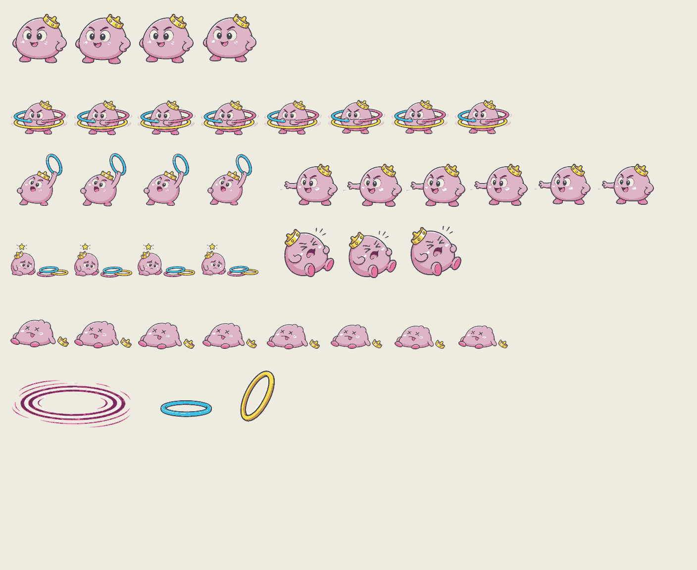
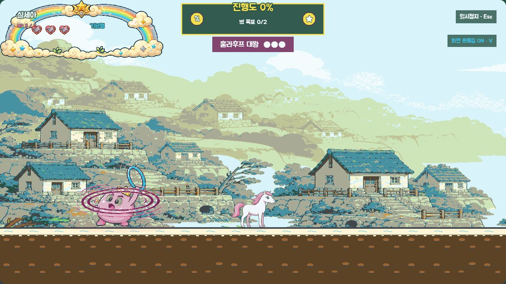
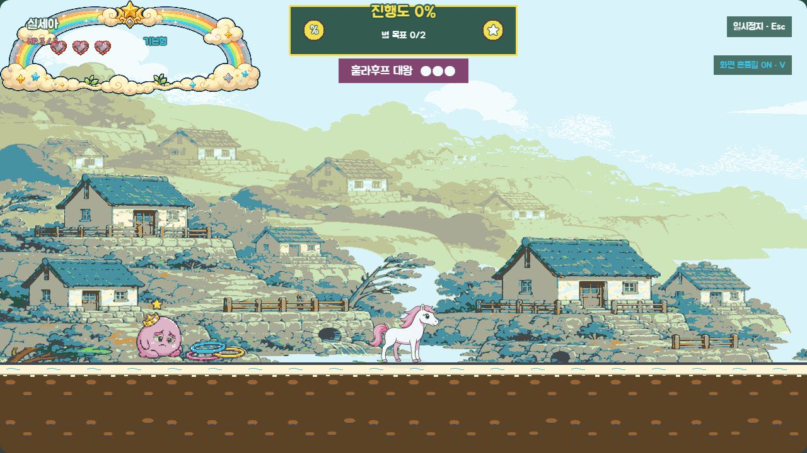

# P10 훌라후프대왕 최종 화면 검토

> 상태: 2026-09-01 사용자 최종 승인 완료 (`P10 최종 승인`)
> 범위: `level-04` 훌라후프대왕 7개 상태, 회전 방어, 두 탄도 링 투사체, 전용 SFX 5종
> 기준 앵커: `references/P10_HULA_ANCHOR_REVIEW.md`에서 2026-08-31 승인한 형태·프레임 수·팔레트

## 최종 에셋 시트

- 본체는 `idle/spin/warning/throw/vulnerable/hurt/defeated` 순서로 4/8/4/6/4/3/8프레임, 총 37프레임이다.
- 회전 방어 효과는 256×112, 낮은 링은 112×64, 점프 회피 링은 80×112 투명 PNG다.
- 모든 128×128 보스 프레임은 발 기준선 14~18px, 좌우 최소 여백 4px를 지키며 승인 팔레트 밖 픽셀은 0%다.
- 최종 이미지가 없거나 `?fallback=1`이면 기존 도형 보스·코드 생성 링·회전 타원 표시로 자동 전환한다.

## 실제 런타임

### 회전 방어

`spin_guard`에서는 본체를 감싼 세 겹 링과 단단한 표정이 함께 보인다. 이 상태의 점프 밟기는 보스 HP를 줄이지 않으며 접촉 피해와 180ms 재생 제한의 방어음을 적용한다.

### 발사 예고와 링 탄도

예고 자세는 한 링을 세워 탄도 변화를 색 없이도 먼저 알린다. 실제 volley는 낮은 가로 링과 점프 회피용 세로 링을 서로 다른 표시 크기·충돌 크기로 사용하고, 보스룸 진행 방향에 따라 발사 방향을 계산한다.

### 약점 노출

`vulnerable_rest`에서는 세 겹 방어 효과가 사라지고 링이 바닥에 놓이며 본체가 주저앉는다. 이 상태에서 머리 위로 떨어질 때만 유효 타격이 된다.

고정 검수 진입점은 다음과 같다.

- 회전: `/?visualReview=level-04&section=boss_hula&offset=1150&hula=spin`
- 예고: `/?visualReview=level-04&section=boss_hula&offset=1150&hula=warning`
- 약점: `/?visualReview=level-04&section=boss_hula&offset=1150&hula=vulnerable`
- 그 밖의 고정 상태: `hula=idle|throw|hurt|defeated`

## 효과음과 BGM

| 키 | 길이 | 연결 |
|---|---:|---|
| `sfx_hula_spin` | 0.62초 | 회전 방어 시작 |
| `sfx_hula_throw` | 0.34초 | 각 volley 발사 |
| `sfx_hula_guard` | 0.22초 | 회전 방어 접촉, 180ms 간격 제한 |
| `sfx_hula_weakness` | 0.46초 | 약점 상태 시작 |
| `sfx_hula_defeat` | 1.05초 | 격파 애니메이션 시작 |

모두 22050Hz mono 16-bit PCM WAV다. 별도 보스 곡은 추가하지 않고 기존 `bgm_boss`를 유지했다. 공용 보스 BGM 전환과 경고음 우선순위를 그대로 사용하므로 새 곡 도입에 따른 믹싱 회귀를 만들지 않는다. 음소거에서도 회전 링·세운 링·바닥 링으로 상태를 판독할 수 있다.

## 생성·가공 기록

- 생성 방식: Codex 내장 이미지 생성의 정밀 오브젝트 편집 모드
- 생성 결과 원본: `assets/_source/p10/p10_hula_king_color_source_v1.png`
- 알파 복원 원본: `assets/_source/p10/p10_hula_king_color_source_alpha_v1.png`
- 생성 요청: 승인된 흑백 시트의 캐릭터 정체성·표정·포즈·배치를 정확히 유지하고, 몸 `#DEB5C6/#D294AC`, 얼굴 `#F4FBFD`, 왕관 `#F5DF4F/#D09A4E`, 링 `#3DBFE3/#E573A0/#F5DF4F`, 위험 강조 `#752B5A`, 외곽선 `#42474E`만 적용한 투명 생산 시트를 요청했다. 문자·배경·추가 캐릭터·새 소품은 금지했다.
- 후처리: 생성 결과의 가장자리 연결 중성 배경과 체크무늬만 제거한 뒤 승인 팔레트 양자화, 기준선 정렬, 37개 프레임·3개 효과 분리, 시트 조립을 `scripts/build-p10-assets.js`로 재현 가능하게 만들었다.

## 검증 결과

- `npm run test` 통과: 100개 seed, 7개 애니메이션 계약, 방어 중 타격 차단
- `npm run validate` 통과: manifest 210개(시각 154·오디오 56), mapping 137개, 런타임 파일 215개
- 캐릭터 110프레임·46시트, 적 129프레임·29시트, 환경 효과 10개, 오디오 56개 규격·duration·baseline·알파·팔레트 검증 통과
- `npm run build` 통과
- `npm run test:soak` 통과: 60분 등가 216,000프레임, 훌라후프 Pool peak 8/10·거부 0, GC 후 heap +0.05MiB
- 실제 브라우저에서 회전·예고·약점·투사체 상태를 확인했고 콘솔 warning/error는 0건이다.

## 사용자 확인 게이트

- 회전 방어와 약점 노출이 색 없이 자세와 링 위치만으로 구분되는가.
- 본체 크기와 왕관·표정이 쓰나미 마을 배경에서 잘 읽히는가.
- 낮은 링과 점프 회피 링의 탄도가 충분히 다르게 보이는가.
- 전용 효과음 5종과 기존 `bgm_boss` 조합을 P10 최종본으로 잠가도 되는가.

2026-09-01 사용자가 **`P10 최종 승인`**이라고 명시했다. 최종 컬러 에셋·링 효과·SFX·런타임 연결을 P10 승인본으로 잠그며, 이후 P11에서는 이 에셋을 다시 만들지 않는다.
