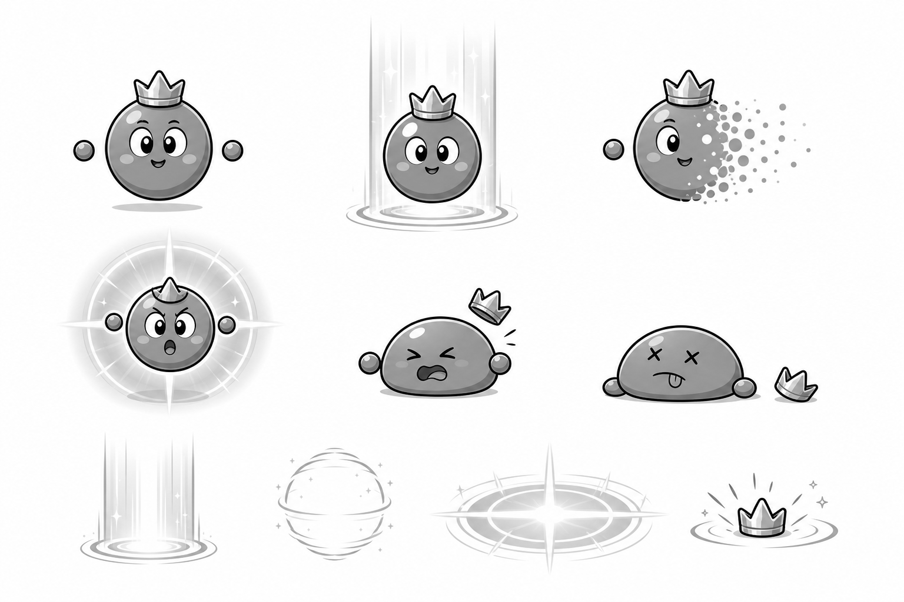
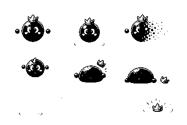

# P11 투명대왕 흑백 아트 앵커 검토

> 상태: 승인 완료 — 2026-09-01 사용자 `P11 앵커 승인`
> 범위: 투명대왕 본체, 빛 공개, 소멸 중간 형태, 실패 공격, 피격·격파, 빛·잔상 효과의 형태 승인
> 주의: 아래 이미지는 최종 컬러 에셋 제작 전 방향을 잠그는 흑백 콘셉트다. 게임 에셋·manifest·mapping에는 아직 등록하지 않았고 신규 SFX도 만들지 않았다.

## 1. 잠글 시각 방향

1. 완전한 구형 몸, 작은 3봉 왕관, 큰 눈과 작은 입을 핵심 정체성으로 유지한다.
2. 훌라후프대왕과 구분되도록 다리·몸통·의상을 없애고, 표현이 필요할 때만 몸에서 떨어진 작은 둥근 손 두 개를 사용한다.
3. 공개 상태는 세로 빛기둥과 바닥 원형 표식, 소멸은 몸 한쪽이 작은 점으로 흩어지는 형태로 구분한다.
4. 실패 공격은 보스 뒤의 큰 원형 파동과 가로·세로 십자 빛을 함께 사용해 색 없이도 위험 범위를 읽게 한다.
5. 피격은 옆으로 찌그러진 구와 살짝 뜬 왕관, 격파는 바닥에 납작해진 구와 분리된 왕관으로 만든다. 무섭거나 고통스러운 묘사는 사용하지 않는다.

## 2. 검토 이미지

### 전체 흑백 앵커

위쪽은 대기·빛 공개·소멸, 가운데는 실패 공격·피격·격파, 아래쪽은 공개 빛기둥·구형 잔상·십자 공격 파동·왕관 충격 효과다. 상태와 효과가 서로 겹치지 않게 배치되어 있다.

### 25% 축소 확인

384×256에서도 완전한 구, 빛기둥 안의 구, 한쪽이 점으로 흩어지는 구, 원·십자 실패 공격, 찌그러진 피격과 납작한 격파가 구분된다.

### 25% 이진 실루엣

중간 명암을 제거해도 대기의 원형 몸, 소멸 방향의 점무늬, 피격의 가로 찌그러짐, 격파의 낮은 실루엣과 떨어진 왕관이 남는다. 매우 옅은 빛은 이진본에서 사라지므로 최종 런타임에서는 빛 외곽선과 바닥 표식을 별도 효과 스프라이트로 유지한다.

## 3. 승인 뒤 잠글 제작 단위

| 역할 | 제안 프레임 | 용도 |
|---|---:|---|
| `idle` | 4 | 등장·회복 뒤 짧은 부유 대기 |
| `reveal` | 6 | 빛 안에서 완전히 나타나는 1회 연출 |
| `hide` | 6 | 한쪽부터 점으로 흩어져 사라지는 1회 연출 |
| `attack` | 6 | 기억 실패 뒤 원·십자 빛 공격 |
| `hurt` | 3 | 유효 밟기 뒤 가로로 찌그러지는 반동 |
| `defeated` | 8 | 몸이 납작해지고 왕관이 옆에 떨어지는 1회 연출 |
| 공개 빛기둥 | 6 | 위치 예고·공개 공용 투명 PNG 반복 효과 |
| 구형 잔상 | 4 | 소멸 뒤 짧게 남는 위치 기억 보조 효과 |
| 실패 공격 파동 | 6 | 큰 원과 십자선이 함께 확장되는 예고 효과 |

숨은 기억 창에서는 보스 캐릭터 이미지를 표시하지 않는다. 정확한 물리 위치와 후보 위치 표식은 승인된 회색 상자 규칙을 그대로 사용한다.

## 4. 최종 컬러 적용안

새 HEX를 추가하지 않고 `data/palette.js`의 승인 팔레트만 사용한다.

| 역할 | 적용안 |
|---|---|
| 몸 | `#9ADDF2` 기본, `#4691A2` 그림자 |
| 얼굴·하이라이트 | `#F4FBFD`, `#42474E` |
| 왕관 | `#F5DF4F`, 어두운 부분 `#D09A4E` |
| 공개 빛 | `#F5DF4F`, 중심 `#F4FBFD` |
| 소멸 점·잔상 | `#3DBFE3`, 외곽 `#F4FBFD` |
| 실패 공격 | `#D1333D`, 외곽 `#752B5A`, 십자 `#F4FBFD` |
| 공통 외곽선 | `#42474E` |

색은 상태를 보조할 뿐이며, 빛기둥·점 소멸·원과 십자·몸의 높이 차이를 항상 함께 유지한다.

## 5. 생성 기록

- 생성 방식: Codex 내장 이미지 생성 도구의 기본 built-in 모드
- 최종 선택 원본: `assets/_source/p11/p11_invisible_king_anchor_generated_v1.png`
- 참조 입력: `assets/_source/p10/p10_hula_king_anchor_generated_v1.png`, `assets/_anchor/potato_king_anchor.png`
- 참조 역할: P10 앵커는 굵은 선·친근한 표정·세 행 접촉 시트 배치만, 감자대왕 앵커는 단순한 게임 얼굴과 외곽선 굵기만 참고했다. 훌라후프·감자 실루엣·색은 복제하지 않았다.
- 후처리: 선택 원본을 변경하지 않고 `scripts/build-p11-anchor-review.js`로 완전한 회색조 접촉 시트, 25% 축소본, 명암 기준 이진 실루엣을 생성했다.
- 검증 결과: 원본 1536×1024, 축소본 384×256, RGB 채널 최대 편차 0
- 생성 프롬프트: 동일한 완전 구형 캐릭터와 작은 3봉 왕관을 대기·빛 공개·한쪽 점 소멸·원과 십자 실패 공격·찌그러진 피격·납작한 격파로 나누고, 하단에 공개 빛기둥·구형 잔상·십자 파동·왕관 충격을 독립 배치한 3:2 흑백 접촉 시트를 요청했다. 텍스트·색·배경·훌라후프·감자 몸·뿔·무기·갑옷·망토·겹친 패널을 금지했다.

## 6. 사용자 확인 게이트

다음 다섯 항목을 함께 확인한다.

- 완전한 구형 몸과 작은 왕관이 투명대왕의 정체성으로 적절한가.
- 빛 공개와 한쪽부터 점으로 사라지는 소멸이 색 없이 구분되는가.
- 원·십자 실패 공격이 작은 크기에서도 위험 범위로 읽히는가.
- 피격과 격파가 무섭지 않으면서도 전투 결과로 읽히는가.
- 제안 프레임 수와 승인 팔레트로 최종 캐릭터·효과·SFX를 제작해도 되는가.

## 7. 승인 기록

2026-09-01 사용자가 **`P11 앵커 승인`**이라고 명시했다. 위 형태, 4/6/6/6/3/8 캐릭터 프레임, 공개 빛기둥 6프레임, 구형 잔상 4프레임, 실패 공격 파동 6프레임과 승인 팔레트를 최종 제작 기준으로 잠근다. 승인분을 커밋한 뒤 최종 컬러 스프라이트, 투명 효과, 신규 SFX, manifest·mapping 등록과 런타임 검증으로 이동한다.
