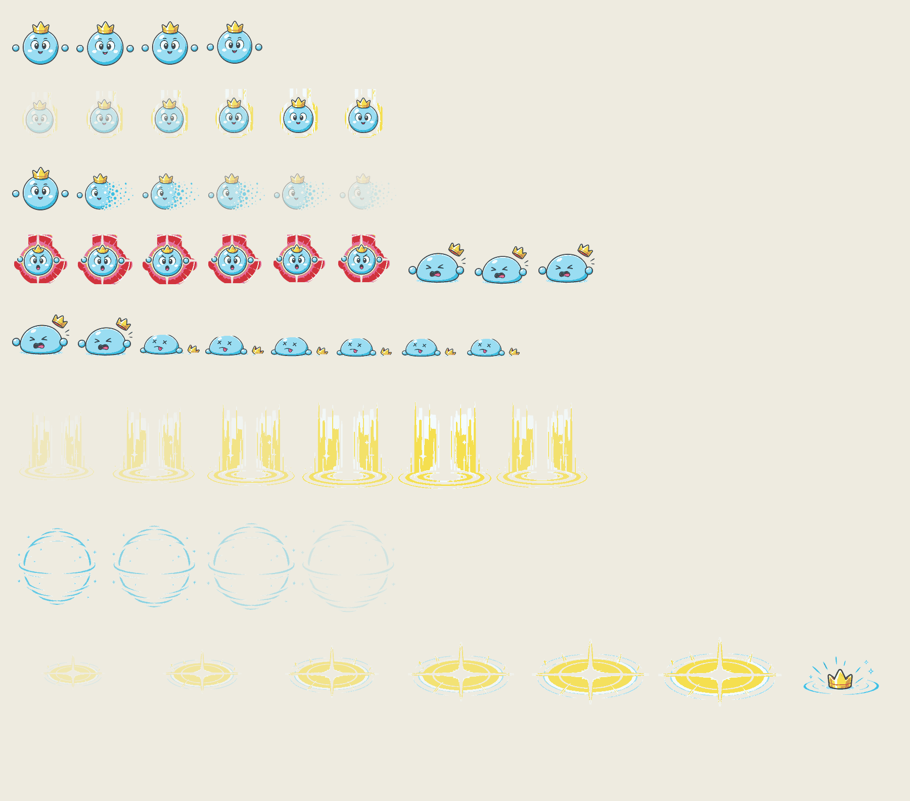
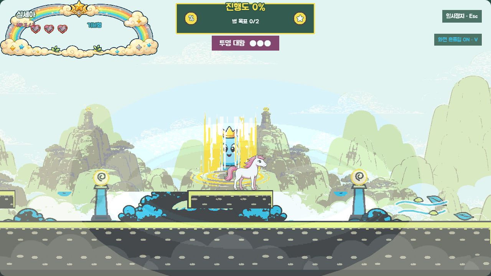
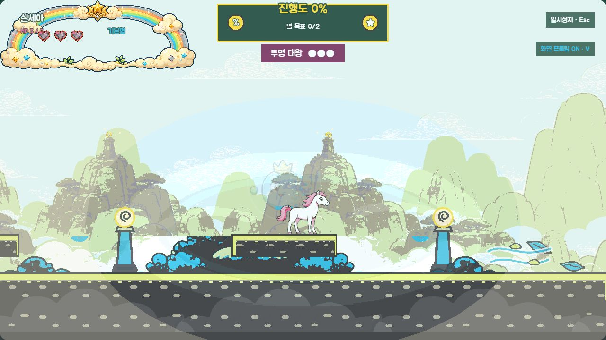
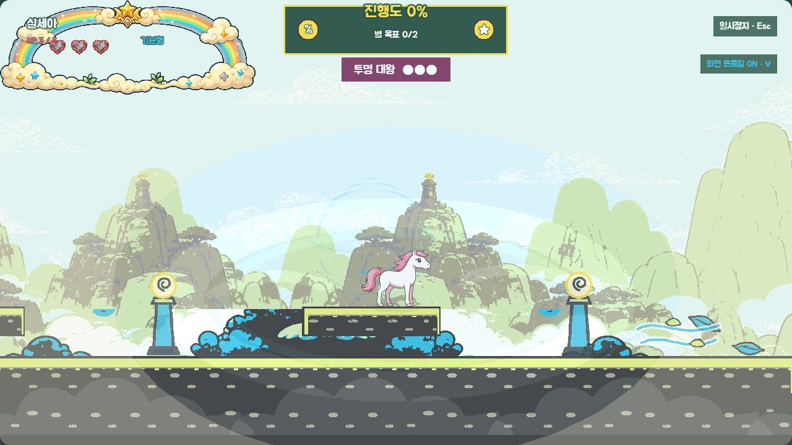
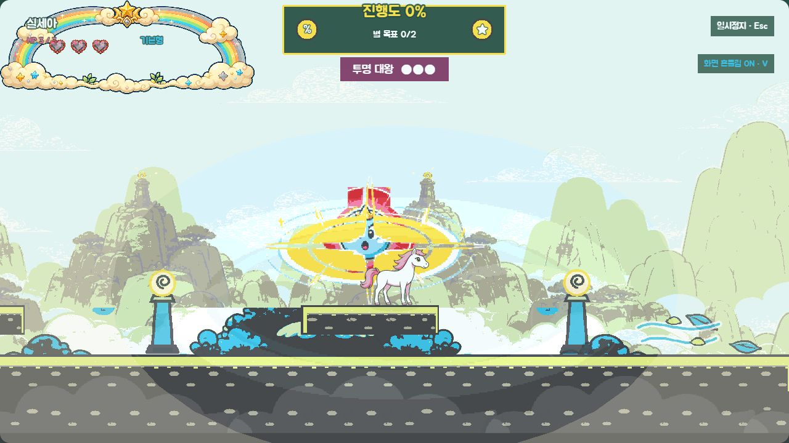
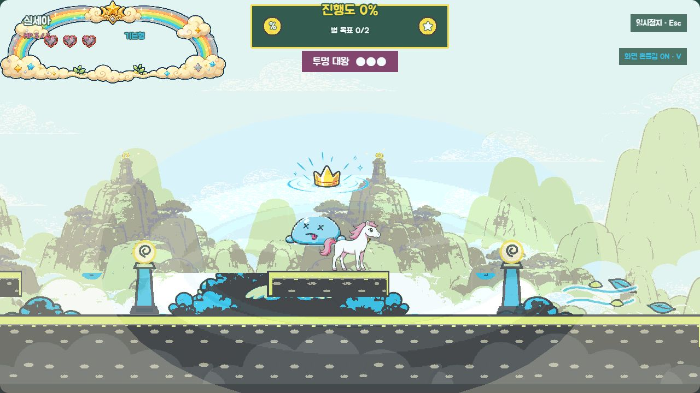
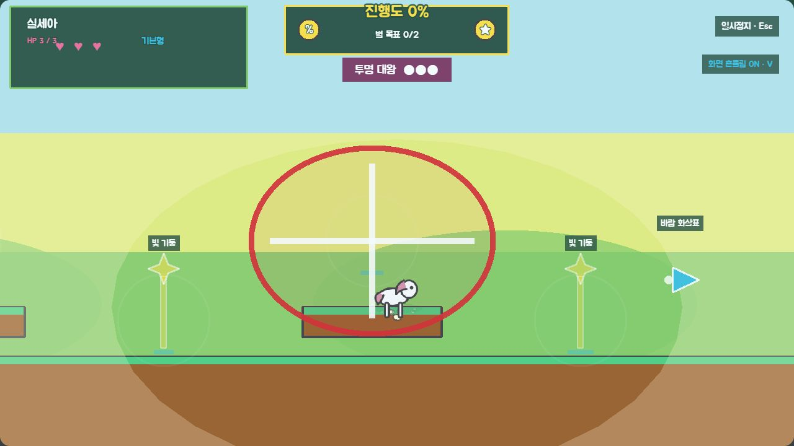

# P11 투명대왕 최종 화면 검토

> 상태: 2026-09-01 사용자 최종 승인 완료 (`P11 최종 승인`)
> 범위: `level-03` 투명대왕 6개 애니메이션, 빛 공개·점 소멸·위치 잔상·실패 공격·왕관 충격, 전용 SFX 5종
> 기준 앵커: `references/P11_INVISIBLE_ANCHOR_REVIEW.md`에서 승인한 구형 몸·3봉 왕관·4/6/6/6/3/8프레임과 팔레트

## 최종 에셋 시트

- 본체는 `idle/reveal/hide/attack/hurt/defeated` 순서로 4/6/6/6/3/8프레임, 총 33프레임이다.
- 공개 빛기둥 6프레임, 구형 잔상 4프레임, 실패 공격 6프레임과 정적 왕관 충격 효과를 분리했다.
- 128×128 본체 프레임은 발 기준선 14~18px를 지키고, 전체 본체·효과에서 승인 팔레트 밖 픽셀은 0%다.
- 최종 이미지가 없거나 `?fallback=1`이면 후보 원·코드 빛기둥·도형 실루엣·원/십자 공격으로 자동 전환한다.

## 실제 런타임

### 빛 공개

빛 예고 뒤 1.2초 동안 몸이 완전히 드러난다. 공개가 끝나면 420ms 동안 오른쪽부터 점으로 흩어지는 `hide` 애니메이션이 재생되며, 위치는 이동하지 않는다.

### 점 소멸과 기억 창

숨은 기억 창에서는 본체 알파가 0이고 물리 위치만 유지한다. 짧은 잔상이 사라진 뒤에도 다섯 후보 위치의 바닥 표식이 남아 색과 소리 없이 위치 규칙을 복기할 수 있다.

### 기억 실패 공격과 격파

기억 시간이 끝나면 보스가 나타나고 큰 원·가로/세로 십자 파동으로 공격 범위를 알린다. 유효 밟기에서는 찌그러진 `hurt`와 왕관 충격을, HP 0에서는 1.28초 `defeated`를 끝까지 보여 준다.

고정 검수 진입점은 다음과 같다.

- 공개: `/?visualReview=level-03&section=boss_invisible&offset=1400&invisible=revealed`
- 소멸: `/?visualReview=level-03&section=boss_invisible&offset=1400&invisible=hide`
- 기억: `/?visualReview=level-03&section=boss_invisible&offset=1400&invisible=memory`
- 실패 공격: `/?visualReview=level-03&section=boss_invisible&offset=1400&invisible=miss`
- 그 밖의 고정 상태: `invisible=relocate|warning|hit|defeated`

## fallback·접근성

`fallback=1&reducedEffects=1&mute=1`에서도 다섯 후보 위치, 선택 위치 단서와 큰 원·십자 공격 범위가 유지된다. 브라우저의 정상 상태 5종과 fallback 상태에서 console warning/error는 0건이었다.

## 효과음과 BGM

| 키 | 길이 | 연결 |
|---|---:|---|
| `sfx_invisible_warning` | 0.68초 | 위치 빛 예고 시작 |
| `sfx_invisible_reveal` | 0.72초 | 공개 시작 |
| `sfx_invisible_hide` | 0.48초 | 점 소멸 시작 |
| `sfx_invisible_attack` | 0.64초 | 기억 실패 공격 |
| `sfx_invisible_defeat` | 1.05초 | 격파 시작 |

모두 22050Hz mono 16-bit PCM WAV다. 별도 곡은 추가하지 않고 기존 `bgm_boss`를 유지했다.

## 생성·가공 기록

- 생성 방식: Codex 내장 이미지 생성의 정밀 편집 모드
- 생성 결과 원본: `assets/_source/p11/p11_invisible_king_color_source_v1.png`
- 생성 요청: 승인된 흑백 시트의 정체성·표정·포즈·배치를 유지하고 승인된 몸·왕관·공개·소멸·공격 팔레트만 적용했다. 문자·배경·추가 캐릭터·새 소품은 금지했다.
- 후처리: 연결 중성 배경 제거, 승인 팔레트 양자화, 기준선 정렬, 본체 33프레임·효과 17개 단위 분리와 시트 조립을 `scripts/build-p11-assets.js`로 재현 가능하게 만들었다.

## 검증 결과

- `npm run test` 통과: 100개 seed, 6개 애니메이션 계약, 공개 1200ms·소멸 420ms 잠금
- `npm run validate` 통과: manifest 225개(시각 164·오디오 61), mapping 142개, 런타임 파일 230개
- 적 162프레임·35시트, 환경 효과 14개, 오디오 61개 규격·duration·baseline·알파·팔레트 검증 통과
- `npm run build` 통과
- 실제 브라우저 정상 5상태와 fallback·효과 약하게·음소거 상태에서 console warning/error 0건

## 사용자 확인 게이트

- 빛기둥 공개와 오른쪽부터 점으로 사라지는 소멸이 즉시 구분되는가.
- 본체가 사라진 기억 창에서 직전 위치를 기억해 밟는 규칙이 읽히는가.
- 큰 원·십자 실패 공격이 색 없이도 위험 범위로 보이는가.
- 찌그러진 피격과 납작한 격파가 어린이 대상 톤을 유지하는가.
- 전용 SFX 5종과 기존 `bgm_boss` 조합을 P11 최종본으로 잠가도 되는가.

2026-09-01 사용자가 **`P11 최종 승인`**이라고 명시했다. 최종 컬러 에셋·투명 효과·SFX·런타임 연결을 P11 승인본으로 잠그며, 이후 P12에서는 이 에셋을 다시 만들지 않는다.
