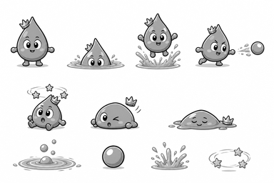
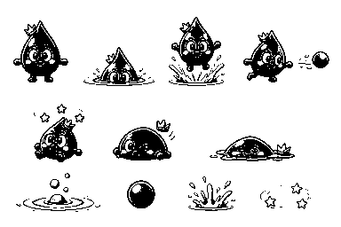

# P12 물대왕 흑백 아트 앵커 검토

> 상태: 승인 완료 — 2026-09-02 사용자 `P12 앵커 승인`
> 범위: 물대왕 본체, 잠수·출현·물 발사·어지러움·피격·격파, 파문·기포·물방울·튀김 효과의 형태 승인
> 주의: 아래 이미지는 최종 컬러 에셋 제작 전 방향을 잠그는 흑백 콘셉트다. 게임 에셋·manifest·mapping에는 아직 등록하지 않았고 신규 SFX도 만들지 않았다.

## 1. 잠글 시각 방향

1. 사용자 영상 원안의 세로 물방울형 몸, 뾰족한 머리, 짧은 둥근 팔, 아주 짧은 다리와 친근한 얼굴을 핵심 정체성으로 유지한다.
2. 다른 대왕과 구분되도록 둥근 공·감자 몸을 쓰지 않고, 물방울 끝을 가리지 않는 작은 3봉 왕관만 옆으로 기울여 둔다.
3. 잠수는 얼굴 윗부분만 웅덩이에 남기고, 출현은 몸 전체가 위로 솟으며 아래쪽 물튀김을 크게 보여 구분한다.
4. 물 발사는 앞으로 기울인 몸·뻗은 팔·본체와 분리된 둥근 물방울로 읽게 한다.
5. 어지러움은 낮게 주저앉은 몸과 회전 별 세 개, 피격은 옆으로 찌그러진 몸과 뜬 왕관, 격파는 낮은 물웅덩이와 옆에 놓인 왕관으로 만든다. 무섭거나 고통스러운 묘사는 사용하지 않는다.

## 2. 검토 이미지

### 전체 흑백 앵커

위쪽은 대기·잠수·출현·물 발사, 가운데는 어지러움 약점·피격·격파, 아래쪽은 파문과 기포·물 투사체·출현 튀김·회전 별 효과다. 상태와 효과가 서로 겹치지 않게 배치되어 있다.

### 25% 축소 확인

384×256에서도 뾰족한 물방울 몸, 얼굴만 남은 잠수, 위로 솟는 출현, 분리된 물 투사체, 회전 별 약점과 낮은 격파 실루엣이 구분된다.

### 25% 이진 실루엣

중간 명암을 제거해도 대기의 뾰족한 몸, 잠수의 낮은 수면선, 출현의 큰 튀김, 발사의 전방 물방울, 어지러움 별 세 개와 격파의 낮은 웅덩이가 남는다. 얇은 파문은 이진본에서 일부 사라지므로 최종 런타임에서는 굵은 외곽 파문을 별도 효과 스프라이트로 유지한다.

## 3. 승인 뒤 잠글 제작 단위

| 역할 | 제안 프레임 | 용도 |
|---|---:|---|
| `idle` | 4 | 웅덩이에서 나온 짧은 대기 |
| `submerge` | 6 | 몸이 낮아져 수면 아래로 사라지는 1회 연출 |
| `emerge` | 6 | 웅덩이에서 위로 솟는 1회 연출 |
| `attack` | 6 | 몸을 기울여 물방울을 발사하는 1회 연출 |
| `dizzy` | 4 | 5/4/3초 약점 동안 주저앉아 별이 도는 반복 |
| `hurt` | 3 | 유효 밟기 뒤 옆으로 찌그러지는 반동 |
| `defeated` | 8 | 낮은 물웅덩이가 되고 왕관이 옆에 놓이는 1회 연출 |
| 파문·기포 | 6 | 출현 위치 경고 반복 효과 |
| 물 투사체 | 4 | 하이라이트가 회전하는 원형 탄환 반복 |
| 출현 튀김 | 6 | `emerge` 아래에 분리 합성하는 1회 효과 |
| 어지러움 별 | 4 | 약점 상태를 색 없이 보조하는 반복 효과 |

캐릭터 스프라이트는 128×128 한 방향 원본을 만들고 반대 방향은 코드 반전을 사용한다. 잠수·출현 위치와 물리 판정은 승인된 회색 상자 `bossPools` 좌표를 그대로 사용한다.

## 4. 최종 컬러 적용안

새 HEX를 추가하지 않고 `data/palette.js`의 승인 팔레트만 사용한다.

| 역할 | 적용안 |
|---|---|
| 몸 | `#3DBFE3` 기본, `#4691A2` 그림자 |
| 얼굴·물 하이라이트 | `#F4FBFD`, 외곽 `#42474E` |
| 왕관 | `#F5DF4F`, 어두운 부분 `#D09A4E` |
| 웅덩이·파문 | `#9ADDF2`, 중심 `#F4FBFD` |
| 물 투사체·튀김 | `#3DBFE3`, 밝은 부분 `#9ADDF2` |
| 어지러움 별 | `#F5DF4F`, 흰 반짝임 `#F4FBFD` |
| 공통 외곽선 | `#42474E` |

색은 상태를 보조할 뿐이며, 몸 높이·튀김·전방 탄환·회전 별·낮은 웅덩이의 형태 차이를 항상 함께 유지한다.

## 5. 생성 기록

- 생성 방식: Codex 내장 이미지 생성 도구의 기본 built-in 모드
- 최종 선택 원본: `assets/_source/p12/p12_water_king_anchor_generated_v1.png`
- 영상 검토본: `assets/_source/p12/p12_video_reference_contact.png`, `p12_video_reference_0418.png`, `p12_video_reference_0434.png`
- 사용자 원안 확인: 영상 04:18 프레임의 세로 물방울 몸·짧은 팔과 다리, 03:48~04:46의 웅덩이 이동·어지러움·물 공격 설명
- 참조 입력: `assets/_source/p12/p12_video_reference_0418.png`, `assets/_source/p11/p11_invisible_king_anchor_generated_v1.png`, `assets/_anchor/potato_king_anchor.png`
- 참조 역할: 영상 프레임은 물방울형 원안만, P11 앵커는 굵은 선·친근한 표정·세 행 접촉 시트 배치만, 감자대왕 앵커는 단순한 게임 얼굴과 외곽선 굵기만 참고했다. 둥근 몸과 기존 보스 실루엣은 복제하지 않았다.
- 후처리: 선택 원본을 변경하지 않고 `scripts/build-p12-anchor-review.js`로 완전한 회색조 접촉 시트, 25% 축소본, 명암 기준 이진 실루엣을 생성했다.
- 검증 결과: 원본 1536×1024, 축소본 384×256, RGB 채널 최대 편차 0
- 생성 프롬프트: 동일한 물방울형 캐릭터와 작은 왕관을 대기·잠수·출현·물 발사·어지러움·피격·격파로 나누고, 하단에 파문/기포·원형 물 투사체·출현 튀김·회전 별을 독립 배치한 3:2 흑백 접촉 시트를 요청했다. 텍스트·색·배경·둥근 공/감자 몸·훌라후프·무기·갑옷·망토·겹친 패널을 금지했다.

## 6. 사용자 확인 게이트

다음 다섯 항목을 함께 확인한다.

- 사용자 원안의 물방울형 몸·짧은 팔과 다리 정체성이 유지되는가.
- 잠수·출현·물 발사·어지러움이 색 없이 구분되는가.
- 파문/기포·물 투사체·튀김·회전 별이 작은 크기에서도 서로 다른 효과로 읽히는가.
- 피격과 격파가 무섭지 않으면서도 전투 결과로 읽히는가.
- 제안 프레임 수와 승인 팔레트로 최종 캐릭터·효과·SFX를 제작해도 되는가.

## 7. 승인 기록

2026-09-02 사용자가 **`P12 앵커 승인`**이라고 명시했다. 위 형태, 4/6/6/6/4/3/8 캐릭터 프레임, 파문·기포 6프레임, 물 투사체 4프레임, 출현 튀김 6프레임, 어지러움 별 4프레임과 승인 팔레트를 최종 제작 기준으로 잠근다. 승인분을 커밋한 뒤 최종 컬러 스프라이트·효과·전용 SFX·manifest/mapping 등록과 런타임 검증으로 이동한다.
