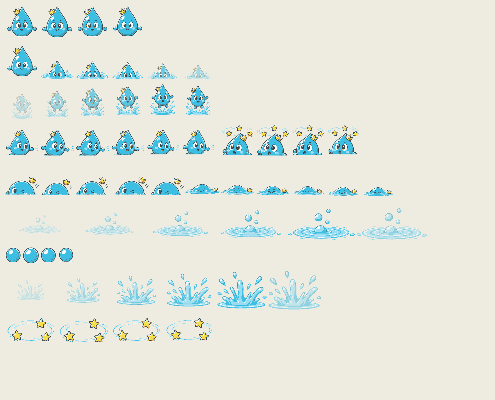
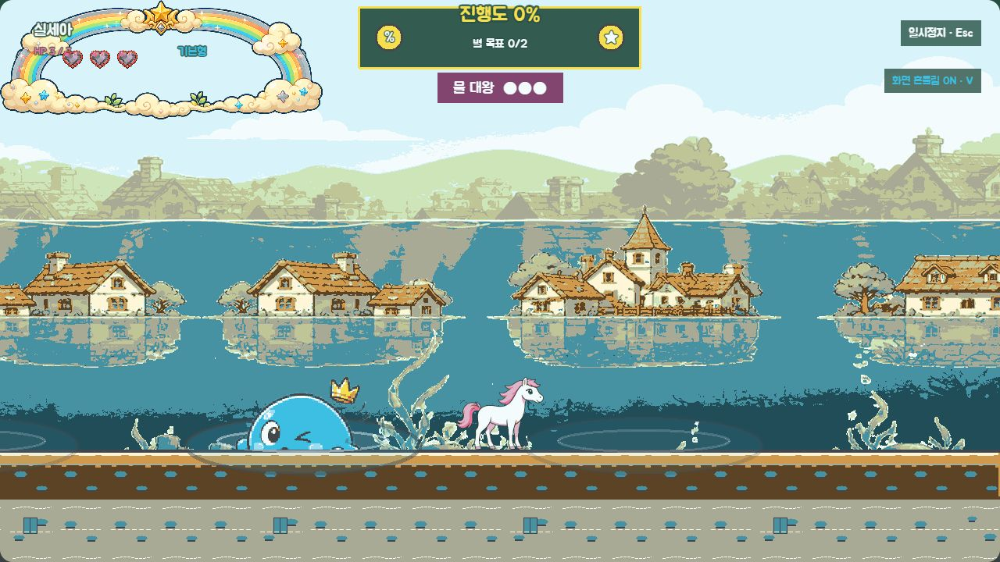
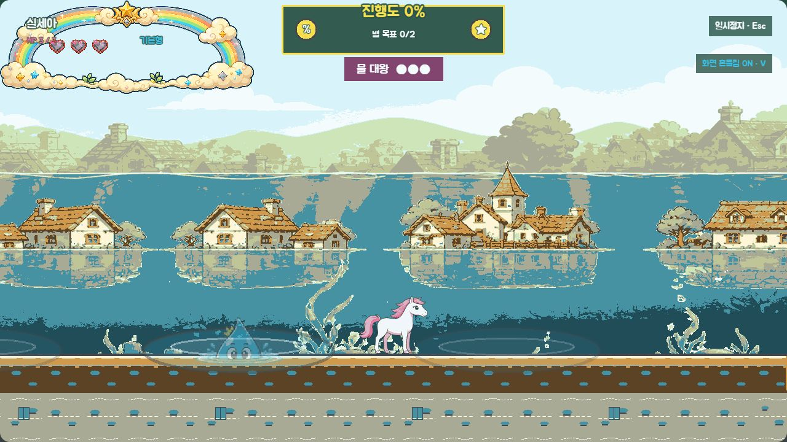
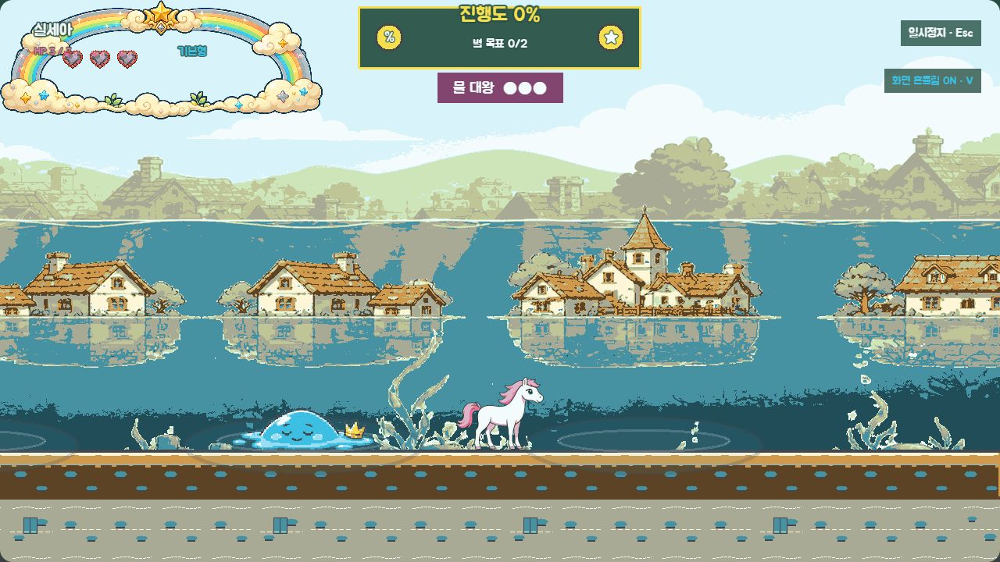

# P12 물대왕 최종 화면 검토

> 상태: 2026-09-02 사용자 최종 승인 완료 (`P12 최종 승인`)
> 범위: `level-05` 물대왕 7개 애니메이션, 웅덩이 파문·물 투사체·출현 물보라·어지러움 별, 전용 SFX 6종
> 기준 앵커: `references/P12_WATER_ANCHOR_REVIEW.md`에서 승인한 물방울형 몸·작은 왕관·4/6/6/6/4/3/8프레임과 팔레트

## 최종 에셋 시트

- 본체는 `idle/submerge/emerge/attack/dizzy/hurt/defeated` 순서로 4/6/6/6/4/3/8프레임, 총 37프레임이다.
- 웅덩이 파문 6프레임, 구형 물 투사체 4프레임, 출현 물보라 6프레임, 어지러움 별 궤도 4프레임을 분리했다.
- 128×128 본체와 독립 효과는 승인 팔레트 밖 픽셀 0%, 투명 모서리와 발 기준선 검사를 통과한다.
- 이미지가 없거나 `?fallback=1`이면 기존 도형 물방울 몸·코드 파문·기포·별·투사체로 자동 전환한다.

## 실제 런타임

### 웅덩이 예고와 출현 공격

선택 웅덩이는 본체가 나오기 전에 확장 파문과 상승 기포로 표시한다. 출현 순간에는 세로 물보라와 본체 자세를 겹치고, 단계별 1/2/3개의 물 투사체를 플레이어 방향으로 발사한다.

### 약점·피격·잠수

어지러움 동안만 유효 타격이 가능하다. 일반 모드는 5/4/3초, 쉬운 모드는 정확히 6/5/4초이며, 카운다운과 별 궤도를 함께 사용한다. 피격은 납작한 몸과 왕관 분리, 잠수는 수면 아래로 내려가는 반투명 키포즈로 구분한다.

### 격파

HP 0에서는 1.34초 이상의 8프레임 격파를 끝까지 보여 준 뒤 보스를 비활성화한다. 과격한 폭발 대신 편안한 표정의 낮은 물웅덩이와 옆으로 놓인 왕관을 사용한다.

고정 검수 진입점은 다음과 같다.

- 예고: `/?visualReview=level-05&section=boss_water&offset=1400&water=warning`
- 출현 공격: `/?visualReview=level-05&section=boss_water&offset=1400&water=emerge`
- 약점: `/?visualReview=level-05&section=boss_water&offset=1400&water=dizzy`
- 피격: `/?visualReview=level-05&section=boss_water&offset=1400&water=hit`
- 잠수: `/?visualReview=level-05&section=boss_water&offset=1400&water=submerge`
- 격파: `/?visualReview=level-05&section=boss_water&offset=1400&water=defeated`

## fallback·접근성

`fallback=1&reducedEffects=1&mute=1`에서도 네 웅덩이, 물방울 실루엣, 회전 별과 5초 카운다운이 유지된다. 보스 웅덩이는 기존 `waterZones`와 분리되어 숨 0·입수/출수 이벤트를 만들지 않는다. 브라우저의 정상 6상태와 fallback 상태에서 console warning/error는 0건이었다.

## 효과음과 BGM

| 키 | 길이 | 연결 |
|---|---:|---|
| `sfx_water_warning` | 0.62초 | 선택 웅덩이 예고 |
| `sfx_water_emerge` | 0.52초 | 출현 물보라 |
| `sfx_water_attack` | 0.38초 | 물 투사체 volley |
| `sfx_water_dizzy` | 0.58초 | 약점 시작 |
| `sfx_water_submerge` | 0.44초 | 잠수 시작 |
| `sfx_water_defeat` | 1.08초 | 격파 시작 |

모두 22050Hz mono 16-bit PCM WAV다. 별도 곡은 추가하지 않고 기존 `bgm_boss`를 유지했다.

## 생성·가공 기록

- 생성 방식: Codex 내장 이미지 생성의 정밀 편집 모드
- 생성 결과 원본: `assets/_source/p12/p12_water_king_color_source_v1.png`
- 생성 요청: 승인된 흑백 시트의 실루엣·표정·포즈·배치를 유지하고 승인된 파랑 몸·금빛 왕관·물·별 팔레트만 적용했다. 문자·배경·추가 캐릭터·새 소품은 금지했다.
- 후처리: 연결 체크 배경 제거, 승인 팔레트 양자화, 기준선 정렬, 본체 37프레임·효과 20프레임 분리와 시트 조립을 `scripts/build-p12-assets.js`로 재현 가능하게 만들었다.

## 검증 결과

- `npm run test` 통과: 100개 seed, 7개 애니메이션 계약, 잠수 480ms·출현 520ms·격파 1.34초 이상 잠금
- `npm run validate` 통과: manifest 242개(시각 175·오디오 67), mapping 147개, 런타임 파일 247개
- 적 162프레임·35시트, 환경 효과 18개, 오디오 67개 규격·duration·baseline·알파·팔레트 검증 통과
- `npm run build` 통과
- 실제 브라우저 정상 6상태와 fallback·효과 약하게·음소거 상태에서 console warning/error 0건

## 사용자 확인 게이트

- 파문·기포 예고와 출현 물보라가 본체보다 먼저 읽히는가.
- 물 투사체와 약점 별 궤도가 색 없이도 서로 다른 역할로 보이는가.
- 일반 5/4/3초와 쉬움 6/5/4초 약점 규칙을 이 화면·리듬으로 잠가도 되는가.
- 납작한 피격, 반투명 잠수, 편안한 물웅덩이 격파가 어린이 대상 톤을 유지하는가.
- 전용 SFX 6종과 기존 `bgm_boss` 조합을 P12 최종본으로 잠가도 되는가.

2026-09-02 사용자가 **`P12 최종 승인`**이라고 명시했다. 최종 컬러 에셋·물 효과·SFX·런타임 연결을 P12 승인본으로 잠그며, 이후 P13에서는 이 에셋을 다시 만들지 않는다.
