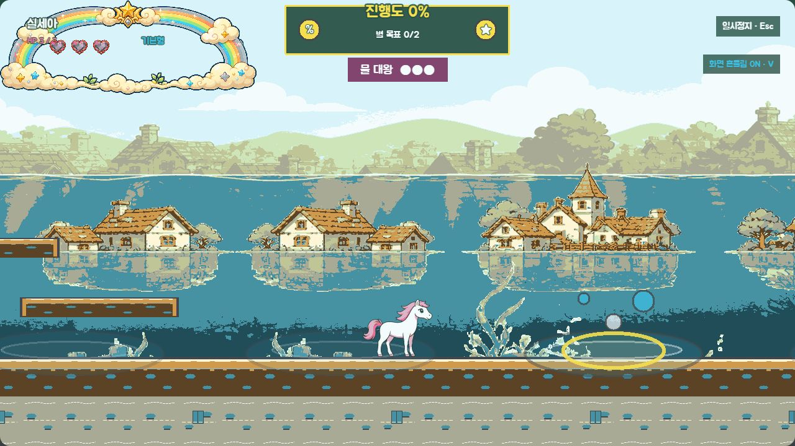
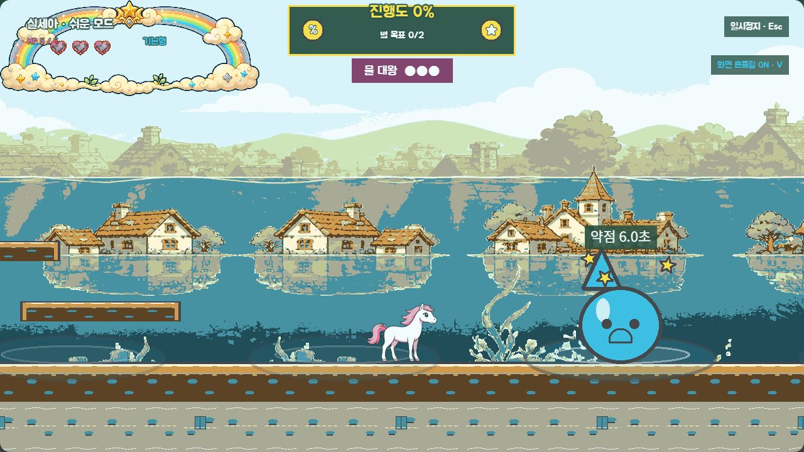
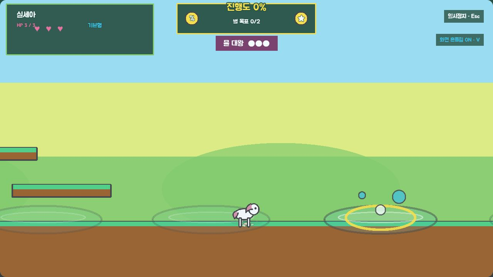

# P12 물대왕 회색 상자 검수

> 상태: 승인 완료 — 2026-09-02 사용자 `P12 코스 승인`
> 범위: `level-05` 우측 보스룸, 네 웅덩이 이동, 물방울 공격, 어지러움 약점, 일반·쉬움·효과 약하게·음소거·fallback
> 제외: 최종 물대왕 아트, 전용 애니메이션, 신규 SFX

## 1. 전투 상태도

```text
pool_hidden (다음 웅덩이 선택·잠수)
  → pool_warning (최소 0.9초, 파문+기포)
  → emerge_attack (출현+물방울 1/2/3개)
  → dizzy_vulnerable (5/4/3초, 쉬움 6/5/4초)
      ├─ 위에서 밟기 성공 → hit → submerge → pool_hidden
      ├─ 시간 종료 → submerge → pool_hidden
      └─ 약점 밖 접촉 → 피해 없는 안전 반동 → submerge
  → HP 0 → defeated → 게이트 1회 생성 → 자동 클리어
```

같은 웅덩이는 연속 선택하지 않고, 가능한 후보가 있으면 플레이어와 280px 이상 떨어진 웅덩이를 우선한다. 선택은 레벨 Seed에서 파생한 `SeededRandom`만 사용한다.

## 2. 잠금 수치

| 항목 | 1페이즈 | 2페이즈 | 3페이즈 |
|---|---:|---:|---:|
| 약점 시간 — 일반 | 5.0초 | 4.0초 | 3.0초 |
| 약점 시간 — 쉬움 | 6.0초 | 5.0초 | 4.0초 |
| 물방울 수 | 1 | 2 | 3 |
| 물방울 속도 | 300 | 335 | 370 |
| 경고 기준 | 1,000ms | 950ms | 900ms |

- HP와 유효 밟기는 일반·쉬움 모두 3회다.
- 쉬운 모드는 배수 계산을 섞지 않고 정확한 6/5/4초를 사용한다.
- 어지러움이 아닐 때 접촉해도 HP를 빼지 않는다. 플레이어를 수평 180·수직 -420으로 안전 반동시키고 보스를 잠수시킨다.
- 물방울은 `ObjectPool` 최대 12개를 사용하며, 실제 전투에서는 수명 종료·화면 이탈 때 즉시 반환한다.
- 물방울 피해는 `HealthManager.takeDamage(..., { type: "water_king_projectile" })` 한 경로만 사용한다.

## 3. 보스룸과 수중 시스템 분리

기존 `level-05`의 `0~8,192` 좌표와 세 대형 수중 구간은 그대로 두고 오른쪽에 2,048px을 추가했다.

| 항목 | 값 |
|---|---:|
| 기존 코스 끝 / 보스룸 시작 | x=8,192 |
| 보스룸 끝 / world width | x=10,240 |
| 보스 직전 완전 회복 | x=8,064 |
| 새 출구 | x=10,064 |
| 지상 바닥 높이 | y=576 |

| 보스 전용 웅덩이 | 중심 x | 폭 × 깊이 |
|---|---:|---:|
| `pool_left` | 8,464 | 304 × 72 |
| `pool_mid_left` | 8,900 | 304 × 72 |
| `pool_mid_right` | 9,340 | 304 × 72 |
| `pool_right` | 9,776 | 304 × 72 |

네 웅덩이는 `boss.bossPools`에만 있으며 `environment.waterZones`에는 들어가지 않는다. 따라서 웅덩이를 밟거나 건너도 입수·출수·숨 소모·숨 0 피해가 발생하지 않는다. 보스 section 진입 동안 숨 시스템을 중지하고, 직전 체크포인트는 HP·비행 에너지·숨을 모두 회복한다.

## 4. 판독성과 접근성

- 선택된 웅덩이는 두꺼운 타원 파문과 크기가 다른 기포 세 개로 출현 위치를 먼저 알린다.
- 출현 상태는 물방울형 본체와 외곽선이 있는 원형 물 투사체를 동시에 보여 준다.
- 약점 상태는 회전하는 별 세 개와 `약점 N.N초` 카운다운을 함께 표시한다.
- 약점 이외의 상태에서는 보스 HP가 줄지 않아 공격 가능 상태를 일관되게 학습할 수 있다.
- 화면 효과 `약하게`와 음소거에서도 파문·기포·별·카운다운이 유지된다.
- fallback에서는 외부 보스 에셋 없이 같은 코드 도형과 물리 판정으로 전투를 확인할 수 있다.

## 5. 고정 상태 검수 진입점

기준 주소:

`http://localhost:5173/?visualReview=level-05&section=boss_water&offset=800`

- 실제 반복: 기준 주소에서 `water`를 생략
- 잠수: `&water=hidden`
- 웅덩이 경고: `&water=warning`
- 출현·물방울: `&water=emerge`
- 어지러움 약점: `&water=dizzy`
- 피격 / 잠수 / 격파: `&water=hit`, `&water=submerge`, `&water=defeated`
- 쉬운 모드 약점: `&water=dizzy&easy=1`
- 효과 약하게·음소거: `&effects=reduced&mute=1`
- 도형·무음 fallback: `&fallback=1`
- 캐릭터 변경: `&character=silsea` 또는 `&character=potato89`
- 디버그 패널: `&debug=1` (` 키로 숨김)

고정 상태에서는 상태 타이머와 접촉 전이를 멈춘다. `emerge`의 물방울도 화면 비교를 위해 공격 경로 중간에 정지하지만, 실제 반복에서는 속도·수명·화면 이탈 반환을 그대로 사용한다.

## 6. 대표 화면

### 웅덩이 경고



### 출현과 물방울 공격


### 일반 모드 약점 5초


### 쉬운 모드 약점 6초



### 도형·무음 fallback 경고



## 7. 검증 결과

- `npm run test`: 통과 — 100개 Seed × 24회 선택에서 같은 웅덩이 연속 선택과 280px 미만 근접 선택 없음
- `npm run validate`: 통과 — 보스 정의·행동 등록·phase·tilemap 폭·목표·체크포인트·웅덩이/수중 분리 확인
- `npm run build`: 통과
- 정상 경고·출현·약점, 쉬운 모드 6초 약점, `effects=reduced&mute=1&fallback=1`을 1280×720 런타임에서 확인
- 위 브라우저 상태 모두 콘솔 오류·경고 0건
- 기존 세 `waterZones`의 좌표·숨 수치와 일반 코스 구조는 변경하지 않음

## 8. 사용자 확인 항목

- 보스룸을 이동할 때 네 웅덩이의 순서·간격과 현재 출현 위치가 읽히는가
- 파문·기포 경고 뒤 출현하는 흐름이 충분히 명확한가
- 물방울 1→2→3개와 속도 증가가 공정해 보이는가
- 일반 5/4/3초, 쉬움 6/5/4초 약점 시간이 적당한가
- 약점 밖 접촉의 피해 없는 안전 반동 규칙이 적당한가
- 기존 침수 마을 분위기를 유지하면서 보스 전용 얕은 웅덩이가 수중 구간과 구별되는가

## 9. 승인 기록

2026-09-02 사용자가 `P12 코스 승인`이라고 명시했다. 안전 반동과 일반 5/4/3초·쉬움 6/5/4초를 포함한 이 회색 상자를 기준으로 흑백 아트 앵커를 제작하며, 최종 컬러 에셋과 전용 오디오는 별도의 앵커 승인 전까지 만들지 않는다.
