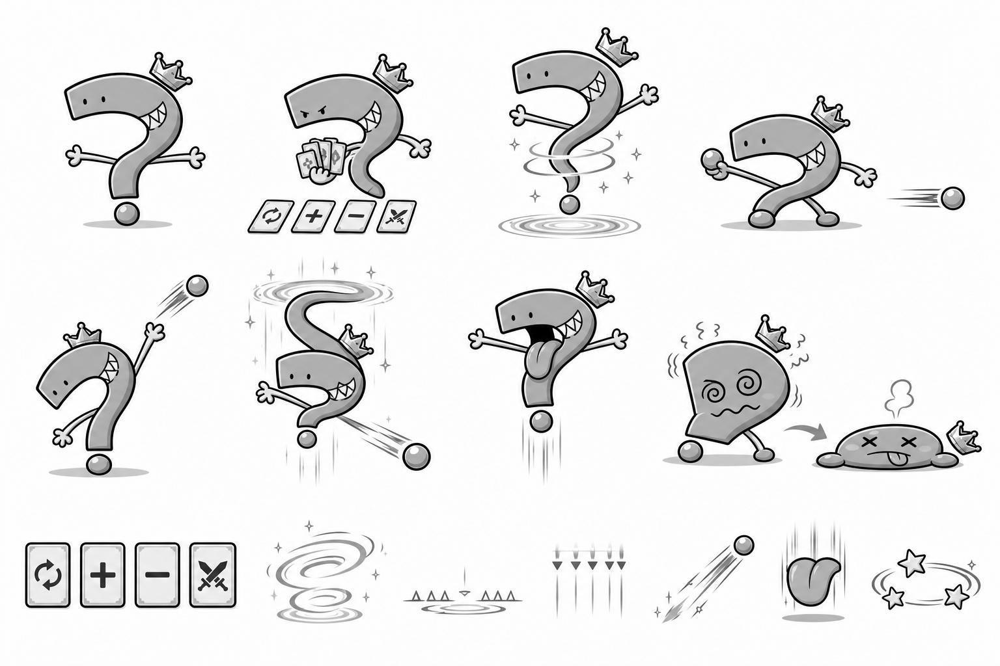
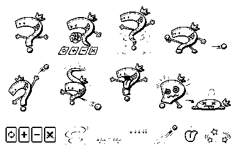

# P13 랜덤대왕 흑백 아트 앵커 검토

> 상태: 승인 완료 — 2026-09-02 사용자 `P13 앵커 승인`
> 범위: 랜덤대왕 본체, 결과 카드, 순간이동, 지상·상단·이동 투척, 하늘 메롱, 약점·피격·격파와 공격 예고 효과의 형태 승인
> 주의: 아래 이미지는 최종 컬러 에셋 제작 전 방향을 잠그는 흑백 콘셉트다. 게임 에셋·manifest·mapping에는 아직 등록하지 않았고 신규 SFX도 만들지 않았다.

## 1. 잠글 시각 방향

1. 사용자 영상 원안의 큰 물음표 몸, 짧고 평평한 머리, 점 눈, 안쪽 굴곡의 톱니 이, 가는 팔과 분리된 아래 점을 핵심 정체성으로 유지한다.
2. 바나나·뱀·물방울·둥근 공으로 읽히지 않도록 물음표 윗머리와 아래 점의 간격을 항상 남기고, 작은 3봉 왕관만 옆으로 기울여 대왕 계열을 연결한다.
3. 결과 뽑기는 카드 네 장과 손에 든 카드 묶음, 순간이동은 세로로 늘어난 몸과 나선, 세 투사체는 낮음·높음·대각선 궤도로 색 없이 구분한다.
4. 하늘 메롱은 화면 위에 뜬 세로 실루엣과 큰 혀, 아래쪽 수직 낙하선으로 만든다. 익살스러운 도발로 보이되 공격 위험은 예고 효과가 담당한다.
5. 약점은 낮게 주저앉고 소용돌이 눈이 된 몸, 피격은 왕관이 뜨며 찌그러지는 반동, 격파는 낮게 납작해진 몸과 떨어진 왕관으로 만든다. 무섭거나 고통스러운 묘사는 사용하지 않는다.

## 2. 검토 이미지

### 전체 흑백 앵커



위쪽은 대기·결과 뽑기·순간이동·지상 투사체, 가운데는 상단 투사체·위치 이동 뒤 투척·하늘 메롱·약점과 격파, 아래쪽은 결과 카드 네 종과 순간이동·공격 예고·투사체·메롱·회전 별 효과다. 상태와 효과가 서로 겹치지 않게 배치되어 있다.

### 25% 축소 확인


384×256에서도 물음표 몸, 카드 네 장, 나선 이동, 낮음·높음·대각선 투사체, 큰 혀, 소용돌이 눈과 납작한 격파 실루엣이 구분된다.

### 25% 이진 실루엣



중간 명암을 제거해도 물음표 외곽, 분리된 아래 점, 카드 묶음, 이동 나선, 세 투사체 궤도, 세로 메롱, 약점과 격파 높이 차가 남는다. 얇은 경고선 일부는 이진본에서 약해지므로 최종 런타임에서는 2px 이상 외곽과 바닥 마커를 별도 효과 스프라이트로 유지한다.

## 3. 승인 뒤 잠글 제작 단위

| 역할 | 제안 프레임 | 용도 |
|---|---:|---|
| `idle` | 4 | 대기실과 전투 사이의 짧은 물음표 흔들림 반복 |
| `draw` | 6 | 결과 카드 또는 공격 카드를 섞고 한 장을 고르는 1회 연출 |
| `teleport` | 6 | 몸이 세로로 늘어나 나선 속으로 사라지는 1회 연출 |
| `attack` | 6 | 낮음·높음·대각선 투사체에 공용으로 쓰는 팔 휘두르기 |
| `taunt` | 6 | 하늘에서 큰 혀를 내미는 메롱 1회 연출 |
| `vulnerable` | 4 | 공격 뒤 소용돌이 눈으로 주저앉는 약점 반복 |
| `hurt` | 3 | 유효 밟기 뒤 몸과 왕관이 튀는 반동 |
| `defeated` | 8 | 몸이 낮게 납작해지고 왕관이 떨어지는 1회 연출 |
| 결과 카드 앞면 | 4종 정지 | 코스 재도전·점수 증가·점수 감소·직접 전투 아이콘 |
| 카드 섞기 효과 | 6 | `draw` 뒤쪽에 분리 합성하는 반복 효과 |
| 순간이동 나선 | 6 | 대기실·전투 위치 이동 공용 1회 효과 |
| 투사체 | 4 | 낮음·높음·대각선 공격에 공용으로 쓰는 회전 탄환 |
| 낮음·높음 예고 | 각 4 | 바닥선과 상단선의 반복 위험 표시 |
| 대각선 예고 | 4 | 위치 이동 뒤 투척 궤도 표시 |
| 메롱 예고 | 6 | 세로 낙하선과 혀 그림자를 결합한 반복 표시 |
| 약점 별 | 4 | 소용돌이 눈을 색 없이 보조하는 반복 효과 |

캐릭터 스프라이트는 128×128 한 방향 원본을 만들고 반대 방향은 코드 반전을 사용한다. `attack`은 동일한 몸 프레임에 발사 높이와 궤도 효과만 바꾼다. 결과 카드 글자는 이미지에 굽지 않고 UI에서 `코스`, `+100`, `-100`, `전투`를 아이콘과 함께 표시한다.

## 4. 최종 컬러 적용안

새 HEX를 추가하지 않고 `data/palette.js`의 승인 팔레트만 사용한다.

| 역할 | 적용안 |
|---|---|
| 몸 | `#D294AC` 기본, `#745767` 그림자 |
| 얼굴·이·하이라이트 | `#F4FBFD`, 외곽 `#42474E` |
| 왕관 | `#F5DF4F`, 어두운 부분 `#D09A4E` |
| 코스 카드·순간이동 | `#3DBFE3`, 밝은 부분 `#9ADDF2` |
| 점수 증가 카드 | `#F5DF4F`, 외곽 `#957242` |
| 점수 감소 카드 | `#E573A0`, 위험 강조 `#D1333D` |
| 전투 카드·투사체 | `#752B5A`, 중심 하이라이트 `#F4FBFD` |
| 메롱 혀 | `#E573A0`, 위험 외곽 `#D1333D` |
| 약점 별 | `#F5DF4F`, 흰 반짝임 `#F4FBFD` |
| 공통 외곽선 | `#42474E` |

색은 결과와 공격을 보조할 뿐이며, 카드 아이콘·투사체 높이·대각선·세로 메롱·약점 높이의 형태 차이를 항상 함께 유지한다.

## 5. 생성 기록

- 생성 방식: Codex 내장 이미지 생성 도구의 기본 built-in 모드
- 최종 선택 원본: `assets/_source/p13/p13_random_king_anchor_generated_v1.png`
- 영상 검토본: `assets/_source/p13/p13_video_reference_contact.png`, `p13_video_reference_0000.png`, `p13_video_reference_0006.png`, `p13_video_reference_0056.png`, `p13_video_reference_0061.png`
- 사용자 원안 확인: 영상 00:00~00:06의 물음표 몸·점 눈·톱니 이·가는 팔·분리된 아래 점, 00:56~01:23의 무작위 위치·공격·하늘 메롱 설명
- 참조 입력: `assets/_source/p13/p13_video_reference_0000.png`, `assets/_source/p10/p10_hula_king_anchor_generated_v1.png`, `assets/_source/p11/p11_invisible_king_anchor_generated_v1.png`, `assets/_source/p12/p12_water_king_anchor_generated_v1.png`
- 참조 역할: 영상 프레임은 물음표형 원안만, P10~P12 앵커는 굵은 선·친근한 표정·작은 왕관·흰 배경 접촉 시트 배치만 참고했다. 기존 보스의 몸과 능력은 복제하지 않았다.
- 후처리: 선택 원본을 변경하지 않고 `scripts/build-p13-anchor-review.js`로 완전한 회색조 접촉 시트, 25% 축소본, 명암 기준 이진 실루엣을 생성했다.
- 검증 결과: 원본 1536×1024, 축소본 384×256, RGB 채널 최대 편차 0
- 생성 프롬프트: 영상 원안의 물음표 몸을 유지하고 작은 왕관을 더해 대기·결과 뽑기·순간이동·지상/상단/대각선 투사체·하늘 메롱·약점/격파를 두 행으로 나누며, 하단에 카드 네 종과 각 예고 효과를 독립 배치한 1536×1024 흑백 접촉 시트를 요청했다. 텍스트·색·배경·바나나/뱀/물방울/둥근 몸·겹친 패널을 금지했다.

<details>
<summary>내장 이미지 생성에 사용한 정확한 프롬프트</summary>

```text
Create a polished BLACK-AND-WHITE / grayscale 2D game character concept-sheet anchor for a cute side-scrolling platform boss called the Random King.

REFERENCE ROLES:
- The first attached image is the primary subject-identity reference from the creator's hand-drawn video. Preserve its unmistakable character idea: a large curved QUESTION-MARK-shaped body, a short flat rectangular head at the upper-left end, two tiny dot eyes, a mischievous jagged-tooth mouth near the inner bend, two thin arms with simple three-finger hands, and a separate round dot below that works like tiny feet/base.
- The next three attached images are style/layout references ONLY: use their clean chunky grayscale game-concept line art, friendly expressive eyes/faces, compact king crown, soft gray fills, thick black outer contours, white background, and evenly spaced contact-sheet presentation. Do not copy their body shapes or powers.

CANVAS / COMPOSITION:
- Exact 1536x1024 landscape sheet on a clean white background.
- No panels, no labels, no letters, no numbers, no UI text, no watermark.
- Arrange 8 distinct full-character poses in two clean rows, with generous spacing and no overlaps:
  1) neutral mischievous idle, readable question-mark silhouette;
  2) drawing/shuffling four small result cards whose symbols are only: looping arrow, plus sign, minus sign, crossed swords;
  3) teleport anticipation with the question-mark body stretching upward in a spiral;
  4) ground projectile throw, low horizontal ball;
  5) high projectile throw, high horizontal ball;
  6) teleport throw from above at a diagonal;
  7) sky taunt: floating overhead, tongue sticking out dramatically, clear vertical danger silhouette;
  8) vulnerable/dizzy then defeated flattened pose, crown popped off (can be a paired mini-sequence in the final slot).
- Along the bottom edge, add separate isolated effect anchors: four result cards, teleport spiral, low warning line, high warning line, diagonal trajectory mark, vertical tongue warning, dizzy stars.

CHARACTER DIRECTION:
- Add a small tilted three-point crown, consistent across poses.
- Keep the question-mark body as the dominant silhouette in every standing/air pose. It must not look like a banana, snake, droplet, or ordinary round blob.
- Cute mischievous child-friendly villain, not scary. Strong readable facial expressions. Thick clean linework suitable for later sprite production.
- Use grayscale only, values separated enough to survive a 25% preview and silhouette threshold test.
- Soft minimal shadows only. No scenery, no color, no gradients that obscure the silhouette.

The result is an art-direction anchor, not a sprite sheet: prioritize identity consistency and state readability over frame-by-frame animation.
```

</details>

## 6. 사용자 확인 게이트

다음 다섯 항목을 함께 확인한다.

- 사용자 원안의 물음표 몸·점 눈·톱니 이·분리된 아래 점 정체성이 유지되는가.
- 결과 카드 네 종과 순간이동이 색 없이 구분되는가.
- 낮음·높음·대각선 투사체와 세로 메롱이 작은 크기에서도 서로 다른 공격으로 읽히는가.
- 약점·피격·격파가 무섭지 않으면서도 전투 결과로 읽히는가.
- 제안 프레임 수와 승인 팔레트로 최종 캐릭터·효과·SFX를 제작해도 되는가.

승인 문구: **`P13 앵커 승인`**

## 7. 승인 기록

2026-09-02 사용자가 **`P13 앵커 승인`**이라고 명시했다. 위 물음표 원안, 결과 카드 네 종, 순간이동, 낮음·높음·대각선 투사체, 세로 메롱, 약점·피격·격파 형태와 4/6/6/6/6/4/3/8 캐릭터 프레임, 카드·나선·투사체·공격 예고·약점 효과 및 승인 팔레트를 최종 제작 기준으로 잠근다. 승인분을 커밋한 뒤 최종 컬러 스프라이트·효과·전용 SFX·manifest/mapping 등록과 런타임 검증으로 이동한다.
