# P13 랜덤대왕 최종 화면 검토

> 상태: 2026-09-03 사용자 최종 승인 완료 (`P13 최종 승인`)
> 범위: `level-02` 랜덤대왕 결과 카드 4종, 8개 본체 애니메이션, 네 공격과 독립 효과, 전용 SFX 7종
> 기준 앵커: `references/P13_RANDOM_ANCHOR_REVIEW.md`에서 승인한 물음표 몸·카드·순간이동·투사체·하늘 메롱·약점/격파 형태와 팔레트

## 최종 에셋 시트

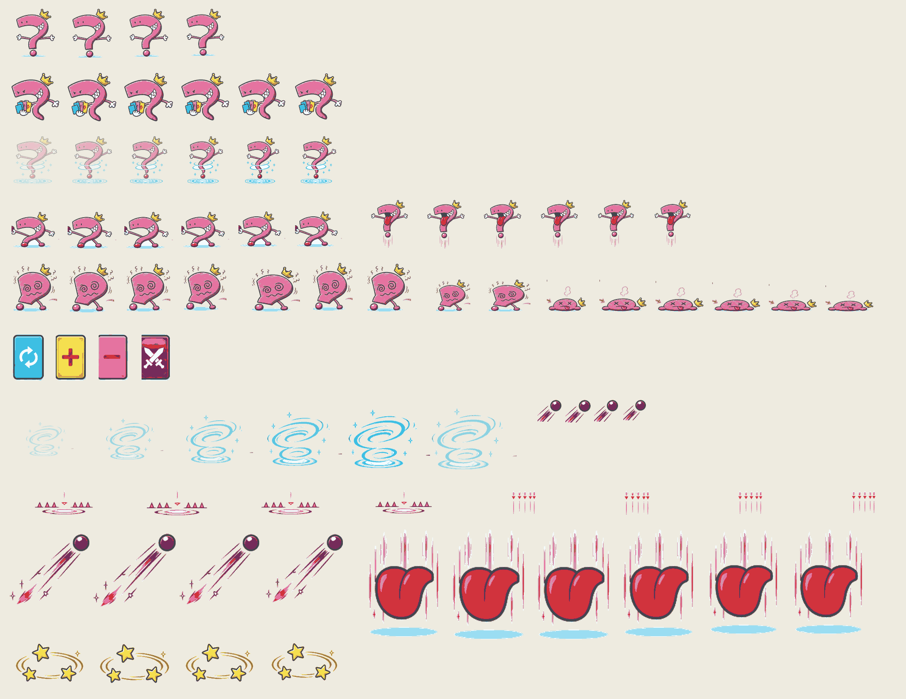

- 본체는 `idle/draw/teleport/attack/taunt/vulnerable/hurt/defeated` 순서로 4/6/6/6/6/4/3/8프레임, 총 43프레임이다.
- 결과 카드 4종, 순간이동 6, 투사체 4, 낮음·높음·대각선 예고 각 4, 하늘 메롱 6, 약점 별 4프레임을 독립 효과로 분리했다.
- 128×128 본체 프레임은 공통 발 기준선 16±2px, 승인 팔레트 밖 픽셀 0%, 투명 모서리 검사를 통과한다.
- 이미지가 없거나 `?fallback=1`이면 기존 물음표 도형 본체·코드 카드·경고선·투사체·약점 효과로 자동 전환한다.

## 실제 런타임

### 결과 카드

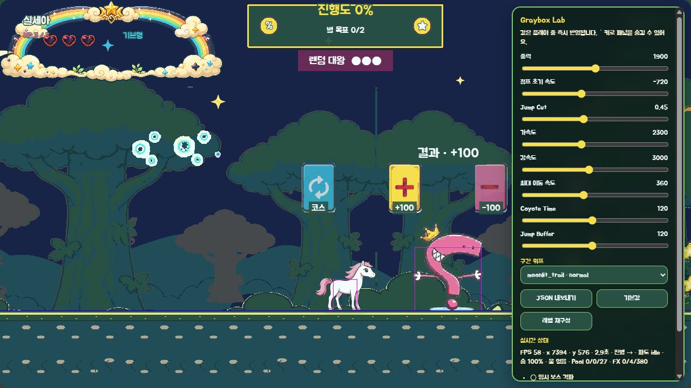

코스, `+100`, `-100`, 전투 결과는 각각 순환 화살표·더하기·빼기·교차 무기 아이콘과 글자를 함께 사용한다. 색이 없어도 카드 형태와 글자로 결과를 구분하며, 현재 결과는 카드 위의 결과 문구로 한 번 더 표시한다.

### 낮은 탄·높은 탄

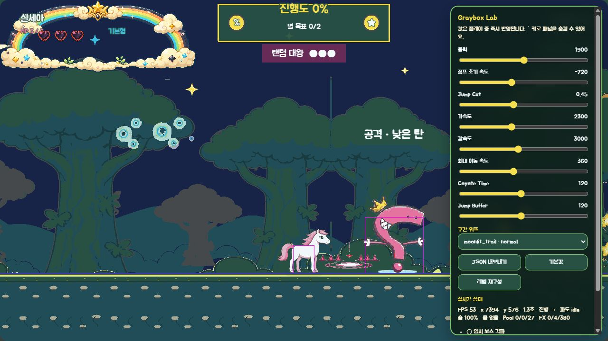

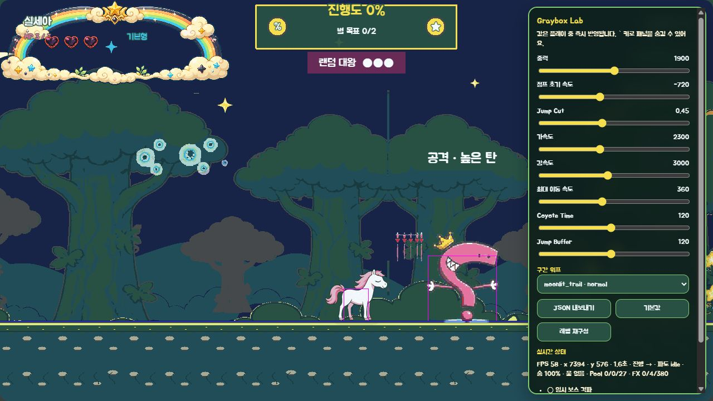

같은 투사체를 사용하더라도 예고 위치와 궤도를 분리했다. 낮은 탄은 점프로, 높은 탄은 낮게 유지해 피하도록 화면만 보고 대응할 수 있다.

### 순간이동 투척·하늘 메롱

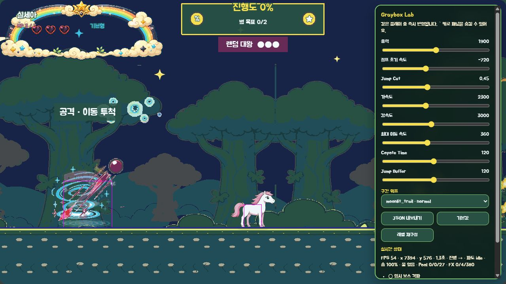

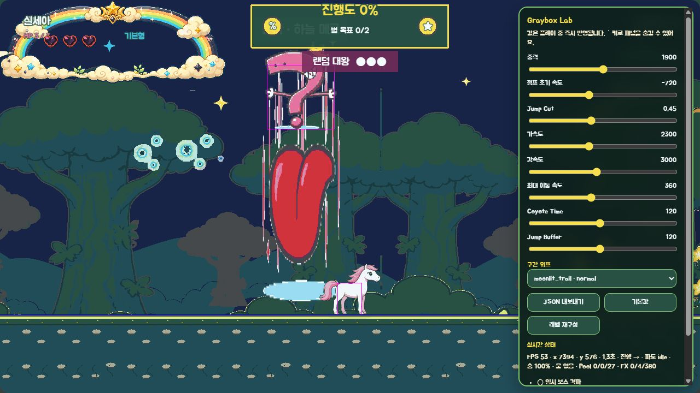

순간이동 투척은 도달 가능한 arena anchor에서만 시작하고 청록 나선과 대각선 예고를 겹친다. 하늘 메롱은 공격 전 세로 위험 영역을 고정해 보여 주며, 적중 시 HP 1만 감소하고 자동 반격은 발생하지 않는다.

### 약점·피격·격파

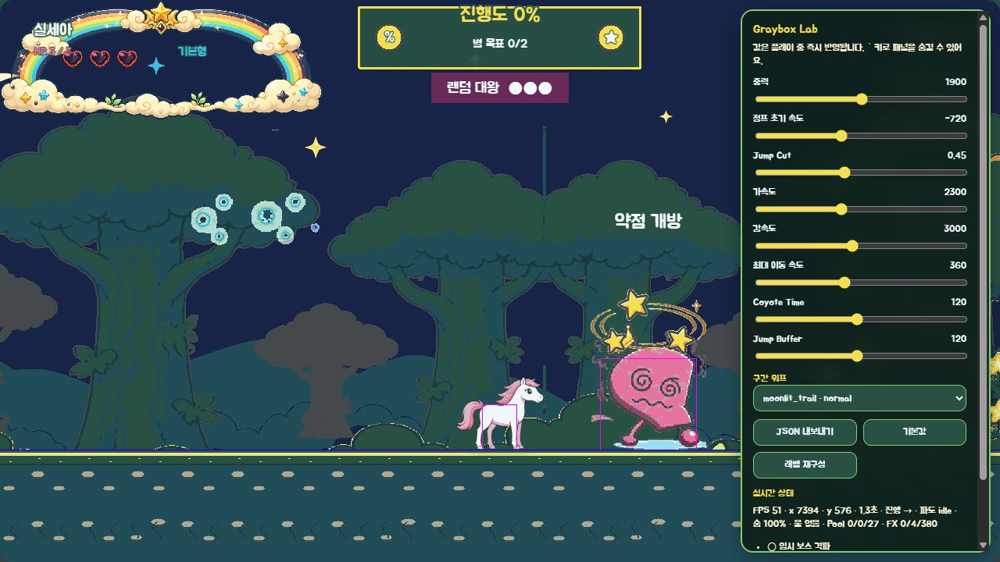

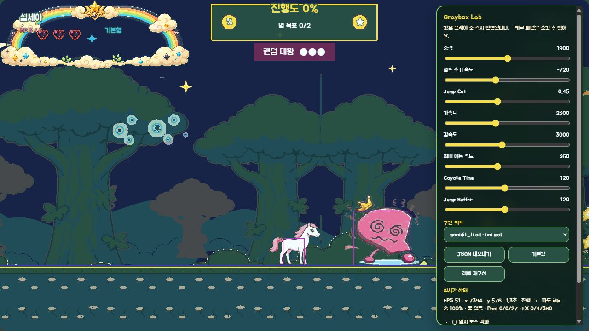

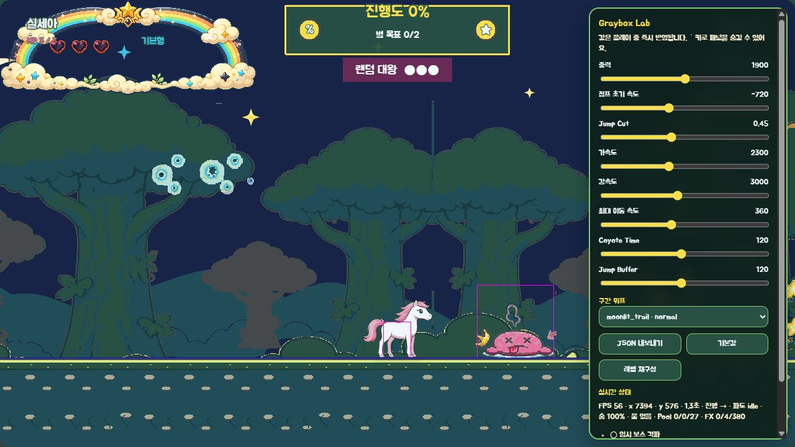

모든 공격 뒤 약점이 한 번 열린다. 약점은 낮아진 몸·소용돌이 눈·별 궤도, 피격은 짧은 찌그러짐과 왕관 반동, 격파는 낮은 실루엣과 떨어진 왕관으로 서로 구분한다.

고정 검수 진입점은 다음과 같다.

- 결과 카드: `/?visualReview=level-02&section=boss_random&offset=1250&random=plus&debug=1`
- 낮은 탄: `/?visualReview=level-02&section=boss_random&offset=1250&random=ground&debug=1`
- 높은 탄: `/?visualReview=level-02&section=boss_random&offset=1250&random=high&debug=1`
- 순간이동 투척: `/?visualReview=level-02&section=boss_random&offset=1250&random=teleport&debug=1`
- 하늘 메롱: `/?visualReview=level-02&section=boss_random&offset=1250&random=tongue&debug=1`
- 약점: `/?visualReview=level-02&section=boss_random&offset=1250&random=vulnerable&debug=1`
- 피격: `/?visualReview=level-02&section=boss_random&offset=1250&random=hurt&debug=1`
- 격파: `/?visualReview=level-02&section=boss_random&offset=1250&random=defeated&debug=1`

## fallback·접근성

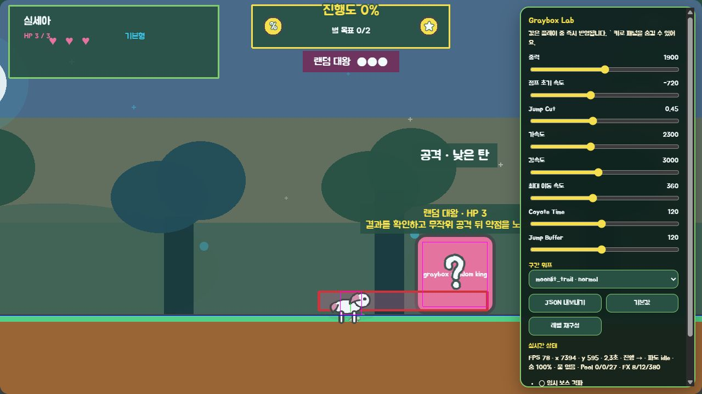

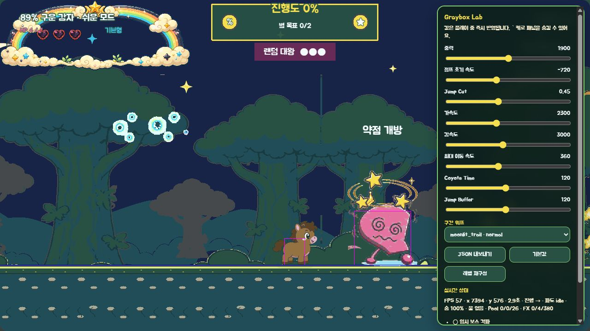

`fallback=1`에서는 보스·공격이 도형으로 전환되어도 결과 문구와 경고 영역이 남는다. `character=potato89&easy=1&mute=1&shake=0&effects=reduced` 조합에서도 낮은 약점 자세·소용돌이 눈·별 궤도를 판독할 수 있고 새 브라우저 탭의 console warning/error는 0건이었다.

## 효과음과 BGM

| 키 | 길이 | 연결 |
|---|---:|---|
| `sfx_random_draw` | 0.62초 | 결과·공격 카드 섞기 |
| `sfx_random_result` | 0.48초 | 결과 확정 |
| `sfx_random_teleport` | 0.64초 | 코스·전투 위치 이동 |
| `sfx_random_throw` | 0.38초 | 낮음·높음·대각선 투사체 발사 |
| `sfx_random_tongue` | 0.58초 | 하늘 메롱 실행 |
| `sfx_random_weakness` | 0.62초 | 약점 개방 |
| `sfx_random_defeat` | 1.08초 | 격파 시작 |

모두 22050Hz mono 16-bit PCM WAV다. 별도 곡은 추가하지 않고 기존 `bgm_boss`를 유지했다.

## 생성·가공 기록

- 생성 방식: Codex 내장 이미지 생성의 정밀 오브젝트 편집 모드
- 편집 입력: `assets/_source/p13/p13_random_king_anchor_generated_v1.png`
- 생성 결과 원본: `assets/_source/p13/p13_random_king_color_source_v1.png`
- 생성 요청: 승인된 1536×1024 흑백 시트의 물음표 실루엣·표정·왕관·손·아래 점·카드·투사체·혀·경고·별과 배치를 그대로 유지하고 승인된 분홍·자두·금색·청록·위험 빨강 팔레트만 적용했다.
- 금지: 문자·숫자·배경·새 캐릭터·새 소품·포즈·구도·실루엣 변경과 팔레트 외 색상.
- 후처리: 흰 배경 제거, 승인 팔레트 양자화, 기준선 정렬, 본체 43프레임·효과 36프레임 분리와 시트 조립을 `scripts/build-p13-assets.js`로 재현 가능하게 만들었다.
- 내장 이미지 생성에 사용한 정확한 프롬프트는 `ASSET_PROMPTS.md`의 `P13 랜덤대왕 최종 생성 기록`에 보존했다.

## 검증 결과

- `npm run test` 통과: P13 결과·공격 덱 1,000 seed, 연속 결과·공격 제한, 강제 전투, 점수 하한과 애니메이션 역할 계약 검증
- `npm run validate` 통과: manifest 265개(시각 191·오디오 74), mapping 156개, 런타임 파일 270개
- 캐릭터 110프레임·46시트, 적 205프레임·35시트, 환경 효과 26개, 오디오 74개 규격·duration·baseline·알파·팔레트 검증 통과
- `npm run build` 통과
- 실제 브라우저 카드·공격 4종·약점·피격·격파·fallback·접근성 조합 확인, 새 세션 console warning/error 0건
- 첫 브라우저 검수에서 발견한 `random_king` 아트 렌더 정의 누락을 보완하고 동일 진입점으로 재검증했다.

## 사용자 확인 게이트

- 물음표 몸과 카드 네 종이 별빛 숲 배경에서도 즉시 구분되는가.
- 낮음·높음·대각선·세로 메롱이 색 없이도 서로 다른 회피 규칙으로 읽히는가.
- 약점·피격·격파가 명확하면서 어린이 대상의 익살스러운 톤을 유지하는가.
- 전용 SFX 7종과 기존 `bgm_boss` 조합을 P13 최종본으로 잠가도 되는가.
- 정상 아트와 fallback·쉬움·저효과·음소거 화면을 P13 승인본으로 잠가도 되는가.

승인 문구: **`P13 최종 승인`**

2026-09-03 사용자가 **`P13 최종 승인`**이라고 명시했다. 최종 컬러 43프레임·효과 36프레임·전용 SFX 7종·결과 카드와 전투 상태·정상/fallback·접근성 런타임을 P13 승인본으로 잠그며, 이후 P14에서는 이 에셋을 다시 만들지 않고 네 보스 통합 검증만 수행한다.
