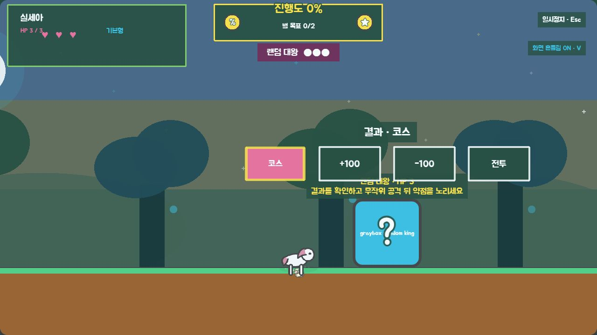
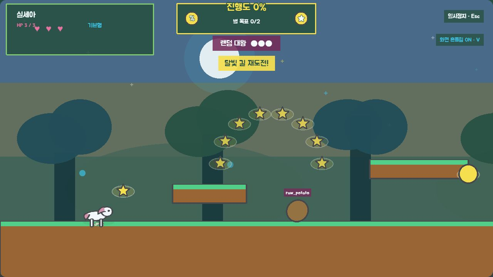
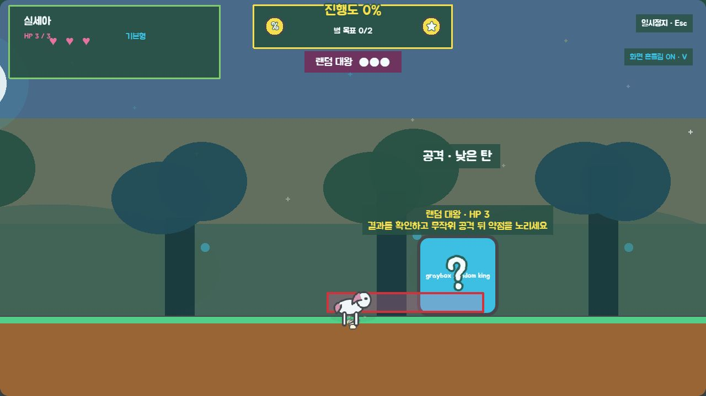
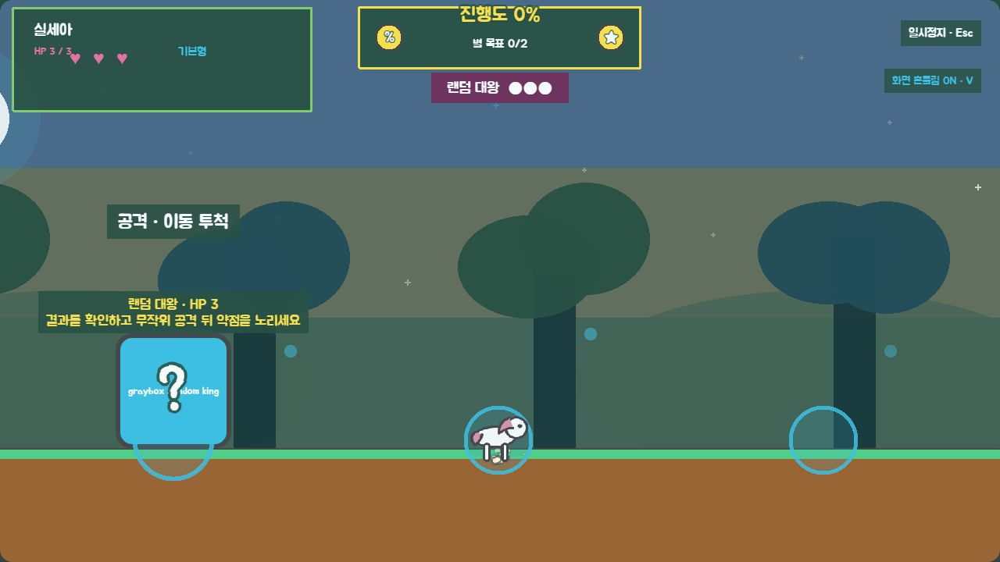
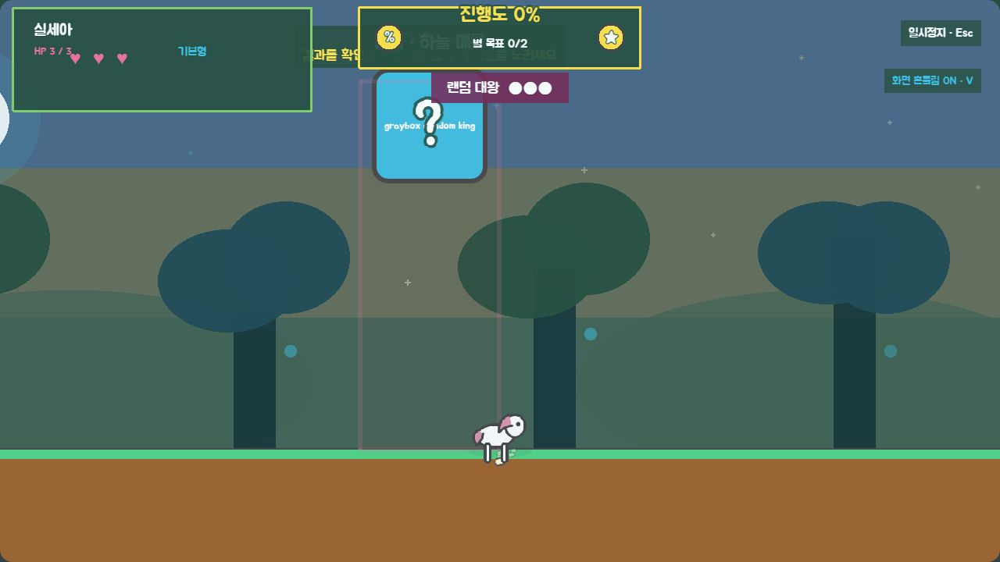
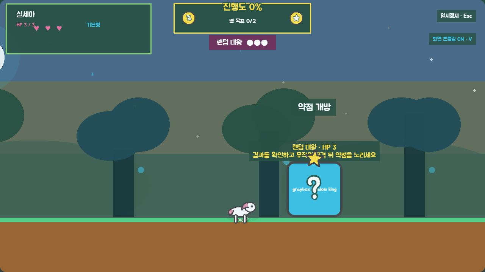

# P13 랜덤대왕 회색 상자 검수

> 상태: 사용자 코스 승인 완료 — 2026-09-02 사용자 `P13 코스 승인`
> 범위: `level-02` 우측 대기실·보스룸, 결과 덱, 안전 코스 재도전, 점수·시간 처리, 네 공격과 약점
> 제외: 랜덤대왕 흑백/컬러 아트, 전용 애니메이션, 전용 효과음

## 1. 결과 흐름

```text
random_intro
  → result_draw
  → result_telegraph
  → 결과 실행
      ├─ replay_section → 안전 코스 재도전 → 대기실 복귀 → random_intro
      ├─ score_plus     → +100 → result_draw
      ├─ score_minus    → -100·0 하한·콤보 초기화 → result_draw
      └─ start_battle   → battle_intro → attack_draw
```

- 결과는 `replay_section`, `score_plus`, `score_minus`, `start_battle` 네 종류다.
- 같은 결과는 연속으로 나오지 않는다.
- 비전투 결과는 최대 3회이며, 다음 추첨은 반드시 `start_battle`이다.
- 같은 재도전 코스는 연속으로 나오지 않는다.
- 추첨 결과, 코스, 공격은 모두 `SeededRandom` 상태와 함께 플레이테스트 이벤트에 기록한다.

## 2. 전투 상태도

```text
attack_draw (공격 보정 덱에서 선택)
  → telegraph (공격별 고유 도형 예고)
  → execute
  → vulnerable (모든 공격 뒤 한 번 보장)
      ├─ 위에서 밟기 성공 → hit → recover → attack_draw
      └─ 시간 종료        → recover → attack_draw
  → HP 0 → defeated → 게이트 1회 생성 → 자동 클리어
```

각 페이즈는 네 공격을 한 번씩 섞은 보정 덱으로 시작한다. 덱을 모두 쓰기 전에는 같은 공격이 반복되지 않으며, 새 덱의 첫 공격도 직전 공격과 다르게 만든다.

| 공격 | 예고 | 실행 | 회피 기준 |
|---|---|---|---|
| `ground_projectile` | 바닥의 분홍색 굵은 띠 | 바닥 높이 탄환 | 점프로 넘기기 |
| `high_projectile` | 상단의 파란색 굵은 띠 | 지상 캐릭터 위로 지나는 탄환 | 지상에 머물기 |
| `teleport_throw` | 네 원형 앵커와 선택 원 확대 | 다른 안전 앵커로 이동 후 조준 투척 | 새 위치와 탄도 확인 |
| `sky_tongue` | 플레이어 위치의 긴 세로 영역 | 하늘에서 메롱, 범위 안이면 HP 1 | 세로 영역 밖으로 이동 |

메롱은 기존 피격 무적과 알리콘 무적을 존중한다. 명중 여부와 관계없이 약점이 열리며 자동 반격은 없다.

## 3. 잠금 수치

| 항목 | 1페이즈 | 2페이즈 | 3페이즈 |
|---|---:|---:|---:|
| 공격 선택 | 520ms | 480ms | 440ms |
| 기본 예고 | 1,000ms | 900ms | 800ms |
| 실행 | 900ms | 820ms | 760ms |
| 일반 약점 | 2,200ms | 1,900ms | 1,700ms |
| 쉬움 약점 | 3,000ms | 2,700ms | 2,400ms |
| 투사체 속도 | 300 | 340 | 380 |

- 쉬운 모드는 결과 종류나 전투 HP를 줄이지 않는다.
- 쉬운 모드 예고는 일반의 1.25배이며, 재진입 피해 유예는 일반 1.0초·쉬움 1.5초다.
- 투사체는 `ObjectPool` 최대 8개를 사용하고 공격 종료·수명 종료·월드 이탈 때 반환한다.
- 모든 공격 실행 뒤 활성 투사체를 회수하고 약점을 한 번 연다.

## 4. 보스룸과 안전 재도전

기존 별빛 숲 `0~6,144`는 그대로 두고 오른쪽에 2,048px을 추가했다.

| 항목 | 값 |
|---|---:|
| 기존 코스 끝 / 보스룸 시작 | x=6,144 |
| 보스룸 끝 / world width | x=8,192 |
| 보스 직전 완전 회복 | x=6,272 |
| 새 출구 | x=8,016 |
| 지상 바닥 | y=576 |

| 재도전 코스 | 안전 앵커 |
|---|---:|
| 달빛 길 | x=256 |
| 빛나는 숲관 | x=1,664 |
| 속삭이는 틈 | x=3,712 |
| 별나무 | x=5,120 |

- 재도전은 레벨을 다시 만들지 않고 플레이어와 물리 몸체를 같은 프레임에 안전 앵커로 이동한다.
- 획득한 수집물, 완료 objective, 처치한 적, 해제한 레이저 스위치와 현재 변신 상태를 유지한다.
- 재도전 중 체크포인트 갱신을 막아 보스 직전 부활 지점을 잃지 않는다.
- 카메라와 section 기반 환경 정책은 새 위치에서 다시 계산된다.
- 재도전 중 사망해도 대기실에 돌아올 때까지 같은 강제 재도전 시간으로 센다.

## 5. 점수와 `clear_time`

- `score_plus`는 진행도 `+100`이다.
- `score_minus`는 진행도 `-100`이며 0 아래로 내려가지 않고 콤보를 초기화한다.
- HUD toast와 접근성 상태 문구로 결과·실제 증감량·재도전 코스를 함께 표시한다.
- 전체 플레이 시간은 계속 누적한다.
- 선택 목표에는 `전체 시간 - 강제 재도전 누적 시간`을 전달한다.
- 성능 스냅숏에는 전체 시간, 선택 목표 시간, 강제 재도전 시간이 각각 남는다.

## 6. 1,000 seed 검증

| 검사 | 결과 |
|---|---:|
| 비전투 결과 4회 이상 | 0건 |
| 직접 전투 없이 종료 | 0건 |
| 같은 결과 연속 | 0건 |
| 같은 재도전 코스 연속 | 0건 |
| 페이즈 공격 4종 누락 | 0건 |
| 같은 공격 연속·페이즈 경계 반복 | 0건 |
| 같은 seed 결과·코스·공격 불일치 | 0건 |

점수 0·80·고점에서 `-100`을 별도로 검사해 음수와 `NaN`이 없음을 확인했다. `level-02` tilemap 폭, 보스룸 바닥, 체크포인트, 출구, 재도전/전투 앵커도 자동 검증한다.

## 7. 고정 상태 검수 진입점

기준 주소:

`http://localhost:5173/?visualReview=level-02&section=boss_random&offset=1250&fallback=1`

- 실제 seed 반복: 기준 주소에서 `random`을 생략
- 결과 카드: `&random=replay`, `&random=plus`, `&random=minus`, `&random=battle`
- 공격 예고: `&random=ground`, `&random=high`, `&random=teleport`, `&random=tongue`
- 약점·피격·격파: `&random=vulnerable`, `&random=hurt`, `&random=defeated`
- 쉬운 모드: `&easy=1`
- 효과 약하게·음소거: `&effects=reduced&mute=1`
- 캐릭터 변경: `&character=silsea` 또는 `&character=potato89`
- 디버그 패널: `&debug=1` (` 키로 숨김)

고정 상태에서는 타이머와 접촉 전이를 멈추며, 실제 seed 반복에서는 결과 실행과 코스 이동·전투를 그대로 수행한다.

## 8. 대표 화면

### 결과 카드 — 코스 재도전



### 실제 seed의 달빛 길 재도전



### 지상 투사체 예고



### 위치 이동 뒤 투척 예고



### 하늘 메롱 예고



### 모든 공격 뒤 약점



## 9. 검증 결과

- `npm run test`: 통과 — 1,000개 seed의 결과·코스·공격 재현성과 종료 보장
- `npm run validate`: 통과 — 보스 등록·상태·tilemap·목표·체크포인트·앵커·시간/점수 경로
- `npm run build`: 통과
- 결과 카드, 지상 투사체, 이동 투척, 하늘 메롱, 약점과 실제 코스 재도전을 1280×720 fallback 런타임에서 확인
- 브라우저 경고·오류 0건
- 실제 재도전 검수에서 발견한 플레이어 표시/물리 몸체 동기화는 같은 프레임 `body.reset`으로 보정하고 다시 확인

## 10. 사용자 확인 항목

- 네 결과 카드와 현재 선택 결과가 한눈에 구분되는가
- 비전투 최대 3회 뒤 직접 전투 규칙이 적당한가
- 네 코스 재도전과 `+100/-100`의 체감이 적당한가
- 낮은 탄·높은 탄·이동 투척·하늘 메롱의 예고가 서로 구분되는가
- 모든 공격 뒤 약점 시간이 일반 2.2/1.9/1.7초, 쉬움 3.0/2.7/2.4초로 적당한가
- 별빛 숲 분위기를 유지한 2,048px 대기실·보스룸 배치가 적당한가

## 11. 승인 기록

- 2026-09-02 사용자가 `P13 규칙 승인`으로 메롱 자동 반격 없음, 수집물 재생성 없음, 강제 재도전 시간 제외, 점수 `+100/-100`을 승인했다.
- 2026-09-02 사용자가 `P13 코스 승인`으로 결과 덱·재도전·점수/시간·네 공격·약점 회색 상자를 승인했다.
- 다음 게이트는 랜덤대왕 역할·실루엣·프레임 수를 확인하는 `P13 앵커 승인`이다.
