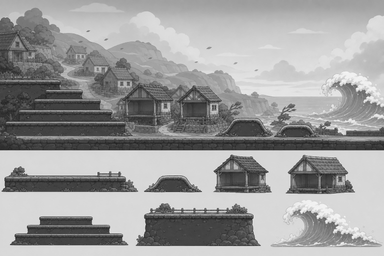
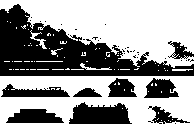

# P4 쓰나미 마을 흑백 아트 앵커 검토

> 상태: 2026-08-26 사용자 승인 완료 (`P4 앵커 승인`)
> 범위: P4 최종 컬러 에셋 제작 전 배경·지형·대피처·파도 형태 승인
> 주의: 아래 이미지는 방향을 잠그기 위한 흑백 콘셉트다. 게임 에셋·manifest에 등록하지 않았으며 최종 BGM과 캐릭터 애니메이션을 포함하지 않는다.

## 확인할 방향

쓰나미 마을은 기존 무지개 언덕의 색상 변형이 아니라 다음 실루엣으로 구분한다.

1. 원경: 둥근 해안 절벽과 높아지는 마을 언덕, 밝은 바다 수평선
2. 플레이 지형: 빈 마을길과 어두운 돌 축대, 왼쪽으로 높아지는 넓은 계단
3. 언덕 대피처: 캐릭터가 완전히 가려질 수 있는 낮고 둥근 흙 둔덕 2종
4. 집 대피처: 내부가 비어 있고 앞면이 열린 경사 지붕 집 2종
5. 높은 지형: 계단을 올라 도착하는 넓은 축대형 대피소
6. 파도: 파노라마와 모듈 모두에서 오른쪽에 위치하는 둥근 거품 마루
7. 재난 톤: 사람이 없는 마을과 젖은 길·휘어진 나무만 사용하고 피해자·공포·화재·심한 파손을 그리지 않음

승인된 코스 순서인 `오른쪽 시작 → 낮은 둔덕 → 큰 둔덕 → 열린 집 2채 → 계단 → 높은 대피소 → 왼쪽 탈출`은 바꾸지 않는다. 최종 배경에서도 파도는 플레이 지형 뒤에 두고 대피처와 충돌 윗면을 가리지 않는다.

## 검토 이미지

### 전체 흑백 앵커


위쪽은 오른쪽에서 왼쪽으로 읽는 연속 플레이 파노라마다. 오른쪽 바다의 파도에서 시작해 둔덕·열린 집·계단형 고지대로 위험과 안전 높이가 단계적으로 변한다. 아래쪽은 최종 에셋 제작에 재사용할 마을 지면, 둔덕, 집 2종, 계단, 고지대, 파도 모듈이다.

### 25% 축소 확인



384×256에서도 오른쪽 파도, 중앙 집 2채, 왼쪽 계단과 높은 마을 언덕이 남는다. 집의 열린 앞면과 파도의 흰 거품도 배경에서 분리된다.

### 25% 이진 실루엣



색과 중간 명암을 제거해도 둔덕은 낮은 반원, 집은 경사 지붕과 열린 내부, 고지대는 수평 계단, 파도는 굽은 마루로 구분된다.

## 최종 컬러 적용안

새 HEX를 추가하지 않고 `data/palette.js`에서 승인된 색만 사용한다.

| 역할 | 제안 팔레트 |
|---|---|
| 밝은 해안 하늘 | `#D9F3FA` |
| 먼 해안 절벽 | `#A8AA96`, `#BFC596` |
| 바다 기본/그림자 | `#4691A2`, `#214D59` |
| 파도 거품 | `#F4FBFD`, `#F1F6FA` |
| 둔덕 잔디 | `#82CB70`, `#285144` |
| 마을길·돌 축대 | `#9A6535`, `#45494B` |
| 집 벽 | `#FFF6D8` |
| 지붕·목재 | `#D09A4E`, `#5D4326` |
| 환경 외곽선 | `#42474E` |
| 경고 UI 보조색 | `#D1333D`, `#752B5A` |

파도는 청록/흰색, 충돌 지형은 갈색/짙은 회색, 대피처 윗면은 녹색으로 역할을 분리한다. 집 내부는 외벽보다 어둡게 유지하되 캐릭터가 묻히지 않도록 가장 어두운 외곽선보다 한 단계 밝게 만든다. 경고 적색은 화면 오른쪽 경고 UI에만 사용하고 마을 배경에는 사용하지 않는다.

## 생성 기록

- 생성 방식: Codex 내장 이미지 생성 도구(기본 built-in 모드)
- 생성 원본 보관: `assets/_source/tsunami/p4_tsunami_anchor_generated.png`
- 참조 입력: `references/p4-graybox-intro.png`, `references/p4-graybox-house-safe.png`, `references/p4-graybox-high-safe.png`, `references/p3-mist-anchor-contact-sheet.png`
- 참조 역할: P4 화면 3장은 승인 코스의 진행 방향·대피처 순서·높이 구조만 참고하고, P3 앵커는 3:2 접촉 시트 구성과 흑백 명암 가독성만 참고
- 후처리: 생성 원본은 변경하지 않고 `scripts/build-p4-anchor-review.js`로 완전한 회색조 접촉 시트, 25% 축소본, 명암 기준 이진 실루엣 검토본 생성
- 검증 결과: 원본 1536×1024, 축소본 384×256, RGB 채널 최대 편차 0
- 최종 입력 프롬프트:

```text
Use case: stylized-concept
Asset type: grayscale game environment concept anchor contact sheet for an original child-friendly 2D side-scrolling platformer stage
Primary request: Design the visual language for “Tsunami Village” while preserving the approved reverse-direction graybox course. It must look like a distinct empty coastal village enduring repeated waves, not a recolor of the rainbow hills, starlight forest, or misty valley.
Input images: Images 1–3 are approved graybox layout references only. Preserve their gameplay order and relative height logic: the player begins at the far right, escapes toward the left, first learns a low earthen-hill shelter, then a larger hill, then two open-front house interiors, then climbs stepped platforms to a broad high refuge before the far-left exit. Ignore and do not reproduce their character, enemies, stars, rainbow scenery, HUD, labels, colors, or UI. Image 4 is a contact-sheet format and grayscale readability reference only; reuse its production-oriented organization and value separation, not its mountain composition or props.
Scene/backdrop: layered rounded coastal headlands and an empty village road, simple clustered cottages with pitched roofs, raised foundations and retaining walls, drainage channels, low earthen berms, and a large curling foamy wave approaching from the far right. The village should show wet surfaces and wind-bent shrubs without victims, panic, severe destruction, or horror.
Subject: one continuous reverse-direction gameplay environment panorama plus isolated reusable village, shelter, high-ground, and wave modules
Style/medium: clean grayscale 2D cel-cartoon game concept art, bold controlled outlines, restrained two-to-three-tone shading, simple rounded shapes, production-oriented rather than painterly
Composition/framing: exact landscape 3:2 contact sheet, ideally 1536x1024. Upper roughly 68 percent: one continuous wide side-scrolling gameplay panorama that reads from RIGHT TO LEFT. At far right, show the safe starting road and the incoming wave beyond it; moving left, clearly stage a low rounded berm shelter, then a larger berm, then two visibly enterable open-front cottages with roofs and sturdy side posts, then a short sequence of broad stepped platforms leading up to a wide high refuge terrace near the far left, followed by a calm exit road. Keep the horizontal traversal corridor and every collision top unobstructed. Make the approaching wave stay behind the gameplay corridor and remain readable without covering shelters.
Lower roughly 32 percent: an orderly strip of seven isolated reusable modules on a plain light-gray background—broad village road/retaining-wall ground, low rounded earthen berm, intact open-front cottage shelter, weathered open-front cottage shelter, broad stepped high-ground platform, raised refuge terrace, and a looping foamy tsunami crest. Give every module generous separation and show each as a clear side-view game asset concept.
Lighting/mood: urgent but safe and hopeful, bright overcast coastal daylight, never horror
Color palette: strict grayscale only with clear value separation between far background, shelters, collision surfaces, and water
Constraints: silhouettes must remain readable at 25 percent scale; collision surfaces must be darker and crisper than background; cottage interiors must be visibly open and large enough for a player; shelter shapes must remain distinct without color; the right-to-left path and right-side wave direction must be obvious from composition alone; no characters; no people; no animals; no enemies; no boss; no collectibles; no stars; no rainbow; no gates; no UI; no HUD; no text; no labels; no arrows; no logos; no watermark; no photorealism; no 3D; no pixel art; no painterly texture; no fire; no victims; no panic; no severe wreckage; do not copy supplied compositions
```

## 사용자 확인 게이트

다음 네 항목을 함께 확인한다.

- 전체 파노라마가 기존 초원·숲·계곡과 다른 ‘쓰나미를 견디는 해안 마을’로 보이는가.
- 집 2채의 열린 내부가 들어갈 수 있는 대피처로 명확한가.
- 오른쪽 파도와 왼쪽 계단·높은 대피소가 역방향 진행을 잘 보여주는가.
- 위 팔레트 적용안으로 최종 배경·타일·파도·대피처·선택 카드를 제작해도 되는가.

2026-08-26 사용자가 **`P4 앵커 승인`**이라고 명시했다. 전용 배경 3레이어·64px 마을 타일셋·집 대피처 2종·파도/경고 효과·선택 카드·BGM을 제작하고 게임에 연결한다.
