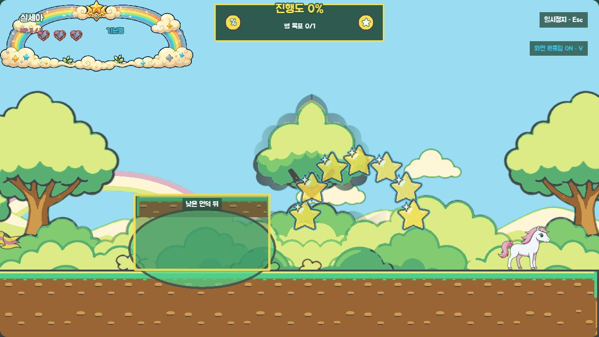
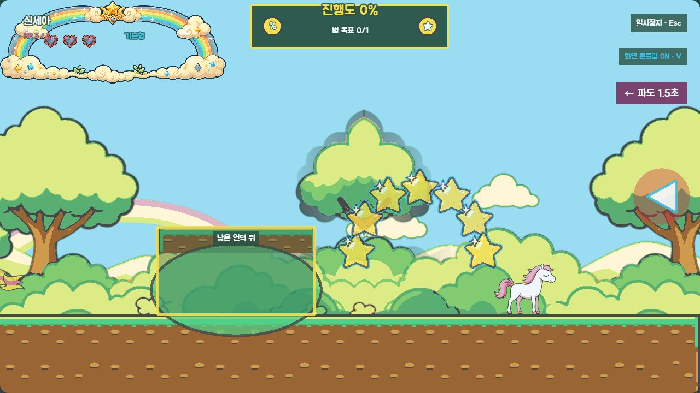
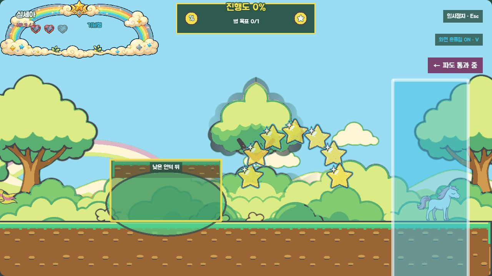
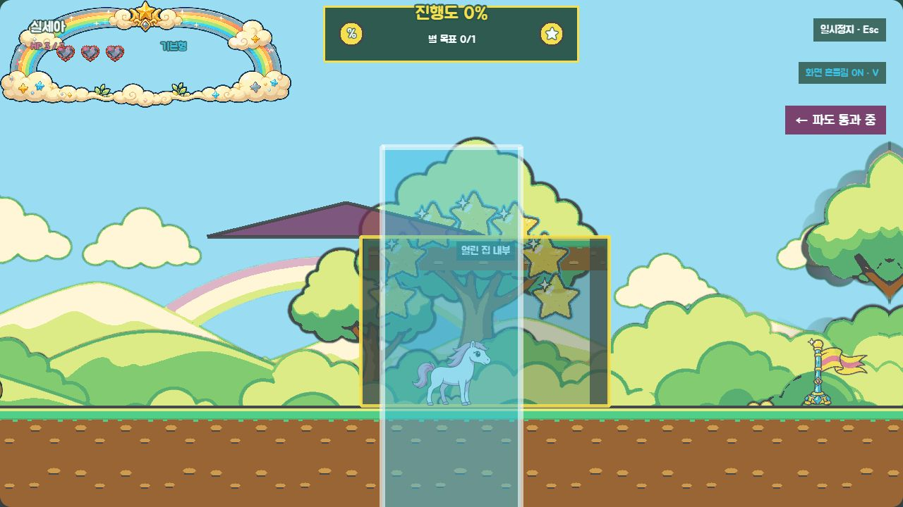
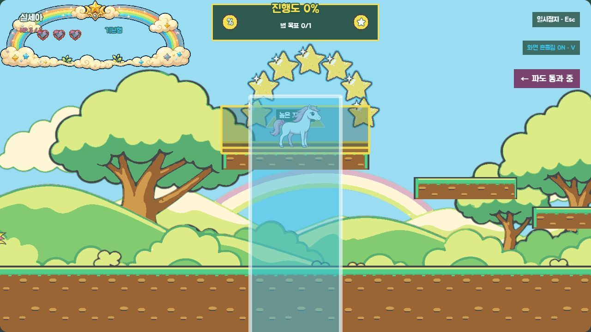
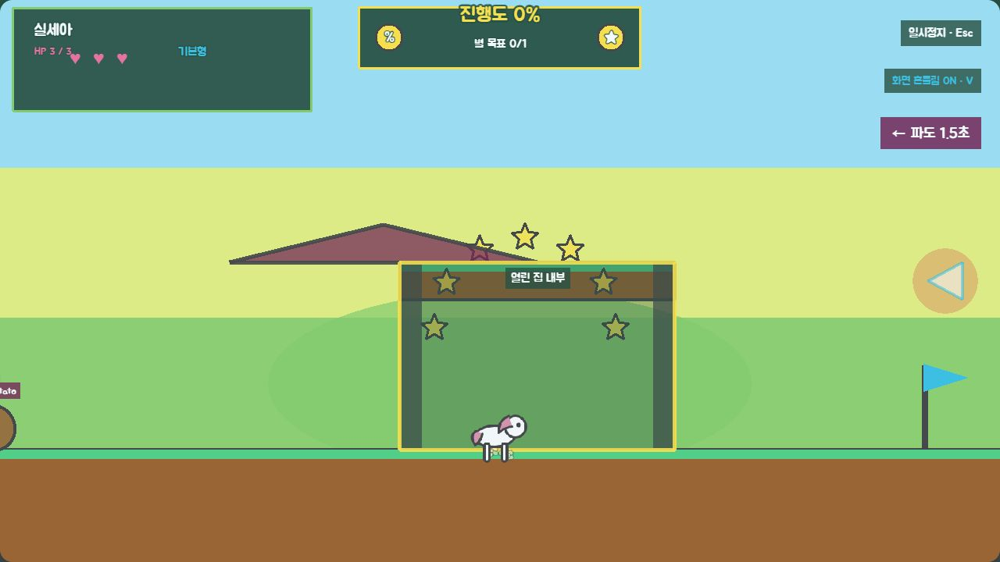
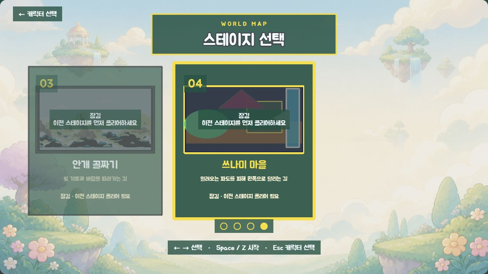

# P4 쓰나미 마을 회색 상자 검토

> 상태: 2026-08-26 사용자 승인 완료 (`P4 코스 승인`)
> 확인 범위: 역방향 코스, 반복 파도 타이밍, 대피처 3종, HP 피해, 스테이지 선택 캐러셀·순차 해금
> 제외 범위: 최종 마을 배경·타일·파도 애니메이션·경고 아이콘·선택 카드·전용 BGM

## 이번 게이트에서 잠글 것

- 플레이어는 오른쪽 `x=8,000`에서 시작해 왼쪽 `x=176` 게이트로 탈출한다.
- 코스는 플레이 순서 기준 `소개 → 낮은 언덕 → 집 2채 → 높은 지형 → 탈출`이다.
- 대피처는 언덕 뒤 2곳, 집 내부 2곳, 높은 지형 1곳의 총 5곳이다.
- 파도는 오른쪽에서 왼쪽으로 반복 통과하며, 같은 파도에 맞으면 HP 1만 한 번 감소한다.
- 4번 스테이지는 3번 스테이지 클리어 뒤 열리고, 잠겨 있어도 이름과 실루엣을 보여준다.

## 수치 대조

| 항목 | 일반 | 쉬움 | P0·P1 승인값 일치 |
|---|---:|---:|---|
| 첫 경고 | 6초 | 8초 | 예 |
| 예고 시간 | 1.5초 | 2.2초 | 예 |
| 반복 간격 | 9~12초 | 12.6~16.8초 | 예 |
| 파도 속도 | 최고 속도×1.15 | 최고 속도×1.05 | 예 |
| 통과 시간 | 2.5초 | 3초 | 예 |
| 대피 판정 유예 | 0.25초 | 0.4초 | 예 |
| 부활 유예 | 3초 | 4.5초 | 예 |
| 피해 | HP 1 | HP 1 | 예 |

파도 통과 중에는 적이 정지하고 종료 뒤 다시 움직인다. 기본형은 높이만으로 면역되지 않으며, 페가수스·알리콘은 발끝이 `y=270` 이상으로 올라가면 파도를 넘는다. 환경 규칙을 건너뛰지 않도록 이 레벨에는 알리콘 아이템을 배치하지 않았다.

## 실제 화면 증거

### 1. 역방향 시작과 첫 대피처

시작 화면에서 플레이어 왼쪽에 첫 별 아치와 낮은 언덕 대피처가 함께 보인다.

### 2. 오른쪽 파도 경고

색 외에도 `←`, `파도 1.5초`, 오른쪽 가장자리 화살표를 함께 사용한다.

### 3. 외부 피격과 내부 무피해

| 대피처 밖 | 열린 집 내부 |
|---|---|
|  |  |

같은 고정 파도 재현에서 대피처 밖은 HP가 3→2로 한 번 감소하고, 집 내부는 HP 3을 유지한다.

### 4. 높은 지형 무피해

오른쪽 계단을 타고 넓은 높은 발판에 도달하는 구도다. 파도가 지나가는 중에도 HP 3을 유지한다.

### 5. 도형 fallback

이미지 에셋을 끈 상태에서도 삼각 지붕·기둥·안전 판정 테두리, 왼쪽 방향과 남은 시간을 판독할 수 있다.

### 6. 네 번째 잠금 카드와 캐러셀

현재 4장 기준 가운데 선택 카드와 이웃 카드, 페이지 점을 표시한다. 잠긴 쓰나미 마을 카드도 이름과 집·언덕·오른쪽 파도 실루엣을 숨기지 않는다.

### 7. 역방향 게이트 클리어

왼쪽 게이트 진입으로 `GameScene → ClearScene` 전환과 `쓰나미 마을 클리어.` 접근성 상태를 확인했다.

## 자동·런타임 검증 범위

- `level-04` schema/order/section 연속성, 좌향 spawn·exit·게이트 아래 바닥
- 일반·쉬운 모드의 승인 수치와 고정 Seed 파도 간격
- 대피처 안/밖 판정, 파도당 중복 피해 방지, 파도 중 적 정지
- 기본형·페가수스·알리콘 높이 회피 규칙
- 체크포인트 안전 바닥·파도 영역 비중첩·부활 유예
- 직전 `order` 클리어 기반 순차 해금과 기존 저장 키 유지
- 실제 정상·fallback·선택·클리어 탭의 처리되지 않은 콘솔 경고·오류 없음

## 확인 요청

다음 네 가지를 함께 확인한다.

1. 오른쪽에서 왼쪽으로 달리는 흐름과 파도 방향이 첫 화면·경고만으로 이해되는가.
2. `낮은 언덕 → 집 내부 → 높은 지형`의 난이도 상승과 총 5개 대피처 간격이 적절한가.
3. 일반 모드의 1.5초 예고, 9~12초 반복, HP 1 피해가 이 코스의 첫 기준으로 적절한가.
4. 네 번째 잠금 카드와 현재 4장 캐러셀 구성이 다음 스테이지를 기대하게 하는가.

2026-08-26 사용자가 **`P4 코스 승인`**이라고 명시했다. 이 회색 상자를 커밋하고, 최종 색을 넣기 전 마을·파도·대피처의 흑백 아트 앵커를 별도 게이트로 제시한다.
