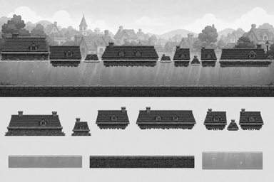
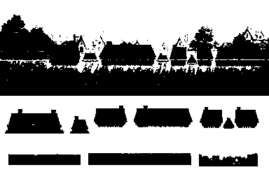

# P5 물에 잠긴 마을 흑백 아트 앵커 검토

> 상태: 2026-08-27 사용자 승인 완료 (`P5 앵커 승인`)
> 범위: P5 최종 컬러 에셋 제작 전 배경·지형·수면·잠긴 지붕 형태 승인
> 주의: 아래 이미지는 방향을 잠그기 위한 흑백 콘셉트다. 게임 에셋·manifest에 등록하지 않았으며 최종 BGM과 캐릭터 수영 애니메이션을 포함하지 않는다.

## 확인할 방향

물에 잠긴 마을은 직전 쓰나미 마을을 단순히 물속에 넣은 화면이 아니라, 파도가 지나간 뒤에도 같은 재해권을 벗어나지 못한 채 통과하는 **다른 침수 마을**로 구분한다.

1. 원경: 잔잔한 수평선 위로 지붕·굴뚝·나무 윗부분만 드러나는 비어 있는 마을
2. 수면: 화면을 가로지르는 하나의 선명한 수면선과 아래로 내려오는 부드러운 빛기둥
3. 호흡 지붕: 캐릭터의 머리가 물 밖으로 나올 만큼 수면 위로 분명히 솟고, 윗면이 서 있을 수 있게 평평한 작은 지붕
4. 잠수 통로: 잠긴 집과 지붕은 위쪽 장애물로 매달리고, 벽·기둥이 바닥까지 닿지 않아 그 아래가 넓은 수영 통로로 이어짐
5. 코스 차이: 짧은 지붕, 더 긴 지붕, 중간 호흡 지붕을 사이에 둔 지붕 2개의 복합 구간을 폭으로 구분
6. 바닥: 추락 구덩이가 아닌 연속된 석재 길·기초로 보이는 단단한 수중 바닥
7. 재난 톤: 피해자·공포·떠다니는 소지품·심한 잔해 없이 조용하고 안전한 모험 분위기

승인된 코스 순서인 `왼쪽 시작 지붕 → 짧은 잠수 → 호흡 지붕 → 긴 잠수 → 호흡 지붕 → 복합 잠수와 중간 호흡 → 오른쪽 회복 지붕`은 바꾸지 않는다. 최종 배경에서도 수면선, 호흡 지붕 윗면, 잠수 통로와 바닥의 충돌 경계를 장식보다 앞에 둔다.

## 검토 이미지

### 전체 흑백 앵커


위쪽은 왼쪽에서 오른쪽으로 읽는 연속 플레이 파노라마다. 넓은 시작 지붕에서 짧은 잠긴 구조물, 작은 호흡 지붕, 더 긴 구조물, 호흡 지붕, 두 구조물 사이의 중간 호흡 지붕, 넓은 회복 지붕으로 이어진다. 잠긴 구조물은 모두 수면 쪽에 매달리고 아래에는 하나의 넓은 수영 통로가 남는다. 아래쪽은 노출 지붕, 호흡 지붕, 짧은·긴·복합 통로, 수면, 단단한 바닥, 기포·빛 단서를 독립 모듈로 정리했다.

### 25% 축소 확인



384×256에서도 하나의 수면선, 시작·회복 지붕, 작은 호흡 지붕, 폭이 다른 잠긴 구조물과 그 아래의 열린 수영 통로가 남는다. 원경 지붕은 플레이 충돌면보다 밝고 흐리게 분리된다.

### 25% 이진 실루엣



중간 명암을 제거해도 넓은 양끝 지붕, 작은 호흡 지붕, 짧은·긴·복합 상부 장애물, 수중 바닥이 서로 다른 덩어리로 보인다. 밝은 물속 공간은 장애물과 바닥 사이의 연속 통로로 남는다.

## 최종 컬러 적용안

새 HEX를 추가하지 않고 `data/palette.js`에서 승인된 색만 사용한다.

| 역할 | 제안 팔레트 |
|---|---|
| 밝은 수면 위 하늘 | `#D9F3FA` |
| 먼 지붕·나무 | `#A8AA96`, `#BFC596` |
| 물 기본/깊은 그림자 | `#4691A2`, `#214D59` |
| 수면 반사·빛기둥·기포 | `#F4FBFD`, `#F1F6FA` |
| 지붕·목재 | `#D09A4E`, `#5D4326` |
| 잠긴 집 벽 | `#FFF6D8`, `#A8AA96` |
| 호흡 지붕의 안전 윗면 | `#CDE5B9`, `#82CB70` |
| 수중 석재 바닥 | `#45494B` |
| 환경 외곽선 | `#42474E` |
| 숨 UI 보조색 | `#3DBFE3` |

쓰나미 마을의 적극적인 청록 파도와 붉은 경고 대신, 넓고 차분한 청록 물덩어리와 밝은 수면 반사를 사용한다. 호흡 가능한 지붕의 윗면만 연두색으로 제한해 안전 지점을 색상 없이도 형태로, 색이 있을 때는 한 번 더 알아볼 수 있게 한다. 깊은 남청색은 물 아래 먼 배경에만 사용하고 플레이 통로를 검게 막지 않는다.

## 생성 기록

- 생성 방식: Codex 내장 이미지 생성 도구(기본 built-in 모드)
- 생성 원본 보관: `assets/_source/submerged/p5_submerged_anchor_generated.png`
- 참조 입력: `references/p5-graybox-entry.png`, `references/p5-graybox-recovery.png`, `references/p5-graybox-combination.png`, `references/p4-tsunami-anchor-contact-sheet.png`
- 참조 역할: P5 화면 3장은 승인 코스의 수면 높이·지붕 배치·구간 길이만 참고하고 캐릭터·UI·수집물·기존 색은 제외했다. P4 앵커는 3:2 접촉 시트 구성과 흑백 명암 가독성만 참고하고 파도·역방향·기존 집 형태는 복제하지 않았다.
- 1차 교정: 최초 시안의 수중 집 벽과 기둥이 바닥까지 내려와 수영 통로를 막았기 때문에, 모든 잠긴 구조물을 수면 쪽 상부 장애물로 줄이고 바닥 위에 연속된 열린 통로를 남기는 정밀 편집을 한 차례 적용했다.
- 후처리: 최종 생성 원본은 변경하지 않고 `scripts/build-p5-anchor-review.js`로 완전한 회색조 접촉 시트, 25% 축소본, 명암 기준 이진 실루엣 검토본을 생성했다.
- 검증 결과: 원본 1536×1024, 축소본 384×256, RGB 채널 최대 편차 0
- 최초 생성 프롬프트:

```text
Use case: stylized-concept
Asset type: grayscale game environment concept anchor contact sheet for an original child-friendly 2D side-scrolling platformer stage
Primary request: Design the visual language for “Submerged Village” while preserving the approved left-to-right graybox course. It is a different village still inside the same disaster region, now calmly flooded after the tsunami. It must feel distinct from the earlier coastal tsunami village, rainbow hills, starlight forest, and misty valley.
Input images: Images 1–3 are approved graybox layout references only. Preserve their gameplay logic: an exposed starting rooftop above one continuous readable waterline; a SHORT submerged passage beneath an overhead drowned roof or building mass; a small rooftop that breaks the surface for breathing; a clearly LONGER submerged passage beneath a second overhead structure; another breathing rooftop; then a COMBINATION passage with two overhead drowned structures separated by a small mid-water breathing rooftop; finally a broad exposed recovery rooftop toward the right. Ignore and do not reproduce their characters, HUD, flags, stars, collectible arcs, rainbow scenery, labels, colors, or UI. Image 4 is a contact-sheet organization and grayscale readability reference only. Reuse its production-oriented upper-panorama/lower-module layout and clean value separation, but do not reuse its reverse direction, wave, exact houses, or composition.
Scene/backdrop: a quiet empty flooded village seen in side view, with layered distant rooftops, chimneys, treetops, lamp posts and rounded hills emerging above water; closer houses and covered walkways are partly submerged. Below the waterline show softened house walls, windows, stone foundations, street edges, gentle bubbles and simple downward light shafts. Above water show only safe rooftops, upper windows, chimneys and treetops. No people, victims, floating belongings, wreckage, panic, or horror.
Subject: one continuous left-to-right gameplay environment panorama plus isolated reusable submerged-village, breathing-rooftop, water-surface, floor, and underwater-cue modules.
Style/medium: clean grayscale 2D cel-cartoon game concept art, bold controlled outlines, restrained two-to-three-tone shading, rounded child-friendly shapes, production-oriented rather than painterly.
Composition/framing: exact landscape 3:2 contact sheet, ideally 1536x1024. Upper roughly 68 percent: one continuous wide side-scrolling panorama read LEFT TO RIGHT. Keep a single crisp horizontal waterline across the play view. Start with a broad exposed roof; then show a short overhead drowned building/roof mass hanging down from above with a clearly open swim corridor underneath; then a small roof platform protruding above the water; then a visibly longer overhead drowned structure with a deeper but generous swim corridor; then another small breathing roof; then two medium overhead structures with a small exposed breathing roof in the gap; finish with a broad calm recovery roof at the far right. Every collision edge and swim opening must be unobstructed and distinguishable at small size. The water bottom is a continuous solid stone street/foundation, never a pit.
Lower roughly 32 percent: an orderly strip of eight isolated reusable side-view modules on a plain light-gray background—broad exposed rooftop platform, small breathing rooftop, short overhead drowned-roof passage, long overhead drowned-building passage, paired overhead structures with a middle breathing gap, seamless water-surface strip, solid submerged stone-floor strip, and a simple bubble-plus-light-shaft underwater cue. Give modules generous separation.
Lighting/mood: quiet, adventurous, safe and hopeful after a disaster; diffuse daylight above water and soft light shafts below; never horror.
Color palette: strict grayscale only with clear value separation among distant background, above-water roof silhouettes, water body, underwater architecture, collision surfaces and open swim corridors.
Constraints: silhouettes must remain readable at 25 percent scale; waterline must remain visible without color; breathing rooftops must clearly protrude above the surface and be standable; short, long, and paired combination structures must have noticeably different widths; the left-to-right route must be obvious from composition alone; the underwater floor must always read as solid; no characters; no people; no animals; no enemies; no boss; no collectibles; no stars; no rainbow; no gates; no flags; no UI; no HUD; no text; no labels; no arrows; no logos; no watermark; no large tsunami wave; no rain; no lightning; no fire; no victims; no panic; no severe wreckage; no floating debris; no photorealism; no 3D; no pixel art; no painterly texture; do not copy supplied compositions.
```

- 통로 교정 프롬프트:

```text
Use case: precise-object-edit
Asset type: grayscale game environment concept anchor contact sheet
Input images: Image 1 is the edit target and the current Submerged Village anchor.
Primary request: Change only the gameplay clearance beneath the large submerged building obstacles. In the UPPER panorama, truncate the underwater walls and support piers of the short obstacle, the clearly longer obstacle, and both obstacles in the paired combination so each overhead building mass ends around the upper-middle of the water. Leave a broad, continuous, unmistakably OPEN WATER SWIM TUNNEL beneath every obstacle and above the solid stone floor. The tunnel must be tall enough for a side-scrolling player character and must connect left to right without any pillar reaching the floor. Keep the small breathing rooftops protruding above the water and standable. Preserve the left-to-right sequence: exposed start roof, short overhead passage, breathing roof, longer overhead passage, breathing roof, paired overhead passages separated by a breathing roof, broad recovery roof.
In the LOWER module strip, change only the short, long, and paired overhead-passage modules so their walls/supports visibly stop high above the module baseline, leaving a large empty gap underneath. Keep the separate exposed roof, small breathing roof, water-surface strip, solid floor strip, and bubble/light module.
Constraints: preserve exact 3:2 contact-sheet layout, village identity, strict grayscale, waterline, background, value separation, line style, module spacing, lighting and all unmentioned details; no characters; no text; no labels; no arrows; no UI; no HUD; no stars; no rainbow; no gate; no victims; no debris; no watermark. Do not add new objects.
```

## 사용자 확인 게이트

다음 네 항목을 함께 확인한다.

- 전체 파노라마가 직전 쓰나미 마을과 다른 ‘파도가 지나간 뒤의 다른 침수 마을’로 보이는가.
- 수면 위 호흡 지붕과 구조물 아래의 열린 수영 통로가 명확한가.
- 짧은·긴·복합 잠수의 폭 차이와 왼쪽→오른쪽 진행이 읽히는가.
- 위 팔레트 적용안으로 최종 배경·타일·수면 효과·선택 카드·수영 애니메이션을 제작해도 되는가.

2026-08-27 사용자가 **`P5 앵커 승인`**이라고 명시했다. 이 앵커를 커밋하고 전용 배경 3레이어·64px 침수 마을 타일셋·호흡 지붕/잠긴 구조물·수면/빛결/기포 효과·수영/호흡 피드백·선택 카드·BGM을 제작해 게임에 연결한다.
