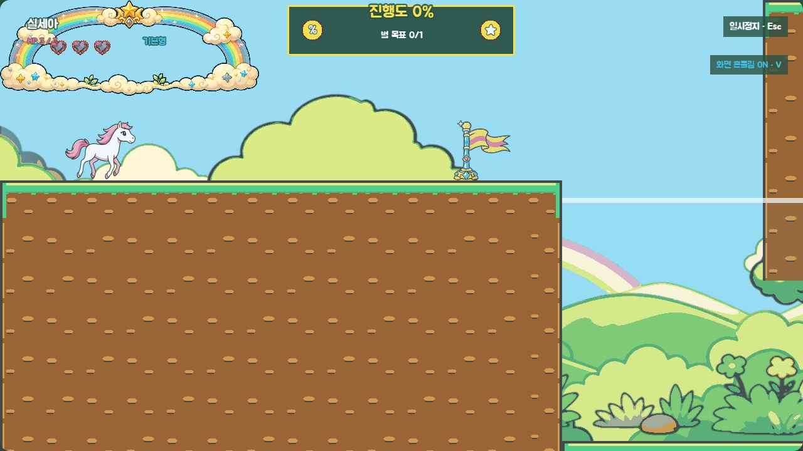
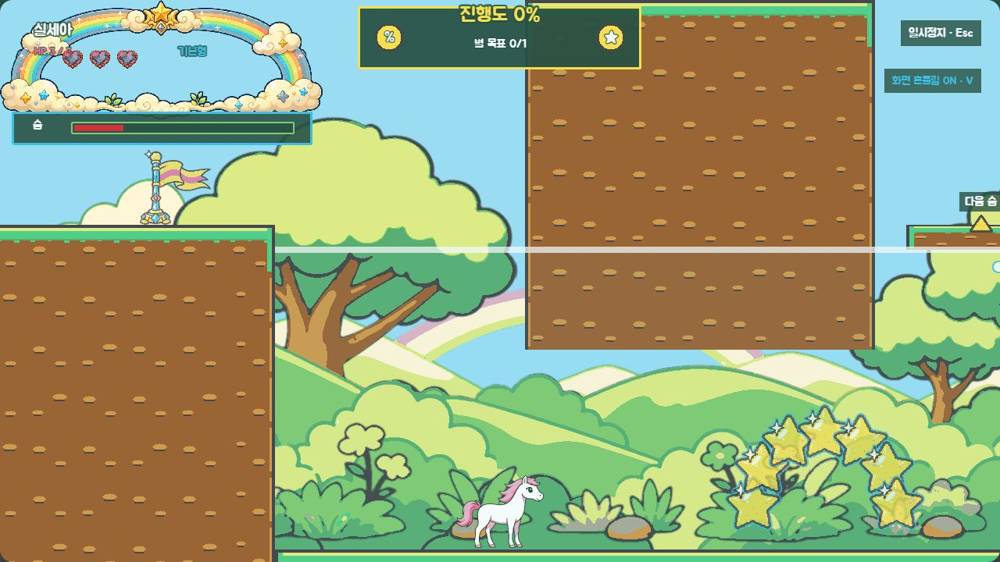
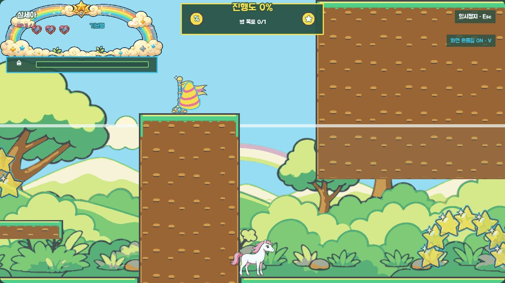
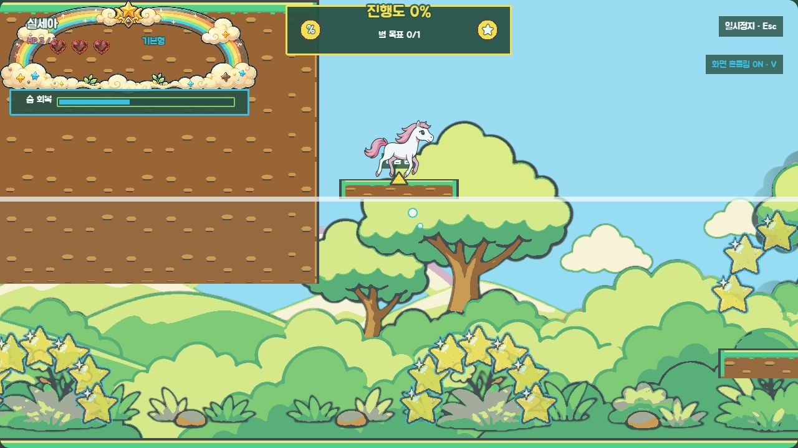
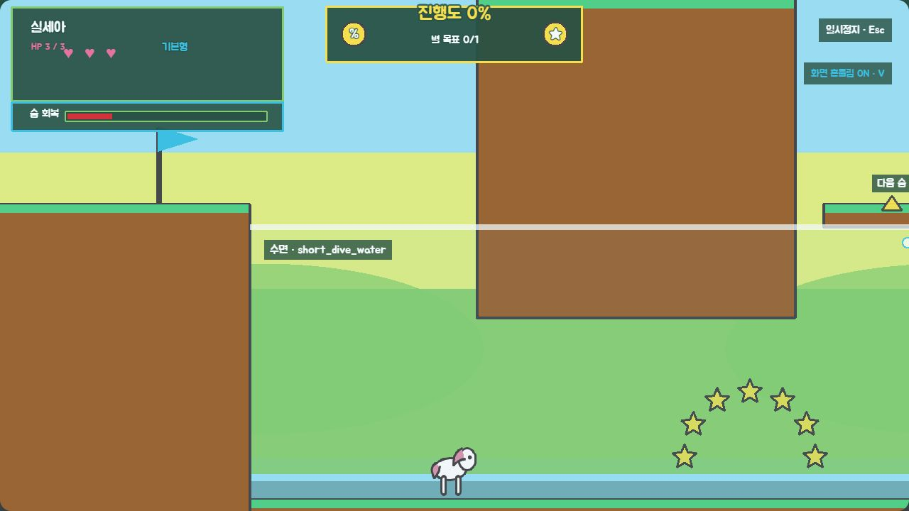
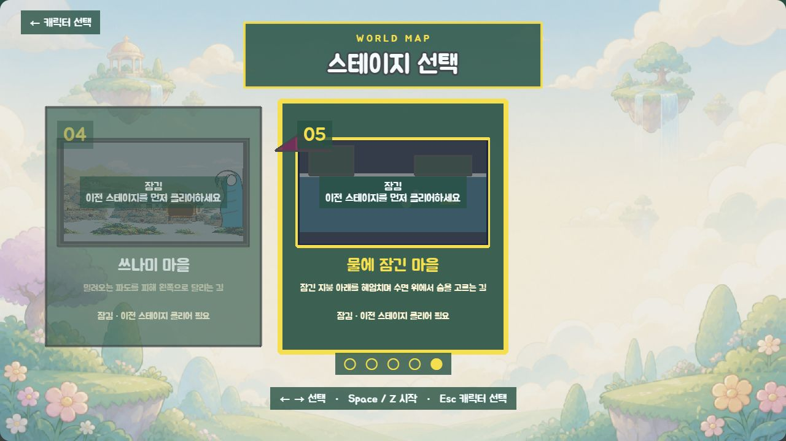
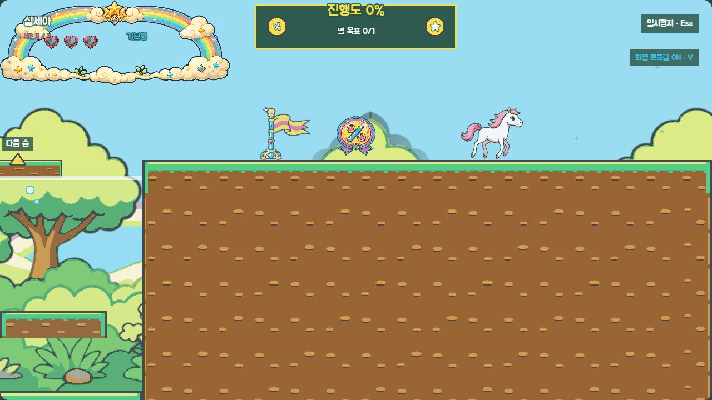

# P5 물에 잠긴 마을 회색 상자 검토

> 상태: 2026-08-27 사용자 승인 완료 (`P5 코스 승인`)
> 확인 범위: 정방향 코스, 짧은·긴·복합 잠수, 수면 지붕 호흡 지점, 숨 0 환경 피해, 체크포인트, 변신 규칙, 5장 선택 캐러셀
> 제외 범위: 최종 침수 마을 배경·타일·수면/빛결/기포 효과·수영 애니메이션·전용 BGM·선택 카드 이미지

## 이번 게이트에서 잠글 것

- 플레이어는 왼쪽 `x=192`에서 시작해 오른쪽 `x=8,016` 게이트로 이동한다.
- 코스는 `진입 지붕 → 짧은 잠수 → 긴 잠수 → 중간 호흡이 있는 복합 잠수 → 회복 지붕과 게이트` 순서다.
- 수면은 세 구간 모두 `y=320`, 바닥은 `y=704`이며 물속에는 `pit`을 두지 않는다.
- 잠긴 지붕 아래를 통과하려면 몸을 낮춰 헤엄쳐야 한다. 각 지붕 뒤에는 수면보다 32px 높은 작은 호흡 지붕과 `다음 숨` 표식이 있다.
- 복합 잠수는 두 잠긴 지붕 사이에 실제로 설 수 있는 중간 호흡 지붕을 둔다.
- 체크포인트는 진입 전, 짧은 잠수 뒤, 긴 잠수 뒤, 최종 회복부의 네 곳이며 부활하면 숨이 가득 찬다.
- 유니콘 자석은 유지하고, 페가수스는 물속에서 비행과 비행 게이지 소모가 멈춘다. 알리콘은 숨 감소·숨 피해에 면역이지만 이 스테이지에는 알리콘 아이템을 배치하지 않는다.

## 수치 대조

| 항목 | 일반 | 쉬움 | P0·P1 승인값 일치 |
|---|---:|---:|---|
| 숨 완전 소모 | 12초 | 17초 | 예 |
| 숨 완전 회복 | 2초 | 1.5초 | 예 |
| 숨 0 이후 피해 | 2.5초마다 HP 1 | 3.5초마다 HP 1 | 예 |
| 낮은 숨 경고 | 30% | 35% | 예 |
| 수중 중력 | 0.35배 | 0.35배 | 예 |
| 최대 낙하 속도 | 260 | 260 | 예 |
| 수평 속도 | 0.75배 | 0.8배 | 예 |
| 헤엄치기 상승 | -230 / 0.35초 | -240 / 0.3초 | 예 |

## 실제 화면 증거

### 1. 진입 지붕과 첫 수면

마른 지붕은 수면보다 32px 높고, 오른쪽의 흰 수면선 아래로 내려가며 첫 잠수가 시작된다.

### 2. 짧은 잠수와 다음 호흡 지점

한 개의 짧은 잠긴 지붕을 지나면 오른쪽 화면 안에 `다음 숨` 화살표와 수면 지붕이 보인다. 빈 공간이 아니라 실제 충돌 지형이다.

### 3. 숨 0의 회복 유예

숨이 0이 되는 순간 즉시 실패하지 않는다. 이 상태부터 일반 2.5초·쉬움 3.5초마다 `HealthManager`를 통해 HP 1이 감소하므로 수면으로 복귀할 시간이 남는다.

### 4. 수면 위 호흡 지붕

캐릭터의 머리가 수면보다 8px 이상 위로 나온 상태에서만 HUD가 `숨 회복`으로 바뀐다. 일반 모드는 빈 숨에서 2초 동안 회복한다.

### 5. 복합 잠수의 중간 호흡

두 번째 캐릭터도 같은 판정을 사용한다. 좌우의 잠긴 지붕 사이에 중간 호흡 지붕을 두어 두 번의 잠수를 한 번의 숨으로 강제하지 않는다.

### 6. 도형 fallback

이미지 에셋을 끈 상태에서도 흰 수면선, `수면 · short_dive_water` 라벨, 다음 숨 화살표, 낮은 숨의 붉은 HUD가 함께 남는다.

### 7. 다섯 번째 잠금 카드와 캐러셀

가운데 5번 카드와 왼쪽 4번 이웃 카드만 표시해 다섯 장이 화면 밖으로 잘리지 않는다. 다섯 개 페이지 점과 키보드·게임패드의 순환 순서는 `LEVELS` 순서를 그대로 사용한다.

### 8. 최종 회복 지붕과 오른쪽 게이트

복합 잠수 뒤 넓은 회복 지붕에서 숨을 정리하고 오른쪽 게이트로 진입한다.

## 자동·런타임 검증 범위

- `level-05` schema/order/section 연속성, 우향 spawn·exit, 게이트와 체크포인트 아래 안전 지형
- 물 구간 3곳의 경계·최대 잠수 거리, 물속 `pit` 금지, 호흡 지점 4곳의 물 영역 연결
- 호흡 지점마다 수면 위 충돌 지형 존재
- 일반·쉬운 모드의 승인 수치, 수면 아래 소모와 8px 위 회복 판정
- 숨 0 피해의 `HealthManager → recordDamage → HP 0 부활` 경로와 환경 피해 무경직
- 체크포인트 부활 시 숨 완전 회복
- 수중에서 페가수스 비행 대신 수영 입력을 우선하는 연결과 알리콘 면역
- 4번 클리어 뒤 5번 해금, 5장 캐러셀·페이지 표시
- 정상·fallback 탭의 처리되지 않은 콘솔 경고·오류 없음

## 확인 요청

다음 네 가지를 함께 확인한다.

1. `짧은 잠수 → 긴 잠수 → 중간 호흡이 있는 복합 잠수`의 난이도 상승이 자연스러운가.
2. 흰 수면선, 다음 숨 화살표, 작은 지붕만으로 머리를 물 밖에 내야 한다는 규칙이 이해되는가.
3. 일반 12초 잠수·2초 회복·숨 0 뒤 2.5초마다 HP 1 감소를 첫 기준으로 사용해도 되는가.
4. 왼쪽에서 오른쪽으로 돌아온 진행 방향과 5장 선택 캐러셀이 혼란스럽지 않은가.

2026-08-27 사용자가 **`P5 코스 승인`**이라고 명시했다. 이 회색 상자를 커밋하고, 최종 색을 넣기 전 침수 마을·수면·잠긴 지붕의 흑백 아트 앵커를 별도 게이트로 제시한다.
