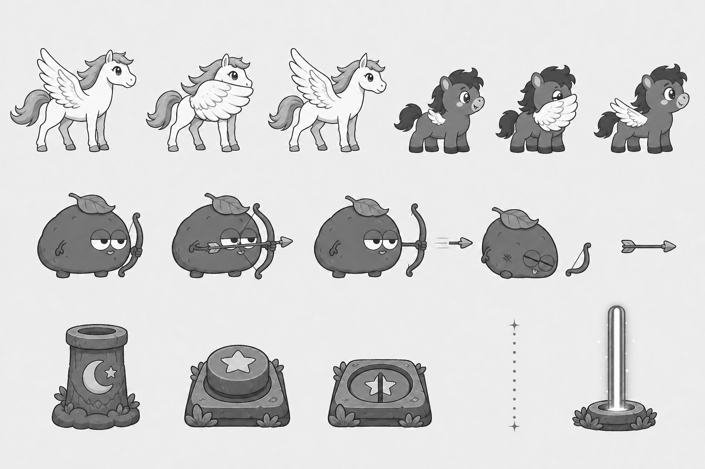
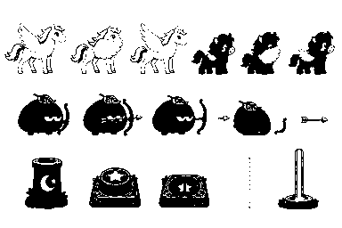

# P6 공용 전투·장치 흑백 아트 앵커 검토

> 상태: 2026-08-28 사용자 승인 완료 (`P6 앵커 승인`)
> 범위: P6 최종 컬러 에셋 제작 전 날개 방어·감자 궁수·화살·레이저 발사기·스위치·빔 형태 승인
> 주의: 아래 이미지는 방향을 잠그기 위한 흑백 콘셉트다. 게임 에셋·manifest·mapping에는 등록하지 않았으며 P6 효과음도 포함하지 않는다.

## 확인할 방향

1. 실세아와 감자89의 날개는 모든 자세에서 어깨에 붙어 있고, 방어 중에는 앞쪽 얼굴·가슴만 가린다.
2. 방어는 전신 보호막이나 비행 자세가 아니라 `준비 → 날개를 앞으로 모아 유지 → 해제`로 읽힌다. 최종 4프레임은 준비 1, 전개 1, 유지 1, 해제 1로 제작한다.
3. 감자 궁수는 생감자의 둥근 몸·졸린 눈·작은 발·입·표면 자국을 유지하고, 작은 뿌리손·잎 표식·나뭇가지 활만 역할 단서로 더한다.
4. ON 스위치는 버튼이 올라오고 완전한 별이 보이며, OFF 스위치는 버튼이 눌리고 별이 갈라져 색 없이도 상태를 구분한다.
5. 레이저 예고는 가는 점선, 활성 빔은 흰 중심과 굵은 이중 외곽선으로 구분한다. 발사기는 달·별 문양과 식물 받침을 써서 별빛 숲의 마법 장치로 보이게 한다.

좌향은 기존 방식대로 런타임에서 우향 에셋을 반전하고 화살은 한 방향 원본을 회전한다. 최종 제작에서도 방어 날개와 몸 사이에 빈틈을 만들지 않으며, 궁수의 활·화살은 어린이용 둥근 형태를 유지한다.

## 검토 이미지

### 전체 흑백 앵커

위쪽은 실세아와 감자89의 방어 준비·유지·해제, 가운데는 감자 궁수의 대기·조준·발사·패배와 독립 화살, 아래쪽은 발사기·ON/OFF 스위치·예고선·활성 빔이다. 모든 요소를 분리 배치해 최종 프레임 제작 때 서로 섞이지 않게 했다.

### 25% 축소 확인

384×256에서도 두 캐릭터의 일반 날개와 전면 방어 날개, 궁수의 활·수평 화살, 돌출/함몰 스위치, 점선 예고와 굵은 활성 빔이 구분된다.

### 25% 이진 실루엣

중간 명암을 제거해도 전면으로 모인 날개, 감자 궁수의 활, 발사기와 두 스위치의 높이 차, 예고 점선과 활성 빔의 외곽이 서로 다른 덩어리로 남는다.

## 최종 컬러 적용안

새 HEX를 추가하지 않고 `data/palette.js`와 기존 캐릭터 에셋의 승인색만 사용한다.

| 역할 | 적용안 |
|---|---|
| 실세아·감자89 | 기존 페가수스 프레임의 몸·갈기·날개 색을 그대로 유지 |
| 감자 궁수 몸·그림자 | `#957242`, `#5D4326` |
| 궁수 잎 표식 | `#CDE5B9`, `#82CB70` |
| 활·화살 | `#D09A4E`, `#5D4326`, 깃 보조 `#E573A0` |
| 공통 외곽선 | `#42474E` |
| 발사기·스위치 몸체 | `#193A3E`, `#214D59`, 식물 `#285144` |
| ON 별·활성 표시 | `#F5DF4F`, `#F4FBFD` |
| OFF 상태 | `#A8AA96`, 갈라진 별과 함몰 형태 병행 |
| 레이저 예고 | `#D294AC`, 가는 점선 |
| 활성 빔 | 중심 `#F4FBFD`, 안쪽 `#3DBFE3`, 바깥 `#752B5A` |
| 방어 성공 호·반짝임 | `#3DBFE3`, `#F4FBFD` |

## 생성 기록

- 생성 방식: Codex 내장 이미지 생성 도구(기본 built-in 모드)
- 최종 선택 원본: `assets/_source/p6/p6_combat_devices_anchor_generated_v2.png`
- 참조 입력: `references/character-pegasus-contact-sheet.png`, `references/character-potato-pegasus-contact-sheet.png`, `references/enemy-raw-potato-contact-sheet.png`, `references/p6-graybox-guard.png`, `references/p2-starlight-anchor-contact-sheet.png`
- 참조 역할: 캐릭터 2장은 승인된 얼굴·몸 비율·갈기·날개 연결을, 생감자 시트는 적 정체성과 선화를, 회색 상자는 방어 방향과 적 크기를, 별빛 숲 앵커는 흑백 명암과 생산용 접촉 시트 구성을 고정했다.
- 단일 교정: 최초 시안에서 흰 활성 빔 외곽이 이진 축소 시 사라져, 활성 빔에만 중간 명도의 연속 외곽 두 줄을 추가했다. 다른 캐릭터·적·장치는 유지했다.
- 후처리: 선택 원본은 변경하지 않고 `scripts/build-p6-anchor-review.js`로 완전한 회색조 접촉 시트, 25% 축소본, 명암 기준 이진 실루엣을 생성했다.
- 검증 결과: 원본 1536×1024, 축소본 384×256, RGB 채널 최대 편차 0
- 생성 프롬프트: 캐릭터 2종의 우향 방어 준비·유지·해제, 생감자 정체성을 유지한 궁수 4자세와 화살, 별빛 숲형 발사기·돌출 ON/함몰 OFF 스위치·점선 예고·굵은 활성 빔을 세 행에 분리한 3:2 흑백 접촉 시트를 요청했다. 날개는 반드시 몸에 붙고 앞쪽만 가리며, 뿔·분리 날개·전신 버블·현대 기계·텍스트를 금지했다.
- 교정 프롬프트: 오른쪽 아래 활성 빔만 수정해 흰 중심을 보존하면서 전체 높이에 중간 명도의 굵은 외곽 두 줄을 추가하고, 나머지 요소와 픽셀은 가능한 한 그대로 유지하도록 요청했다.

## 사용자 확인 게이트

다음 다섯 항목을 함께 확인한다.

- 두 캐릭터의 정체성이 유지되고 날개가 몸에서 떨어져 보이지 않는가.
- 방어 날개가 비행이나 전신 보호막이 아니라 정면 방어로 읽히는가.
- 감자 궁수의 조준·발사와 독립 화살이 작은 크기에서도 구분되는가.
- 발사기, ON/OFF 스위치, 예고선, 활성 빔이 색 없이도 상태와 역할이 다른가.
- 위 팔레트 적용안으로 최종 캐릭터·적·장치·효과와 P6 효과음 3종을 제작해도 되는가.

2026-08-28 사용자가 **`P6 앵커 승인`**이라고 명시했다. 이 앵커를 커밋하고 최종 컬러 에셋과 `sfx_projectile_guard`, `sfx_laser_warning`, `sfx_laser_off`를 제작·연결한다.
