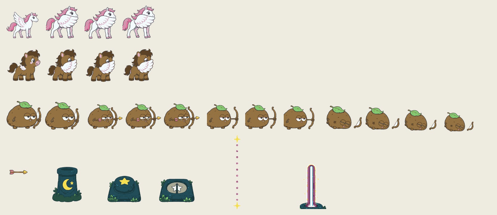
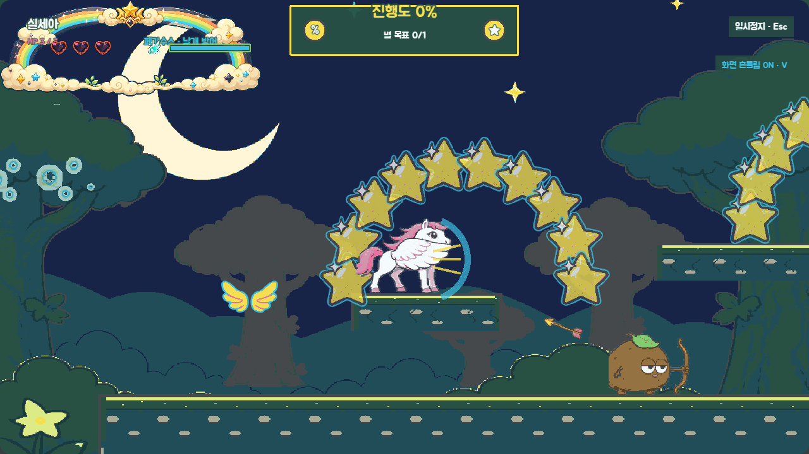
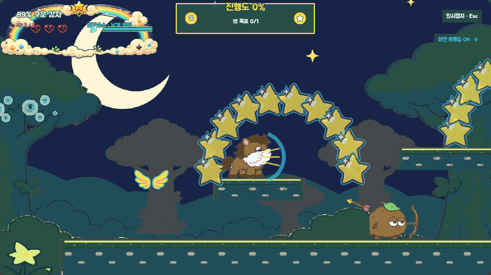
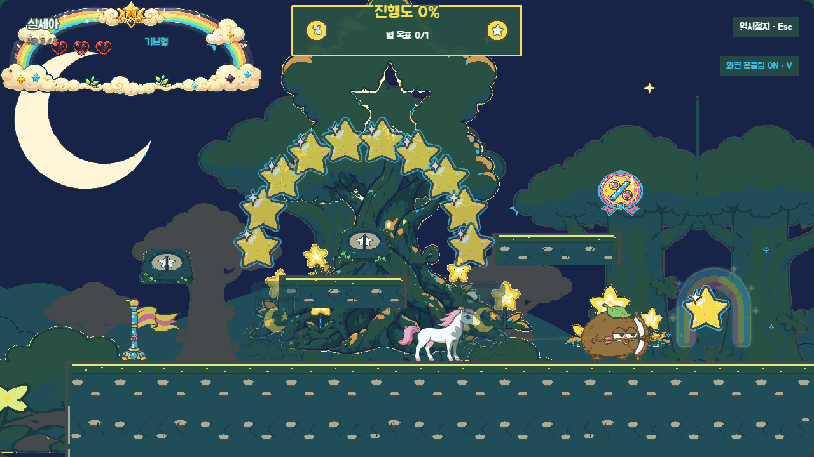

# P6 공용 전투·장치 최종 화면 검토

> 상태: 최종 컬러 에셋·효과음·런타임 연결 완료, 사용자 `P6 최종 승인` 대기
> 범위: 두 캐릭터의 날개 방어, 감자 궁수와 화살, 별빛 숲 레이저·스위치, P6 효과음 3종
> 기준 앵커: `references/P6_COMBAT_ANCHOR_REVIEW.md`에서 2026-08-28 승인한 형태와 팔레트

## 최종 에셋 시트

- 실세아·감자89 방어는 각각 128×128 4프레임이며, 몸과 날개가 한 이미지 안에 붙어 있다.
- 감자 궁수는 대기 2·조준 3·발사 3·패배 4프레임이다. 화살은 64×32 한 장을 런타임에서 진행 방향으로 회전한다.
- 발사기 128×128, 스위치 128×96 2종, 예고 64×256, 활성 빔 96×256을 투명 PNG로 분리했다.
- 모든 최종 PNG는 승인 팔레트로 양자화했고 모서리와 빈 공간은 실제 알파다.

## 실제 런타임

### 실세아·감자89 날개 방어

페가수스 상태에서는 몸에 합성한 방어 시트를 재생해 날개가 떨어져 보이지 않는다. 알리콘은 기존처럼 뿔이 몸 프레임에 합성된 유니콘 동작을 유지하고 날개 부착물·방어 호를 함께 표시하므로, 방어 순간에 뿔이 사라지는 회귀를 만들지 않았다. 청록 호는 실제 정면 150°·96px 판정 방향을 알려 주며 투사체만 막는다.

### 레이저 예고·활성·스위치 OFF

예고는 분홍 점선, 활성은 흰 중심과 청록·자주 이중 외곽, OFF는 함몰된 갈라진 별로 읽힌다. 스위치와 빔의 연결 ID·피해 판정은 기존 승인 규칙을 유지하며, 최종 이미지가 없거나 `?fallback=1`이면 기존 도형 표시로 자동 전환한다.

## 효과음

| 키 | 길이 | 연결 |
|---|---:|---|
| `sfx_projectile_guard` | 0.24초 | 실제 방어 성공 프레임, 같은 프레임 최대 2회 |
| `sfx_laser_warning` | 0.42초 | 플레이어 720px 안쪽에서 예고 단계가 시작될 때 1회 |
| `sfx_laser_off` | 0.38초 | 스위치 OFF와 연결 빔 정지가 적용되는 프레임 |

세 파일은 22050Hz mono 16-bit PCM WAV이며 실제 경보·사이렌을 연상시키는 음색을 쓰지 않았다. 음소거에서도 자세·점선·이중 외곽·갈라진 별만으로 상태를 판독할 수 있다.

## 생성·가공 기록

- 생성 방식: Codex 내장 이미지 생성의 정밀 오브젝트 편집 모드
- 생성 원본: `assets/_source/p6/p6_combat_devices_color_source.png`
- 알파 복원 원본: `assets/_source/p6/p6_combat_devices_color_source_alpha.png`
- 참조: 승인 흑백 P6 앵커, 실세아·감자89 페가수스 시트, 생감자 시트, P6 회색 상자 런타임 화면
- 생성 요청: 승인된 배치와 실루엣은 바꾸지 않고 기존 캐릭터 색, 생감자 갈색·초록 잎·나뭇가지 활, 별빛 숲 짙은 청록 장치, 분홍 점선, 흰 중심·청록·자주 빔을 적용한 투명 생산 시트를 요청했다. 새로운 캐릭터·장치·문자·보호막·배경은 금지했다.
- 후처리: 생성 결과의 체크무늬처럼 칠해진 바깥 배경만 가장자리 연결 영역으로 제거했다. 흰 말 몸 내부는 제거 대상에서 제외하고, 그룹별 승인 팔레트 양자화·작은 분리 조각 제거·128px 기준선 정렬·시트 조립을 `scripts/build-p6-assets.js`로 수행했다.

## 검증 결과

- `npm run test` 통과
- `npm run validate` 통과: manifest 195개(시각 144·오디오 51), mapping 133개, 런타임 파일 200개
- 캐릭터 110프레임·46시트, 적 92프레임·22시트, 오디오 51개 규격·팔레트·duration·알파 검증 통과
- `npm run build` 통과
- 고정 검토 진입점 `?visualReview=level-02&section=star_tree&laser=warning|active|disabled`로 세 상태를 같은 화면에서 비교했다.

## 사용자 확인 게이트

- 두 캐릭터의 방어 날개가 몸에 붙어 있고 정면 방어로 읽히는가.
- 감자 궁수의 생감자 정체성, 조준 자세, 활과 화살이 배경에서 구분되는가.
- 점선 예고·활성 빔·ON/OFF 스위치가 색과 형태 두 신호로 구분되는가.
- 세 효과음과 시각 상태의 시작 시점이 자연스러운가.

수정할 지점이 없다면 **`P6 최종 승인`**이라고 답하면 된다. 승인 전에는 이 최종 구현을 커밋하지 않는다.
