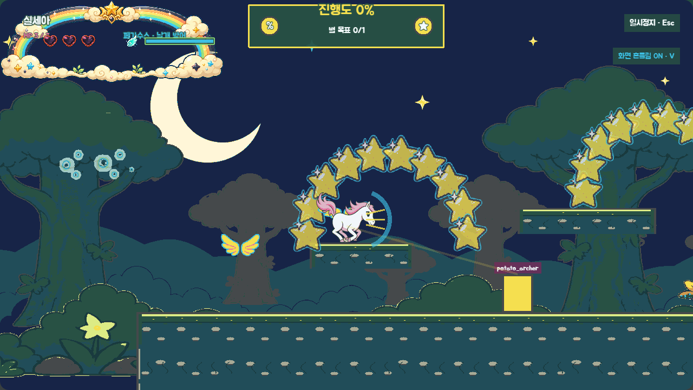
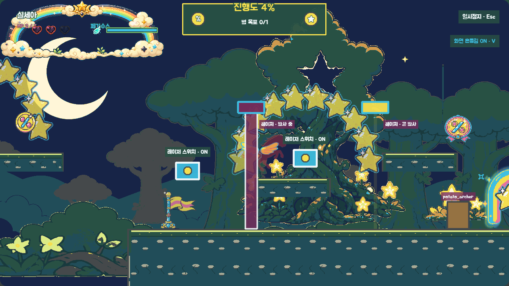

# P6 공용 전투·장치 회색 상자 검토

> 상태: 2026-08-28 사용자 승인 완료 (`P6 코스 승인`)
> 규칙 승인: 2026-08-28 `P6 규칙 승인` · 커밋 `27d6b5f`
> 확인 범위: 별빛 숲의 날개 방어·궁수·화살·레이저·스위치 소개→연습→응용→조합
> 제외 범위: 날개 방어 캐릭터 프레임, 궁수·화살·레이저 최종 에셋, P6 효과음, 중간 보스

## 이번 게이트에서 잠글 것

- `Shift/X`·게임패드 X를 누르면 페가수스·알리콘이 120ms 준비 뒤 날개 방어를 시작한다.
- 페가수스는 기존 비행 게이지를 초당 1.5초분 소모하고 방어 중 수평 속도는 55%이며 상승 비행은 하지 않는다. 해제 뒤 350ms 재사용 대기가 있다.
- 정면 150°·96px 안의 `guardable: true` 화살·일반 투사체만 막는다. 뒤쪽 화살, 레이저, 먹구름 번개, 감자 대왕 탄환, 접촉·환경 피해는 막지 않는다.
- 궁수는 화면 안에서 `조준 예고 → 1발 발사 → 빈틈`을 반복한다. 첫 궁수만 느린 화살 1발을 쏘고 멈춘다.
- 레이저는 `예고 → 빔 → 휴지`를 반복한다. 높은 선택 경로의 스위치를 누르면 같은 ID의 빔만 꺼지고 체크포인트 부활 뒤에도 유지된다.
- 궁수·레이저는 날개를 얻은 뒤의 별빛 숲에서 처음 등장한다. 기존 낭떠러지 `x=3840~4992`에는 추가하지 않는다.

## 4비트 배치와 수치

| 비트 | x 범위 | 일반 | 쉬움 | 안전장치 |
|---|---:|---|---|---|
| 소개 | 2,624~3,136 | 궁수 예고 1.1초·화살 240px/s·1회 | 예고 약 1.53초·화살 180px/s·1회 | 평지, 기존 가시 제거 |
| 연습 | 3,136~3,712 | 예고 0.9초·화살 320px/s·빈틈 1.2초 | 예고 1.25초·화살 240px/s·빈틈 1.55초 | 구간 뒤 체크포인트 |
| 응용 | 4,992~5,504 | 예고 0.9초·빔 1.4초·휴지 1.2초 | 예고 1.3초·빔 1.2초·휴지 1.8초 | HP 회복 체크포인트, 적 없음 |
| 조합 | 5,504~5,952 | 궁수 1명+별도 스위치 레이저 1개 | 같은 완화 수치 | 기존 가시·생감자 제거, 게이트 앞 바닥 |

쉬운 모드는 구간을 삭제하지 않고 예고·빈틈을 늘리고 화살·활성 빔 압박만 줄인다. 화면 내 화살 상한은 일반 4개, 쉬움 3개다.

## 실제 브라우저 화면

### 1. 정면 날개 방어와 궁수 조준

- HUD에 `페가수스 · 날개 방어`와 공유 비행 게이지가 함께 표시된다.
- 캐릭터 정면의 파란 호가 실제 150° 방어 방향을 나타낸다.
- 궁수의 직사각형과 조준선은 최종 에셋이 아닌 회색 상자다. 선은 발사 순간의 목표를 고정하며 화살은 발사 뒤 유도되지 않는다.

### 2. 레이저 두 주기·스위치·궁수 조합

- 왼쪽 레이저는 `발사 중`, 오른쪽은 `곧 발사` 상태라 색뿐 아니라 굵기와 라벨로 주기를 구분한다.
- 각 레이저 앞의 `레이저 스위치 · ON`은 서로 다른 ID에 연결된다.
- 스위치는 높은 선택 경로에 있어 누르지 않고 주기를 보고 통과할 수도 있다.
- 캡처의 HP 2는 활성 레이저가 날개 방어를 무시하고 HP 1을 줄인 실제 판정 결과다.

## 자동·런타임 검증 범위

- 방어 준비·소모·속도·재사용 대기와 방어 중 상승 비행 차단
- 좌우 진행 방향과 무관한 정면 150°·96px 판정, 후면·거리 밖 거부
- 화살 `guardable: true`, Object Pool 일반 4·쉬움 3 상한, 화면 밖 회수
- 궁수 3명의 날개 획득 뒤 배치와 낭떠러지 구간 투사체 금지
- 레이저·스위치 ID 중복/누락, world 범위와 주기 양수 검증
- 일반/쉬운 모드 궁수·레이저 수치 변환과 원본 데이터 불변성
- 스위치 OFF가 같은 `switchId` 빔에만 적용되고 체크포인트 부활에서 초기화되지 않는 런타임 수명
- 정상 에셋 실제 브라우저의 날개 방어·조준선·레이저 예고/활성·HP 피해 화면
- `npm run test`, `npm run validate`, `npm run build` 통과

## 확인 요청

다음 네 가지를 함께 확인한다.

1. `날개 획득 → 느린 1발 → 반복 궁수 → 레이저 → 궁수+레이저`의 난이도 상승이 자연스러운가.
2. 방어 준비 120ms, 게이지 소모 1.5배, 이동 55%, 재사용 350ms가 방어와 회피 중 하나를 고르게 하는 기준으로 적절한가.
3. 레이저 스위치가 필수 열쇠가 아니라 위험을 줄이는 선택 경로인 구성이 적절한가.
4. 별빛 숲의 기존 낭떠러지에는 새 공격을 넣지 않고 앞뒤 평지에만 배치한 것이 좋은가.

2026-08-28 사용자가 **`P6 코스 승인`**이라고 명시했다. 이 회색 상자를 커밋하고 날개 방어·궁수·화살·레이저·스위치의 흑백 아트 앵커를 다음 게이트로 제작한다.
