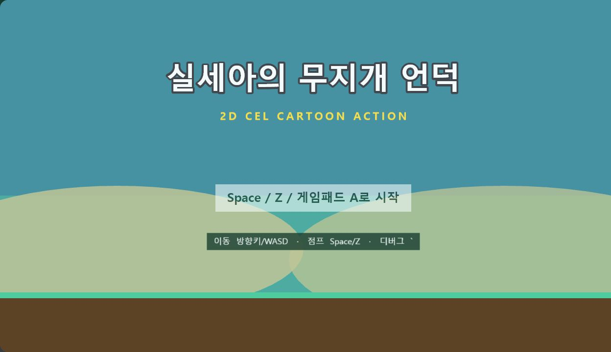
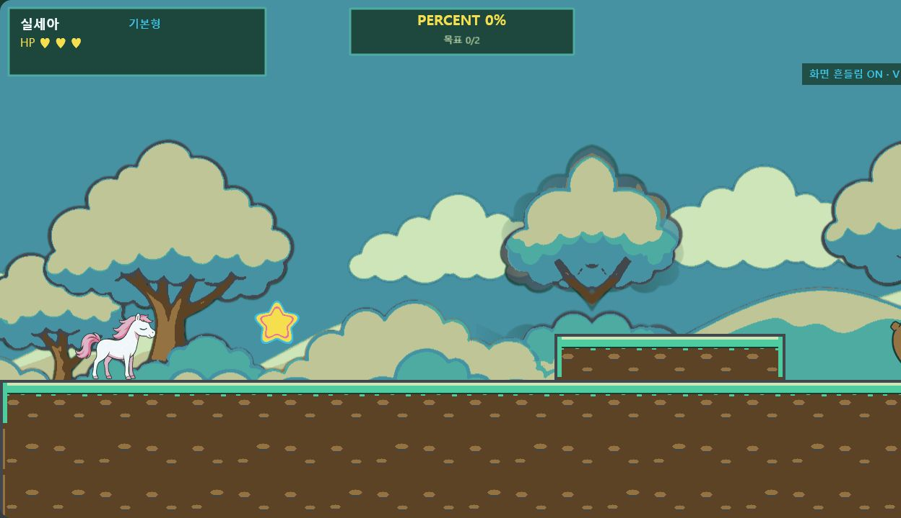
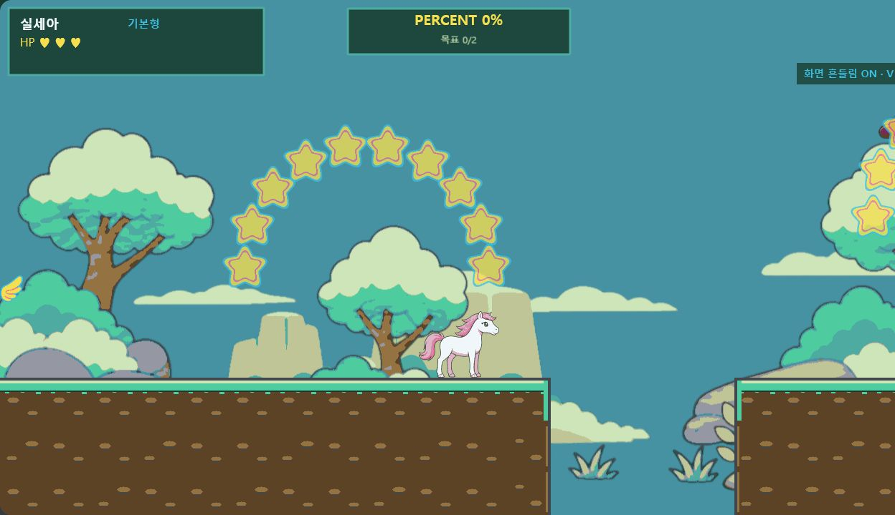
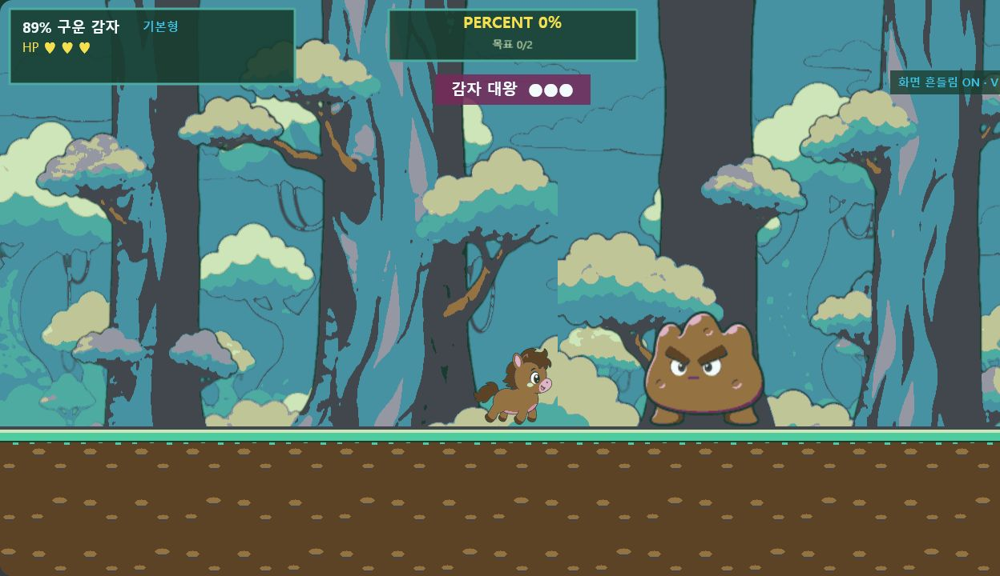

# Phase 3 런타임 화풍 검수

- 검수일: 2026-08-05
- 게임 캔버스 기준: 1280×720
- 승인 캡처: 1248×720 (앱 내 브라우저 CSS-fit, 화면 비율 유지)
- 대상: 타이틀, 일반 숲, 낭떠러지, 보스 숲
- 결과: 승인

## 검수 결과

| 화면 | 확인 항목 | 결과 |
|---|---|---|
| 타이틀 | 공용 팔레트, 제목 위계, 게임 화면과 같은 언덕 색상 | 승인 |
| 일반 숲 | far/mid/near 원근, 캐릭터 외곽선, 별 수집물의 즉시 판독성 | 승인 |
| 낭떠러지 | 지형 단절의 명확성, 별 아크의 동선 유도, pit 배경 무드 | 승인 |
| 보스 숲 | 일반 구간과 구분되는 밀도·명도, 플레이어/보스 크기 대비, 위험 실루엣 | 승인 |

모든 화면에서 `data/palette.js` 기반 색상, 짙은 회녹색 외곽선, 3톤 이내 셰이딩이 일관되게 유지된다. 수집물은 노란색 외곽광으로 배경에서 분리되고, 보스는 플레이어보다 큰 덩어리와 낮은 중심으로 위험 역할이 명확하다.

초기 캡처에서 일반 실행에도 노출되던 구간 ID와 FPS/디버그 문구는 화풍을 방해하므로 `?debug=1`에서만 표시되도록 보정했다. 기본 실행과 아래 승인 캡처에는 디버그 표시가 없다.

## 승인 캡처

### 1. 타이틀

### 2. 일반 숲

### 3. 낭떠러지

### 4. 보스 숲

## 재현 URL

- 일반 숲: `/?visualReview=level-01&section=tutorial&character=silsea`
- 낭떠러지: `/?visualReview=level-01&section=pegasus&offset=896&character=silsea`
- 보스 숲: `/?visualReview=level-01&section=boss&offset=1250&character=potato89`

`visualReview`는 검수용 직접 진입점이며 일반 게임 시작 흐름에는 영향을 주지 않는다. `offset`은 선택 구간 시작점을 기준으로 하며 구간 끝 96px 이전으로 자동 제한된다.
