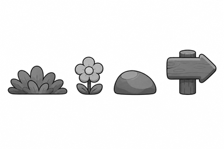
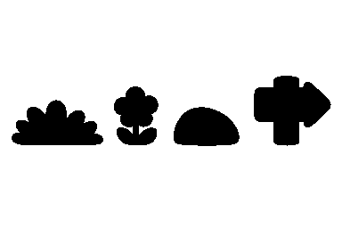

# Should S6 추가 배경 장식 흑백 앵커 검토

> 상태: 승인 완료 — 2026-09-04 사용자 `S6 앵커 승인`

> 승인 문구: `S6 앵커 승인`

## 1. 잠글 시각 방향

1. 풀은 좌우로 퍼지는 낮은 3봉 덩어리와 둥근 잎 5~7개로 만들고, 위험물처럼 보이는 가시 끝을 쓰지 않는다.
2. 꽃은 둥근 꽃잎 5장·작은 중심·짧은 줄기·둥근 잎 2장으로 제한해 별 수집물과 구분한다.
3. 바위는 높이보다 폭이 넓은 비대칭 타원과 작은 좌상단 면만 사용하며, 균열·가시·긴 평면 상단을 만들지 않는다.
4. 표지는 오른쪽을 가리키는 둥근 화살표 판과 짧은 기둥으로 만들고 문자·숫자·추가 판을 넣지 않는다. `level-04`에서는 좌우 반전한다.
5. 네 형태 모두 굵고 둥근 외곽, 최대 3단계 명암, 지면에 붙는 실루엣으로 통일한다. 얼굴·후광·그림자·애니메이션 선은 사용하지 않는다.

## 2. 검토 이미지

### 전체 흑백 앵커

왼쪽부터 풀·꽃·바위·오른쪽 화살표 표지다. 네 소품은 한 행에 분리되어 있고 동일한 지면 기준선에 놓인다.

### 25% 축소 확인

384×256에서도 낮고 넓은 풀, 세로 꽃, 둥근 바위, 화살표 표지의 높이·외곽 차이가 유지되는지 확인한다.

### 25% 이진 실루엣

색과 내부 명암 없이도 네 역할이 분리되어야 한다. 최종 표지 불투명 폭은 배치 안전 조건에 맞춰 표시 폭 112px 중 88px 이하로 후처리한다.

## 3. 승인 뒤 제작 단위

| 키 | 최종 원본 | 런타임 표시 | 형태 잠금 |
|---|---:|---:|---|
| `decor_grass` | 192×128 | 144×72 | 낮은 3봉, 둥근 잎 5~7개 |
| `decor_flower` | 128×128 | 88×88 | 꽃잎 5장, 잎 2장 |
| `decor_rock` | 160×128 | 112×72 | 낮은 비대칭 타원, 좌상단 면 |
| `decor_sign` | 160×192 | 112×144 | 우향 둥근 화살표, 짧은 기둥, 불투명 폭 제한 |

네 파일은 각각 정지 투명 PNG 한 장만 만든다. 프레임 애니메이션, 충돌체, 상호작용 이벤트, 전용 SFX는 추가하지 않는다.

## 4. 최종 컬러 적용안

새 HEX를 추가하지 않고 `data/palette.js`의 기존 승인 팔레트만 사용한다.

| 역할 | 적용 원칙 |
|---|---|
| 풀 | 환경 녹색 3톤, collect·danger 색상 제외 |
| 꽃 | 낮은 채도 분홍·황토·환경 녹색, 빛나는 중심 제외 |
| 바위 | 중성 회색 3톤, 붉은 균열·위험 강조 제외 |
| 표지 | 목재색 3톤, 문자·기호·위험색 제외 |
| 공통 외곽 | 검정 대신 승인된 짙은 색상 외곽 사용 |

## 5. 생성 기록

- 생성 방식: Codex 내장 이미지 생성 도구의 기본 built-in 모드
- 최종 선택 원본: `assets/_source/s6/s6_decor_anchor_generated_v1.png`
- 참조 입력: `references/background-normal-preview.png`, `references/grass-tileset-preview.png`, `references/p2-starlight-anchor-contact-sheet.png`
- 참조 역할: 첫 이미지는 둥근 식생과 지면 장식 비율, 둘째는 단순한 지형 명암, 셋째는 회색조 접촉 시트의 선·간격만 참고했다. 기존 배경 구도·타일 배치·별빛 숲 오브젝트는 복제하지 않았다.
- 후처리: `scripts/build-s6-decor-anchor-review.js`로 완전한 회색조 접촉 시트, 25% 축소본, 임계값 235 이진 실루엣을 생성한다.
- 생성 프롬프트 요약: 흰 배경 1536×1024 한 행에 풀·꽃·바위·우향 표지를 서로 겹치지 않게 배치하고, 굵고 둥근 선·3단계 회색조·강한 축소 실루엣을 요청했다. 색·텍스트·패널·배경·위험물·수집물 표현을 금지했다.

## 6. 사용자 확인 게이트

- 풀의 잎 끝이 위험물처럼 뾰족하지 않고 낮은 식생으로 읽히는가.
- 꽃이 별·퍼센트 같은 수집물 대신 지면 장식으로 읽히는가.
- 바위가 발판이나 가시 장애물로 오인되지 않는가.
- 표지가 문자 없이 방향을 전달하고 좌우 반전에 적합한가.
- 25% 축소와 이진본에서도 네 역할이 서로 구분되는가.

승인 문구: **`S6 앵커 승인`**

## 7. 승인 기록

2026-09-04 사용자가 **`S6 앵커 승인`**이라고 명시했다. 위 풀·꽃·바위·우향 표지의 형태, 축소 실루엣, 최종 캔버스 규격과 기존 팔레트 적용안을 최종 제작 기준으로 잠근다.
