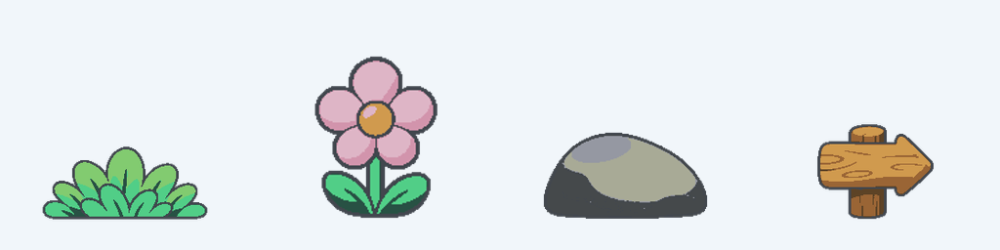
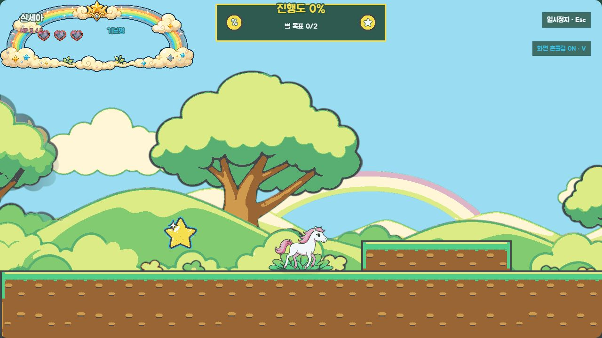
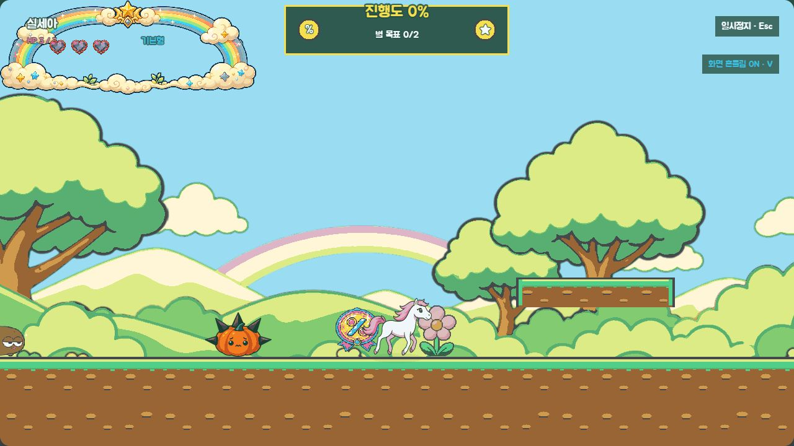
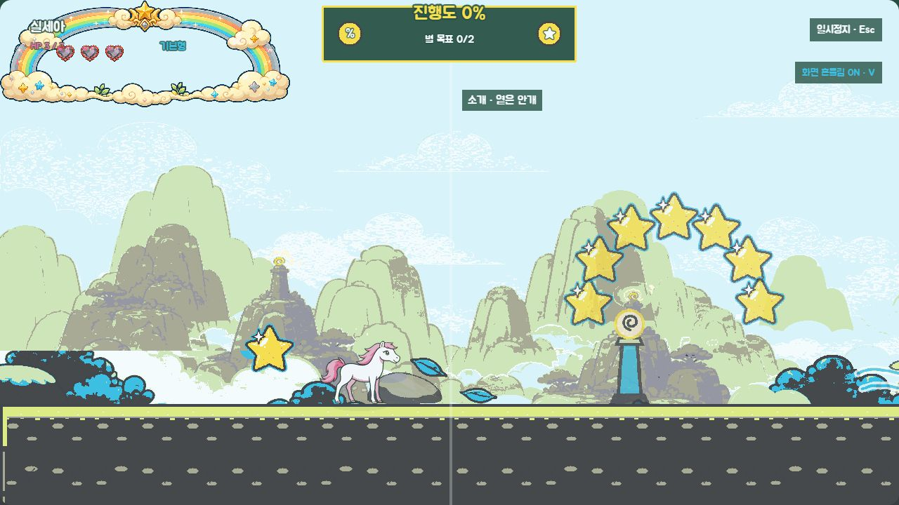
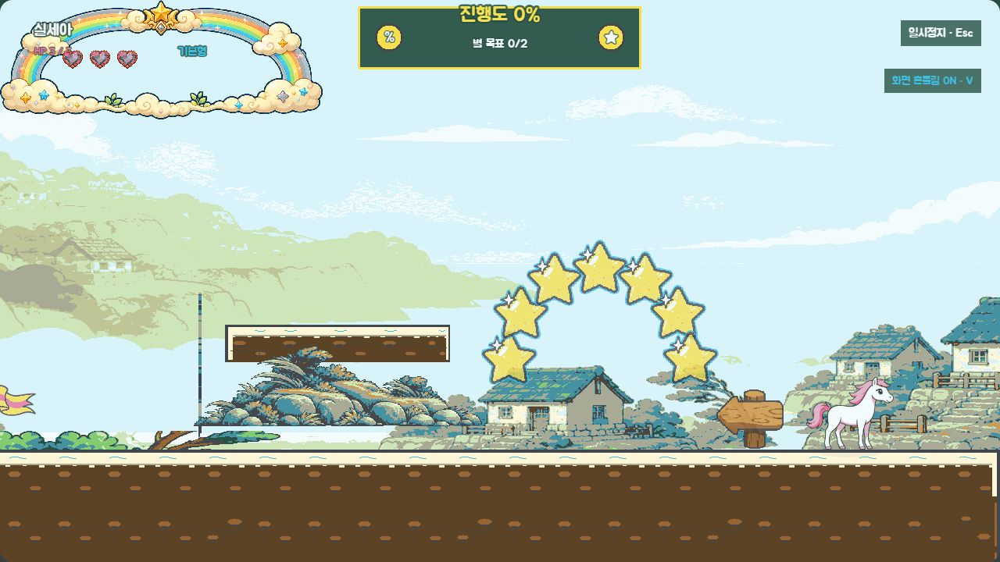

# Should S6 추가 배경 장식 최종 검수

> 상태: 승인 완료 — 2026-09-04 사용자 `S6 최종 승인`

> 승인 문구: `S6 최종 승인`

## 최종 에셋

| 키 | 파일 규격 | 불투명 bounds | 런타임 표시 | 배치 |
|---|---:|---:|---:|---|
| `decor_grass` | 192×128 | 184×81 | 144×72 | `level-01` tutorial x 640 |
| `decor_flower` | 128×128 | 91×120 | 88×88 | `level-01` unicorn_garden x 3200 |
| `decor_rock` | 160×128 | 152×80 | 112×72 | `level-03` mist_intro x 576 |
| `decor_sign` | 160×192 | 124×101 | 112×144 | `level-04` tsunami_intro x 9920, `flipX: true` |

표지의 런타임 불투명 폭은 `124 / 160 × 112 = 86.8px`로 승인 안전 조건 88px 이하를 충족한다.

## 실제 배치

### 무지개 언덕 — 풀

### 무지개 언덕 — 꽃

### 안개 골짜기 — 바위

### 쓰나미 마을 — 왼쪽 표지

표지 원본은 오른쪽 화살표지만 런타임 `flipX: true`를 통해 실제 화면에서 왼쪽 진행을 가리킨다.

## 제작·후처리 기록

- 생성 방식: Codex 내장 이미지 생성 도구 built-in 모드, 승인 앵커를 형태 참조로 사용해 네 파일을 각각 1회 생성.
- 원본: `assets/_source/s6/decor_grass_generated_v1.png`, `decor_flower_generated_v1.png`, `decor_rock_generated_v1.png`, `decor_sign_generated_v1.png`.
- 후처리: `scripts/build-s6-decor-assets.js`에서 alpha 96 미만 후광 제거, 불투명 alpha 잠금, 에셋별 승인 팔레트 양자화, 정확한 캔버스 정규화와 최종 시트 생성.
- 최종 파일: `assets/decorations/decor_grass.png`, `decor_flower.png`, `decor_rock.png`, `decor_sign.png`.
- 생성 프롬프트: 각 호출에서 승인 앵커의 해당 실루엣만 유지하고 실제 투명 배경, 단일 오브젝트, 굵은 색상 외곽, 최대 3단계 명암을 요청했다. 풀은 둥근 잎, 꽃은 꽃잎 5장·잎 2장, 바위는 균열 없는 낮은 타원, 표지는 문자 없는 우향 단일 화살표로 제한했다.

## 연결·검증 결과

- manifest 시각 에셋 4개 추가, mapping 계획 키 4개를 0개로 해제했다.
- `LevelLoader.createDecorations()`가 `scrollFactor`와 `flipX`를 데이터에서 적용한다.
- `scripts/validate-levels.js`가 네 키의 정확한 1회 배치, 승인 좌표, 표지 반전, `level-02`·`level-05` 제외와 보스룸 제외를 고정한다.
- 1280×720 실제 화면에서 수집물·위험물·캐릭터보다 뒤에 보이며, 25% 축소 이진 실루엣에서도 네 역할이 분리된다.
- `fallback=1`에서는 장식 텍스처가 없어도 레벨이 정상 진입하고 기존 도형 모드가 유지된다.

## 사용자 확인 게이트

- 풀·꽃이 수집물이나 위험물보다 낮은 우선순위의 지면 장식으로 보이는가.
- 바위가 발판이나 장애물로 오인되지 않는가.
- 쓰나미 시작 표지가 왼쪽 진행을 문자 없이 전달하는가.
- 네 장식이 기존 배경을 풍성하게 하되 캐릭터·별·체크포인트 판독을 막지 않는가.

승인 문구: **`S6 최종 승인`**

## 승인 기록

2026-09-04 사용자가 **`S6 최종 승인`**이라고 명시했다. 네 최종 PNG, 승인 좌표의 1회 배치, `scrollFactor: 1`, 표지 좌우 반전, 제외 범위와 검증 결과를 S6 완료 기준으로 잠근다.
